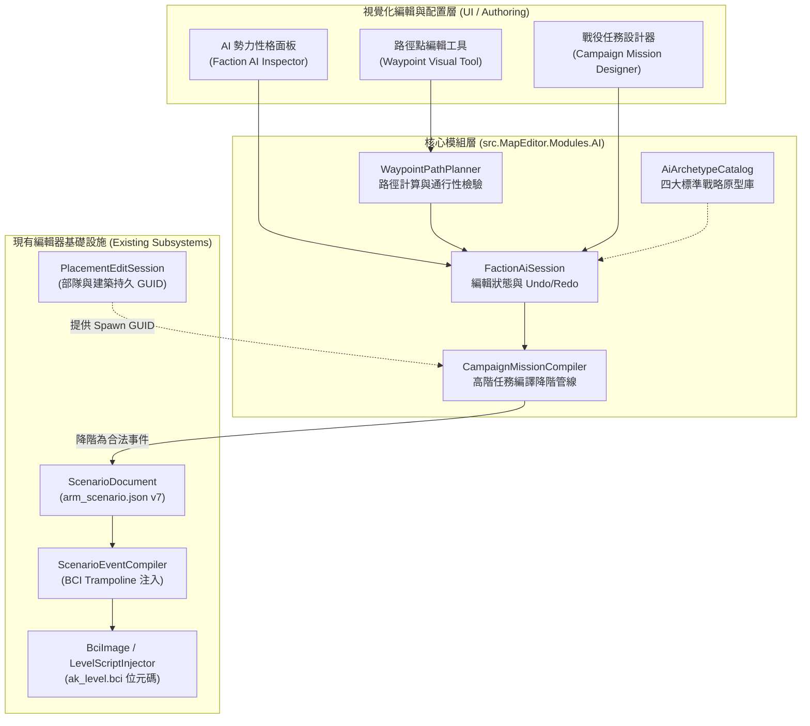
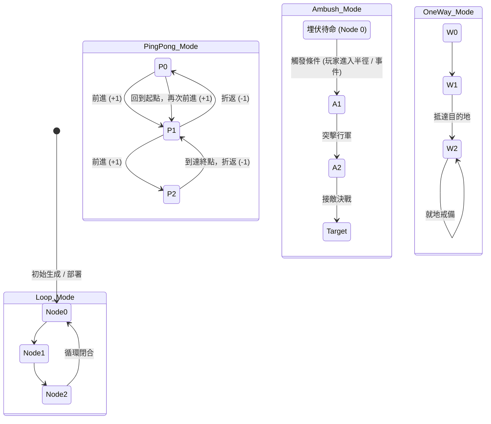
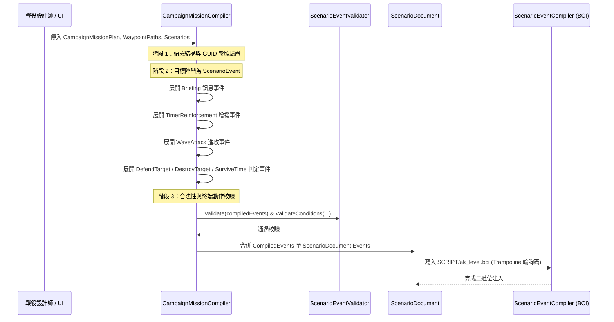

# 《反抗羅馬》(Against Rome) 地圖編輯器：戰役任務腳本與 AI 勢力行為原型配置與模擬系統架構設計

> **文件狀態**：架構設計規範與核心原型已建立  
> **日期**：2026-10-08  
> **目標讀者**：地圖編輯器開發團隊、戰役關卡設計師、逆向工程研究員  
> **實作命名空間**：`AgainstRomeMapEditor.Modules.AI`

---

## 一、 背景與設計動機 (Background & Motivation)

### 1.1 原版遊戲 AI 機制與逆向工程回顧
《反抗羅馬》(Against Rome) 的勢力行為由底層 IPR 腳本虛擬機（BCI0 VM）、原生地圖物件池（DATA 79-byte 結構與 runtime 76-byte 結構）以及聚落範本系統（`.sdl`）共同驅動：
1. **無盡模式（Endless Mode）AI 模組結構**：
   - **M1（增援規模）**：將 `s_addNPCJob_createUnit` 呼叫的部隊上限從 6 擴充至 20 人。
   - **M2（招募節奏與等待間隔）**：控制 NPC 招募排程器在 `ak_level.bci` 的計時節拍（原版預設 180,000 ms，修改器最佳化至 30,000 ms）。
   - **M3（突襲與敗亡快速回收）**：偵測被擊潰的殘存部隊，透過 `s_sendMsg(6, ...)` 與 `s_addNPCJob_dissolveUnit` 快速回收 NPC job 槽位。
   - **M6（羅馬軍團留守防衛）**：修正羅馬增援抵達後不留守基地的原廠邏輯漏洞，提供陣地駐紮。
2. **聚落模板與駐軍配額 (`Dorfverteidigung.bci`)**：
   - 聚落開局透過 `s_setVillageTemplate` 載入 `Endlos_*_Siedlung*.sdl`，內含開局資源（`resv`）與防禦建築配置。
   - 原版村莊透過 `s_searchImportantPos` 動態搜尋防衛錨點，計算駐軍配額並下達 `s_addNPCJob_createUnit`。
3. **原生部隊控制與路徑點 API**：
   - `s_createUnitAndMems`：在指定坐標以陣形、人數、朝向生成部隊，並傳回物件控制代碼。
   - `s_conMoveTo(obj, uid, x, z, ...)`：向部隊下達移動與巡邏命令。
   - `s_setObjAttackDest(obj, uid, targetObj, targetUid, ...)`：下達鎖定目標攻擊指令。
   - `s_getObjPos(obj, uid, &x, &z)`：即時輪詢物件在世界坐標系 $(X, Z)$ 的位置。
   - `placesWaypoint` / `Skriptmark*`：原版地圖用以標記巡邏與警戒路徑點的標記點。

### 1.2 現有地圖編輯器的局限
目前編輯器僅具備：
- 基礎的 2D/3D 物件擺放 (`PlacementEditSession`)。
- 基礎的事件觸發清單 (`ScenarioEventSession`) 與條件系統（物件存在、物件死亡、進入矩形區域）。
- 缺乏**高階戰役目標設計**（如波次進攻 WaveAttack、定時增援 TimerReinforcement、基地存活防衛 DefenseObjective）。
- 缺乏**勢力戰略性格配置**（不同民族/勢力在戰役中缺乏進攻、防守、掠奪等風格區分）。
- 缺乏**部隊巡邏與進攻路線（Waypoint 節點鏈）**的視覺化規劃與管理。

本系統旨在建立一套**高階戰役任務企劃與 AI 勢力原型設計器 (Campaign Mission & Faction AI Archetype Designer)**，讓關卡設計師能以宣告式、視覺化的方式配置戰役目標、AI 勢力性格與巡邏路徑，並將其自動編譯降階為原版合法 BCI 位元碼與 ScenarioEvent 執行序。

---

## 二、 系統整體架構 (System Architecture)

系統由四大核心模組與現有地圖編輯器子系統緊密結合：



---

## 三、 AI 戰略原型目錄 (AiArchetypeCatalog)

### 3.1 四大標準戰略原型
為滿足戰役與遭遇戰設計需求，系統預先定義四種典型的 AI 戰略原型，並支援設計師針對特定地圖進行細部覆寫：

| 原型 ID | 顯示名稱 | 代表民族 | 核心戰略特徵 | 戰術姿態 (`TacticalPosture`) | 交戰規則 (`EngagementRule`) | 目標優先級 (`TargetPriority`) |
|---|---|---|---|---|---|---|
| `NomadicRaider` | **進攻型遊牧部落** | 匈人 (Hun) | 高頻騷擾、掠奪資源、騎射拉扯、不重視城防，遇挫迅速脫離 | `HitAndRun` (游擊拉扯) | `AttackOnSight` (見敵即攻) | `EconomicStructures` (經濟建築優先) |
| `RomanFortress` | **防守型羅馬堡壘** | 羅馬 (Roman) | 要塞據守、高額駐軍、箭塔交叉火網、重裝步兵方陣防衛 | `DefensiveHold` (固守陣地) | `DefendTerritory` (領地警戒) | `MilitaryStructures` (軍事據點優先) |
| `GermanicSettlement` | **經濟擴張型日耳曼聚落** | 日耳曼 (German) / 凱爾特 | 人口增長、農耕伐木、民兵護送隊、對外建立分聚落與拓荒 | `BalancedFormation` (均衡推進) | `RetaliateOnly` (遇襲反擊) | `NearestEnemy` (最近敵人) |
| `BarbarianOutpost` | **中立野蠻人巡邏哨** | 中立 (Neutral) | 定點守候寶箱/險隘，沿巡邏線定時巡察，脫離追擊範圍自動歸位 | `AggressiveRush` (主動衝鋒) | `DefendTerritory` (脫戰回歸) | `NearestEnemy` (最近敵人) |

### 3.2 參數化模型規格 (`AiArchetypeProfile`)
每個 AI 原型具備以下量化參數：
- **`Aggressiveness` (0.0–1.0)**：侵略度。影響主動組織突襲的頻率與部隊出擊門檻。
- **`ExpansionDesire` (0.0–1.0)**：擴張欲。影響建立新聚落中心與開闢資源點的傾向。
- **`EconomicFocus` (0.0–1.0)**：經濟重心。影響村民招募配比與資源倉庫升級優先級。
- **`DefensePriority` (0.0–1.0)**：防守優先級。影響聚落駐軍配額（`GarrisonCap`，最高 20 人）與防禦塔建設。
- **`PatrolRadius` (100–16384)**：巡邏警戒半徑（世界坐標單位）。超出此範圍部隊將脫離戰鬥並回防起點（Leash Mechanism）。
- **`RetreatHealthRatio` (0.0–0.8)**：撤退血量臨界值。小隊平均血量低於此比率時自動下達撤退指令。
- **`MinRaidIntervalSeconds` / `MaxRaidIntervalSeconds`**：進攻波次間隔時間窗。
- **`UnitPreferences`**：兵種配置權重表（包含部隊別名 `Alias`、挑選權重 1–100、最小/最大編制人數）。

### 3.3 勢力綁定與覆寫機制 (`FactionAiProfile`)
每張地圖可為隊伍 0 至 7 分配專屬的 AI 性格：
```csharp
public sealed record FactionAiProfile(
    int Team,
    string ArchetypeId,
    AiArchetypeProfile? CustomOverrides = null,
    Guid? BaseSettlementId = null,
    bool Enabled = true);
```
- 若提供 `CustomOverrides`，則優先採用覆寫之參數；否則繼承 `AiArchetypeCatalog` 之標準原型數值。
- `BaseSettlementId` 綁定所屬主聚落中心建築的持久 GUID，當聚落中心被毀時觸發 AI 崩潰或潰逃邏輯。

---

## 四、 路徑點路線規劃系統 (WaypointPathPlanner)

### 4.1 路徑拓撲結構
巡邏路線由一組有序的 `WaypointNode` 構成，具備四種核心移動模式：



### 4.2 節點屬性與行軍姿態 (`WaypointNode`)
- **`OrderIndex`**：節點在路線中的序號。
- **`WorldX`, `WorldZ`**：地圖世界坐標（0–16383）。
- **`ToleranceRadius`**：抵達判定半徑（預設 150 單位）。當部隊中心進入此半徑即視為到達該節點。
- **`DwellTimeSeconds`**：抵達後的停留等待秒數（預設 0 秒）。可用於哨兵原地戒備觀察數秒後再繼續巡邏。
- **`Stance` (`WaypointStance`)**：
  - `NormalMarch`：標準行軍速度與散兵隊形。
  - `FastMarch`：疾行急行軍（提高移動速度，降低疲勞耐力）。
  - `AggressivePatrol`：武裝偵巡（行軍時主動搜尋視野內敵軍並交戰）。
  - `StealthHold`：隱蔽埋伏（伏擊點專用）。
- **`ActionTriggerName`**：抵達該節點時可選觸發的腳本事件識別字。

### 4.3 演算法：節點推進與折返判斷
`WaypointPathPlanner.GetNextNodeIndex` 透過純粹函式狀態推進，保證在各種模式下的行軍連續性：
```csharp
public static int GetNextNodeIndex(WaypointPath path, int currentIndex, ref bool isReversing)
{
    if (path.Nodes.Count < 2) return 0;
    return path.Mode switch
    {
        WaypointMovementMode.Loop => (currentIndex + 1) % path.Nodes.Count,
        WaypointMovementMode.PingPong => CalculatePingPong(path.Nodes.Count, currentIndex, ref isReversing),
        WaypointMovementMode.OneWay => Math.Min(currentIndex + 1, path.Nodes.Count - 1),
        WaypointMovementMode.Ambush => Math.Min(currentIndex + 1, path.Nodes.Count - 1),
        _ => (currentIndex + 1) % path.Nodes.Count
    };
}

private static int CalculatePingPong(int count, int current, ref bool isReversing)
{
    if (isReversing)
    {
        if (current <= 0) { isReversing = false; return 1; }
        return current - 1;
    }
    if (current >= count - 1) { isReversing = true; return count - 2; }
    return current + 1;
}
```

### 4.4 地形通行性與水體檢驗 (`ValidatePassability`)
`WaypointPathPlanner` 整合地形圖塊與高度遮罩：
- 檢查所有節點坐標是否落在地圖合法範圍內（$0 \le X, Z \le 16383$）。
- 呼叫委派 `isPassablePredicate(x, z)` 檢驗節點是否落在深水區（Water Level 判定）或無法通行的陡峭懸崖。
- 若有不合法節點，編譯期或預檢期即時標記錯誤，防止部隊尋路卡死在不可達區域。

---

## 五、 戰役任務腳本編譯管線 (BciScenarioCompiler)

### 5.1 高階任務目標（Campaign Objectives）
關卡設計師無需直接編寫底層 BCI bytecode 或繁瑣的 `ScenarioEvent` 條件組合，只需宣告高階目標：
1. **`WaveAttack`（進攻波次）**：
   - 定義波次序號、觸發時間延遲（秒）、波次宣告廣播文字。
   - 生成坐標 $(SpawnX, SpawnZ)$。
   - 部隊清單（兵種別名 `Alias`、人數 1–20、所屬隊伍）。
   - 可選綁定進攻路線（`AssignedPathId`）或優先進攻目標（`TargetObjectId`）。
2. **`TimerReinforcement`（定時增援）**：
   - 定義友軍或敵軍增援抵達時間、提示對話訊息、進場坐標與編制。
3. **`DefenseObjective`（基地防衛 / VIP 守護）**：
   - 綁定特定建築（如日耳曼主屋 `BauGerHau00`）或特定英雄/將軍部隊的持久 GUID。
   - 目標存活至指定時間或消滅所有進攻波次即判定獲勝；目標被毀即判定失敗。
4. **`DestroyTarget`（斬首行動 / 摧毀敵陣）**：
   - 擊殺特定敵軍將領或摧毀指定敵軍要塞即宣告任務獲勝。
5. **`ReachArea`（區域突破 / 護送轉移）**：
   - 指定部隊抵達包含 MinX, MinZ, MaxX, MaxZ 的安全撤離點即宣告獲勝。

### 5.2 編譯降階管線 (Compilation & Lowering Pipeline)



### 5.3 降階實例映射對照表

| 高階戰役目標項目 | 降階後之 `ScenarioEvent` 結構 | 包含動作 (`ScenarioAction`) | 包含條件 (`ScenarioCondition`) | 底層 BCI Native 呼叫 |
|---|---|---|---|---|
| **任務簡報**<br>`Briefing` | `MissionBriefing_*`<br>(Delay: 2s, Once) | `Message(text)` | 無 | `s_showTextBox(text, 0)` |
| **定時增援**<br>`TimerReinforcement` | `Reinf_*`<br>(Delay: T 秒, Once) | `Message(msg)`<br>`SpawnUnit(alias, x, z, team, count)` | 無 | `s_showTextBox`<br>`s_createUnitAndMems(...)` |
| **進攻波次**<br>`WaveAttack` | `Wave_NN`<br>(Delay: T 秒, Once) | `Message(announcement)`<br>`SpawnUnit(alias, ...)` | 無 | `s_showTextBox`<br>`s_createUnitAndMems(...)` |
| **防守目標守護**<br>`DefendTarget` | `DefendFail_*`<br>(Delay: 1s, Once) | `Message("防守失敗...")`<br>`Defeat` (Terminal) | `ObjectDeadOrRemoved(TargetId)` | `s_objDead` / `s_objExists`<br>`GLOBAL_MISSION_RESULT = 0`<br>`s_quitGame()` |
| **斬首/摧毀目標**<br>`DestroyTarget` | `DestroyWin_*`<br>(Delay: 1s, Once) | `Message("目標達成...")`<br>`Victory` (Terminal) | `ObjectDeadOrRemoved(TargetId)` | `s_objDead` / `s_objExists`<br>`GLOBAL_MISSION_RESULT = 1`<br>`s_quitGame()` |
| **生存防守目標**<br>`SurviveTime` | `SurviveWin_*`<br>(Delay: RequiredSeconds, Once) | `Message("防守成功...")`<br>`Victory` (Terminal) | 無 | `s_getTime` 檢查時間到期<br>`GLOBAL_MISSION_RESULT = 1`<br>`s_quitGame()` |
| **撤離突破目標**<br>`ReachArea` | `ReachWin_*`<br>(Delay: 1s, Once) | `Message("成功抵達指定區域...")`<br>`Victory` (Terminal) | `ObjectInArea(TargetId, Min/Max)` | `s_getObjPos(idx, uid, &x, &z)`<br>矩形邊界檢查<br>`GLOBAL_MISSION_RESULT = 1` |

### 5.4 虛擬機狀態變數規範與防重入設計
為確保 BCI VM 在長期運行中不發生棧溢位或狀態競態，編譯器遵循嚴格的狀態變數命名與存取規範：
1. **事件截止時間變數**：`ARM_EVENT_DEADLINE_{index}`。使用 `s_setScriptVarL` 與字串常數指標存取。單次事件觸發後設定為 `-1`，徹底防止重複觸發。
2. **物件觀測旗標**：`ARM_EVENT_SEEN_{event}_{condition}`。對於 `ObjectDeadOrRemoved` 條件，必須先在先前輪詢中確認目標存在過，目標死亡或消失時條件才判定成立；若物件一開始就未生成成功，不會誤判為被消滅。
3. **戰役終止互鎖旗標**：`ARM_MISSION_ENDED`。任一勝利或失敗事件觸發後立即寫入 `1`。輪詢迴圈首行即檢查此旗標，若為 `1` 則直接跳過所有後續事件判定並跳至恢復框架指令，防止同幀多個事件重疊覆寫結算結果。
4. **勝負結果代碼**：`GLOBAL_MISSION_RESULT`（1 代表勝利、0 代表失敗），隨後立即呼叫 `s_quitGame()` 進入原廠結算流程。

---

## 六、 與現有編輯器子系統之互動機制 (Integration Mechanism)

### 6.1 與 `PlacementEditSession` 之雙向關聯
1. **持久 GUID 綁定**：
   - 編輯器中擺放的任何士兵部隊或建築均帶有不可變的 `ScenarioId` (GUID)。
   - `WaypointPath.AssignedSpawnIds` 記錄分配給該路線的部隊 GUID 清單。
   - 在 2D 畫布或 3D 視圖中選取部隊時，檢查面板可直接下拉指派所屬的巡邏路線；反之，選取巡邏路線時，畫布即時高亮關聯的部隊模型。
2. **放置變更事件連動**：
   - 當部隊被刪除（`PlacementEditSession.RemoveAt` 或 `RemoveMany`）時，系統發出通知，`WaypointPath` 與 `CampaignObjective` 中關聯的 GUID 自動標記為懸空（Dangling），並在儲存前診斷（`MapDiagnostics`）中提出警告。

### 6.2 與 `ScenarioDocument`（Schema v7）之儲存架構
現有 `arm_scenario.json` 為 Version 6。為支援戰役與 AI 設定，設計向下相容的 Version 7 綱要：
```json
{
  "Version": 7,
  "Spawns": [ /* 原有物件清單 */ ],
  "DataSlots": [ /* 原有 DATA 槽位綁定 */ ],
  "Events": [ /* 降階後或手動編寫的 ScenarioEvent 清單 */ ],
  "AiSettings": {
    "FactionProfiles": [
      {
        "Team": 2,
        "ArchetypeId": "NomadicRaider",
        "BaseSettlementId": "a1b2c3d4-0000-0000-0000-000000000001",
        "Enabled": true
      }
    ],
    "WaypointPaths": [
      {
        "Id": "e5f6a7b8-0000-0000-0000-000000000002",
        "Name": "NorthValleyPatrol",
        "Mode": "Loop",
        "BreakOnCombat": true,
        "ReturnToStartOnLostTarget": true,
        "Nodes": [
          { "Id": "...", "OrderIndex": 0, "WorldX": 1500.0, "WorldZ": 2200.0, "ToleranceRadius": 150.0, "DwellTimeSeconds": 0, "Stance": "NormalMarch" },
          { "Id": "...", "OrderIndex": 1, "WorldX": 2500.0, "WorldZ": 3200.0, "ToleranceRadius": 150.0, "DwellTimeSeconds": 5, "Stance": "AggressivePatrol" }
        ],
        "AssignedSpawnIds": [ "c9d8e7f6-0000-0000-0000-000000000003" ]
      }
    ],
    "MissionPlan": {
      "Title": "防衛阿奎萊亞要塞",
      "Briefing": "阻止北方遊牧騎兵掠奪邊境城鎮！",
      "Objectives": [ /* 高階戰役目標清單 */ ],
      "Waves": [ /* 波次進攻清單 */ ],
      "Reinforcements": [ /* 定時增援清單 */ ]
    }
  }
}
```
- **舊版相容性**：若讀取 v1–v6 舊地圖，`AiSettings` 欄位為 null，系統自動初始化為預設空白設定，不破壞既有存檔。
- **儲存安全性**：所有檔案寫入均置於 `FileRollbackScope` 交易內。若編譯或存檔中途失敗，自動復原 `ak_level.bci` 備份與 JSON 檔案。

### 6.3 儲存前預檢 (`ScenarioSavePreflight`) 與診斷面板 (`MapDiagnostics`)
在儲存地圖前執行高階 AI 與戰役語意檢查：
1. **懸空目標檢查**：檢查 `CampaignObjective` 指定的目標 GUID 是否存在於當前地圖的 `Spawns` 中。
2. **部隊別名合法性**：檢查波次與增援的所有部隊別名（如 `HUN_CAV01`）是否列於 `SYSTEM/CLAK/cl_scint.ini`（`ScriptObjectAliases`）中。
3. **路徑點越界檢查**：所有路徑點節點必須在 $[0, 16383]$ 範圍內。
4. **通行性警示**：若路徑點坐標位於深水或不可通行懸崖，列為黃色警告，提示作者重新拉線。

---

## 七、 原生已驗證原語 vs 未驗證 AI 行為之落差分析 (Verified Primitives vs Unverified Behaviors)

### 7.1 原版遊戲與編輯器中真正可實作且已驗證的原語 (Verified Primitives)
在 `src.Shared/Scripting`（`ScenarioEventCompiler`、`ScenarioEvents`、`ScenarioEventValidator`）以及遊戲實機驗收（`GLOBAL_MISSION_RESULT` 勝利判定、`s_createUnitAndMems` 部隊生成、`s_showTextBox` 訊息對話框）中，**唯一經過驗證且完全可行的行為原語如下**：

1. **定時與波次部隊生成 (Timed Spawn / Wave Attack)**：
   - 原生 Native：`s_createUnitAndMems(count, ..., alias, z, x, ..., team)`
   - 語法與座標：世界座標 $X, Z \in [0, 16383]$（1 地圖圖格 = 256 世界單位，1 碰撞像素 = 64 世界單位）。
   - 限制：部隊人數限制 1–20 人，隊伍編號 0–7，別名必須嚴格存在於 `SYSTEM/CLAK/cl_scint.ini`（`[ObjDefName]`）。
2. **訊息提示與對話框 (Briefing & Notification)**：
   - 原生 Native：`s_showTextBox(text, 0)`。
   - 限制：字串必須使用遊戲支援的 Windows-1252 / 官方字集編碼，不得超過 1000 位元組。
3. **外交狀態變更 (Diplomacy)**：
   - 原生 Native：`s_setTeamHostile(team, otherTeam, hostile)`。
4. **目標狀態監控與勝敗結算 (Object Conditions & Mission End)**：
   - 原生 Native：`s_objExists`、`s_objDead`、`s_getObjPos`（支援矩形範圍 $MinX, MinZ, MaxX, MaxZ \in [0, 16383]$）。
   - 勝敗結算：寫入 `GLOBAL_MISSION_RESULT`（1 勝利 / 0 失敗），並呼叫 `s_quitGame()` 終止戰役。
   - 實機驗證狀態：已於 `ENDL_006` 實機測試中確認 `ObjectInArea` 勝利結算彈出「Вы успешно побороли неприятеля...」。

### 7.2 企劃原型中目前「無法僅透過 ScenarioEvent 編譯」之行為 (Currently Unimplementable via ScenarioEvent)
以下在 `AiArchetypeModels.cs` 與 `WaypointModels.cs` 中定義的高階屬性，**無法**直接由既有 `ScenarioEvent` 體系直接驅動，必須在企劃與設計文件中明確標記其邊界：

1. **巡邏路徑移動 (`WaypointPath` / `WaypointNode`)**：
   - 雖然原版遊戲二進位存在 `s_conMoveTo`（原生位址 `0x5345c0`），但現有 `ScenarioActionKind` 僅支援 `Message`、`Diplomacy`、`SpawnUnit`、`Victory`、`Defeat` 五種，**尚無 `MoveUnit` 或 `PatrolWaypoints` 動作種類**。
   - 現況：波次與增援生成的部隊在生成點原地待命，或依遊戲原生 AI/自動交戰邏輯運作；自訂 Waypoint 節點鏈目前僅保存於編輯器設定模型中，尚未能注入 ak_level.bci。
2. **動態戰術姿態 (`TacticalPosture`) 與交戰規則 (`EngagementRule`)**：
   - `AggressiveRush`、`HitAndRun`、`DefensiveHold`、`AttackOnSight`、`RetaliateOnly` 等規則依賴於原生 NPC Job 排程器（如 `s_addNPCJob`、`Dorfverteidigung.bci` 聚落防衛腳本）。
   - 單純的事件輪詢碼無法即時覆寫部隊底層 micro-AI 或尋敵決策機。
3. **聚落經濟擴張與動態招募 (`ExpansionDesire`, `EconomicFocus`, `UnitPreferences`)**：
   - 原版村莊自主招募與建築由 `.sdl` 模板和 `ak_level.bci` 的 NPC Job 循環（M1–M6）控制，而非由 `ScenarioEvents` 事件控制。
   - 原型中的 `UnitPreferenceWeight` 僅能用於編輯器端隨機挑選生成波次的兵種組成，無法動態改變村民採集資源或主屋的兵種訓練行為。

### 7.3 真實單位與建築別名對照表 (`cl_scint.ini` 實機驗證清單)
所有在戰役企劃、波次編制與原型兵種偏好中使用的別名，均已與原廠 `SYSTEM/CLAK/cl_scint.ini` 核對確認：

| 別名 (Alias) | 原生物件名稱 (NameDef) | 類別 | 部族 | 說明 |
|---|---|---|---|---|
| `GER_INF00` | `FigGerInf00_Hammer_Schild` | Figure | Ger | 日耳曼鐵錘盾兵 |
| `GER_INF01` | `FigGerInf01_Schwert` | Figure | Ger | 日耳曼劍士 |
| `GER_INF02` | `FigGerInf02_Zweihandaxt` | Figure | Ger | 日耳曼雙手斧兵 |
| `GER_INF03` | `FigGerInf03_Doppelhammer` | Figure | Ger | 日耳曼雙錘兵 |
| `GER_SCH00` | `FigGerSch00_Speer` | Figure | Ger | 日耳曼長矛兵 |
| `GER_SCH01` | `FigGerSch01_Axt_Schild` | Figure | Ger | 日耳曼手斧盾兵 |
| `GER_KAVINF00` | `FigGerKav00_Schwert_Schild` | Figure | Ger | 日耳曼騎兵 |
| `GER_HAU00` | `BauGerHau00_Haupthaus` | Building | Ger | 日耳曼主屋（城鎮中心） |
| `ROM_INF00` | `FigRomInf00_Lanze_Schild` | Figure | Rom | 羅馬長槍盾兵 |
| `ROM_INF01` | `FigRomInf01_Schwert_Schild` | Figure | Rom | 羅馬軍團劍盾兵 |
| `ROM_SCH00` | `FigRomSch00_Speer_Schild` | Figure | Rom | 羅馬標槍兵 |
| `ROM_SCH01` | `FigRomSch01_Bogen` | Figure | Rom | 羅馬弓箭手 |
| `ROM_KAVINF00` | `FigRomKav00_Schwert_Schild` | Figure | Rom | 羅馬重騎兵 |
| `ROM_HAU00` | `BauRomHau00_Hauptzelt` | Building | Rom | 羅馬大軍帳 |
| `HUN_INF00` | `FigHunInf00_Keule` | Figure | Hun | 匈人狼牙棒兵 |
| `HUN_INF01` | `FigHunInf01_Schwert_Schild` | Figure | Hun | 匈人劍盾兵 |
| `HUN_SCH00` | `FigHunSch00_Bogen` | Figure | Hun | 匈人步弓手 |
| `HUN_KAVINF00` | `FigHunKav00_Schwert_Schild` | Figure | Hun | 匈人近戰輕騎兵 |
| `HUN_KAVINF01` | `FigHunKav02_Lanze_Schild` | Figure | Hun | 匈人長矛槍騎兵 |
| `HUN_KAVINF02` | `FigHunKav03_Geisterreiter` | Figure | Hun | 匈人幽靈突擊騎兵 |
| `HUN_KAVSCH00` | `FigHunKav01_Bogen` | Figure | Hun | 匈人騎射手 |
| `HUN_HAU00` | `BauHunHau00_Haupthaus` | Building | Hun | 匈人主帳 |
| `KEL_INF00` | `FigKelInf00_Schwert` | Figure | Kel | 凱爾特劍士 |
| `KEL_INF01` | `FigKelInf01_Lanze` | Figure | Kel | 凱爾特長矛兵 |
| `KEL_INF02` | `FigKelInf02_Doppelschwert` | Figure | Kel | 凱爾特雙劍戰士 |
| `KEL_SCH00` | `FigKelSch00_Bogen` | Figure | Kel | 凱爾特弓手 |
| `KEL_SCH01` | `FigKelSch01_Schleuder` | Figure | Kel | 凱爾特投石手 |
| `KEL_SCH02` | `FigKelSch02_Schwere_Schleuder` | Figure | Kel | 凱爾特重型投石手 |
| `KEL_KAVINF00` | `FigKelKav00_Lanze_Schild` | Figure | Kel | 凱爾特騎兵 |
| `KEL_HAU00` | `BauKelHau00_Haupthaus` | Building | Kel | 凱爾特主屋 |
| `ALL_BAE00` | `FigTieBae00_Baer` | Figure | (中立) | 棕熊 |
| `ALL_EBE00` | `FigTieEbe00_Wildschwein` | Figure | (中立) | 野豬 |
| `ALL_WOL00` | `FigTieWol00_Wilder_Wolf` | Figure | (中立) | 野狼 |
| `ALL_RAU00` | `FigTieRau00_Raubkatze` | Figure | (中立) | 肉食猛獸（豹/山貓） |
| `ALL_PACKPF00` | `FigTiePac00_Packpferd` | Figure | (中立) | 馱馬 |
| `ALL_ZIVMAN00` | `FigZivMan00_Zivilist` | Figure | (中立) | 男性平民 |
| `ALL_ZIVWEI00` | `FigZivWei00_Zivilistin` | Figure | (中立) | 女性平民 |

---

## 八、 核心 C# 資料結構與演算法程式碼骨架

核心程式碼已於 `src.MapEditor.Modules/AI/` 建立原型，主要包含以下檔案：

1. **`AiArchetypeModels.cs`**：
   - `EngagementRule`、`TacticalPosture`、`TargetPriority` 列舉。
   - `UnitPreferenceWeight`、`AiArchetypeProfile`、`FactionAiProfile` 記錄。
   - `AiArchetypeCatalog`：預載四大標準戰略原型與查詢 API（兵種均全面採用實機別名，如 `HUN_KAVINF00`、`HUN_KAVSCH00`、`ROM_INF00`、`ROM_SCH00`）。
2. **`WaypointModels.cs`**：
   - `WaypointMovementMode`、`WaypointStance` 列舉。
   - `WaypointNode`、`WaypointPath` 記錄。
   - `WaypointPathPlanner`：路徑總長計算、`GetNextNodeIndex` 推進演算法、通行性檢驗。
3. **`CampaignMissionModels.cs`**：
   - `CampaignObjectiveType` 列舉。
   - `CampaignObjective`、`WaveSquadDefinition`、`WaveAttackDefinition`、`ReinforcementDefinition`。
   - `CampaignMissionPlan` 記錄。
4. **`CampaignMissionCompiler.cs`**：
   - `CampaignCompilationResult` 記錄。
   - `CampaignMissionCompiler.Compile`：將高階戰役規劃降階為合法 `ScenarioEvent` 陣列，並呼叫 `ScenarioEventValidator` 實施合規性檢驗。
5. **`FactionAiSession.cs`**：
   - 實作 `IEditorModule<CampaignMissionSnapshot>`。
   - 提供 Undo/Redo、狀態捕捉（Capture）、基準線對比（IsDirty）與變更重設（Reset）。

---

## 八、 視覺化編輯器互動設計建議 (UI/UX Guidelines)

為達成《世紀帝國 II》與當代 RTS 地圖編輯器的直覺編輯體驗，建議在主表單（`MapEditorForm`）與繪圖控制項中增加以下介面：

1. **2D/3D 路徑點繪製工具（Waypoint Tool）**：
   - 工具列新增「巡邏路徑」圖示。
   - 在 2D 畫布與 3D 視圖中，按住左鍵點擊可連續放置路徑節點。
   - 節點以菱形標記（Diamond Gizmo）呈現，相鄰節點之間繪製半透明方向箭頭連線；若是 `Loop` 模式，尾端節點與首節點繪製閉合虛線。
   - 滑鼠懸停可拖曳移動節點，右鍵點擊可刪除單一節點；`Escape` 鍵退出路線繪製。
2. **勢力 AI 性格面板（Faction AI Inspector）**：
   - 在隊伍色彩選擇器下方新增「AI 戰略性格」下拉選單（進攻型遊牧部落、防守型羅馬堡壘、經濟擴張型日耳曼聚落、中立野蠻人巡邏哨）。
   - 提供「進階參數」摺疊面板，可微調侵略度、擴張欲、駐軍上限與出兵間隔。
3. **戰役事件與波次時間軸面板（Campaign Mission Timeline）**：
   - 以水平時間軸呈現開局 0 秒至 30 分鐘的戰役進程。
   - 波次進攻（WaveAttack）與定時增援（TimerReinforcement）以標籤卡片依時間序排列，支援拖曳時間軸滑桿直接調整觸發秒數。

---

## 九、 驗證與測試策略 (Verification & Test Strategy)

### 9.1 單元測試覆蓋 (`tests/AgainstRomeMapEditor.Modules.Tests/AI/AiArchetypeTests.cs`)
1. **原型目錄測試**：
   - 驗證 `AiArchetypeCatalog` 完整包含四大預設原型，各原型的民族、侵略度、防守度數值正確。
2. **路徑演算法測試**：
   - 驗證 `CalculateTotalDistance` 計算折線與閉環長度精確度。
   - 驗證 `PingPong` 折返推進邏輯（前進至末端轉向反衝，退回首端轉向前進）。
   - 驗證 `Loop` 循環推進取模正確性。
3. **編譯器降階與合規性測試**：
   - 驗證將包含波次、增援、守護目標、斬首目標與生存時間的高階企劃降階為合法 `ScenarioEvent`。
   - **核心驗證**：降階後之事件必須 100% 通過原廠 `ScenarioEventValidator.Validate`、`ValidateConditions` 與 `ValidateTerminalActions`，確保不違反任何 BCI ABI 約束（終端動作必須在單次事件末端、延遲時間介於 0–86400 秒、動作數在 1–32 間、目標 GUID 有效等）。
4. **工作階段狀態追蹤測試**：
   - 驗證 `FactionAiSession` 新增/刪除路徑與波次時 `IsDirty` 的狀態變化，以及 `AcceptChanges()` 與 `Reset()` 的復原行為。

### 9.2 未來整合與遊戲內驗收清單 (Pending Acceptance)
- [ ] 於 WinForms 主介面完成路徑點 2D/3D 繪製控制項與時間軸面板。
- [ ] 於獨立空白場景或測試地圖中匯出包含 `WaveAttack` 與 `WaypointPath` 的 `ak_level.bci`。
- [ ] 在遊戲實機環境中觀察波次進攻生成與部隊沿巡邏路徑移動之動態表現（需取得安裝目錄例外授權後實機驗證）。
