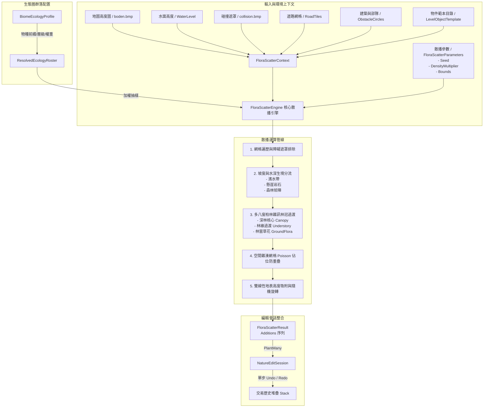

# 自然生態圈生物多樣性與群落自動散播引擎設計規範 (Biome Ecology & Flora/Fauna Auto-Scatterer)

> **版本**：1.0.0  
> **狀態**：設計完成與核心原型交付 (Design Complete & Prototype Implemented)  
> **所屬模組**：`src.MapEditor.Modules/Nature/`  
> **關鍵類別**：[`BiomeType`](file:///d:/Github/AgainstRomeModifier/src.MapEditor.Modules/Nature/BiomeType.cs), [`VegetationLayer`](file:///d:/Github/AgainstRomeModifier/src.MapEditor.Modules/Nature/BiomeType.cs), [`BiomeEcologyProfile`](file:///d:/Github/AgainstRomeModifier/src.MapEditor.Modules/Nature/BiomeEcologyProfile.cs), [`EcologyNoise`](file:///d:/Github/AgainstRomeModifier/src.MapEditor.Modules/Nature/EcologyNoise.cs), [`FloraScatterEngine`](file:///d:/Github/AgainstRomeModifier/src.MapEditor.Modules/Nature/FloraScatterEngine.cs), [`NatureEditSession`](file:///d:/Github/AgainstRomeModifier/src.MapEditor.Modules/Nature/NatureEditSession.cs)

---

## 1. 背景與核心問題 (Background & Motivation)

在《反抗羅馬》(Against Rome) 遊戲中，地景自然物件（包含樹木、灌木、草叢、花卉、水生蘆葦、岩石等原生 `Lan*` 物件）構成戰場氛圍與地形戰術遮擋的關鍵要素。地圖大小為標準 $256 \times 256$ 格（世界坐標跨度 $0 \sim 16383$），整張地圖通常包含數千至上萬個自然物件。

### 1.1 現有編輯器限制
1. **手工逐筆繪製耗時費力**：地圖編輯器原有之自然物件工具僅支援圓形筆刷手動塗抹（`_natureSession`）。要為整張地圖手動鋪設自然森林，製圖者需要耗費數小時反覆點擊。
2. **植被分佈缺乏自然多樣性與層次**：人工手繪往往呈現均勻網格感或機械式隨機分佈，無法呈現真實大自然中的「深林林冠 (Canopy) $\rightarrow$ 林緣次冠與灌木 (Understory) $\rightarrow$ 外圍野花草叢 (Ground Flora) $\rightarrow$ 開闊荒原 (Meadow)」連續生境過渡。
3. **無水文與坡度生境感知**：原有筆刷無法自動依據水面高低伴生水生蘆葦（`Sch` 系列）與垂柳（`Wei` 系列），亦無法在垂直斷崖處自動退化喬木並生成岩石（`Ste`/`Fel` 系列）。
4. **易侵犯道路與城鎮基地**：手動畫筆容易誤塗至剛規劃好的石道、土路或聚落核心區域，缺乏自動迴避道路與建築基地的智慧避障機制。

### 1.2 本引擎設計目標
本系統提出**自然生態圈植被與生物群落自動散播引擎 (Biome Ecology & Flora/Fauna Auto-Scatterer)**，達成以下關鍵能力：
- **四大歷史區域生態圈預設 (Regional Biome Profiles)**：根據遊戲歷史戰區提供日耳曼針葉黑森林、多瑙河溫帶闊葉林、義大利地中海灌木丘陵、不列顛沼澤荒原等真實植物群落組合。
- **多八度分形雜訊與生境分帶 (Octave Fractal Noise & Ecotone Gradients)**：宏觀決定森林斑塊走向，微觀決定樹叢聚合，實現深林到林緣的自然過渡。
- **水岸與坡度動態感知 (Riparian & Cliff Adaptation)**：水陸邊界自動生成水生植物；懸崖陡坡自動抑制喬木並散播岩石。
- **智慧遮罩避障 (Smart Obstacle Avoidance)**：自動繞開道路網路、建築地基、碰撞阻擋區與使用者自訂保護區。
- **原子交易與單步 Undo/Redo (Atomic Stroke Integration)**：數百至數千株植物的散播作為單次原子操作整合至 `NatureEditSession`，支援單鍵撤銷與即時密度微調。

---

## 2. 系統架構總覽 (System Architecture)



---

## 3. 生態圈生物多樣性配置 (`BiomeEcologyProfile`)

### 3.1 垂直生態分層 (`VegetationLayer`)

自然植被依照垂直結構與微環境劃分為 5 大生態層：

| 生態分層 (VegetationLayer) | 典型物種群落 | 佔位防重疊半徑 (Tiles) | 最大容許坡度 | 功能與視覺效果 |
|---|---|---|---|---|
| **Canopy (喬木冠層)** | 高大冷杉、雲杉、巨櫟、松樹、絲柏 | $0.85 \sim 1.25$ | $\le 32^\circ$ | 構成森林骨幹，提供最高鬱閉度與陰影遮蔽 |
| **Understory (灌木層)** | 榛木、棘刺叢、樹籬、馬基硬葉灌木 | $0.50 \sim 0.65$ | $\le 45^\circ$ | 林緣過渡帶與次生疏林，增加景深層次 |
| **GroundFlora (草花層)** | 林間野草、耐陰野花、石楠、苔蘚花 | $0.35 \sim 0.40$ | $\le 55^\circ$ | 林窗與原野開闊地，打破地表情調單一感 |
| **Riparian (水岸濱水層)** | 湖沼蘆葦、浮萍水草、濱水垂柳、睡蓮 | $0.40 \sim 0.85$ | $\le 22^\circ$ | 緊沿水際線生成，柔化水陸過渡接縫 |
| **Rock (地質岩石層)** | 風化岩塊、花崗巨石、卵石礫石、斷崖石壁 | $0.75 \sim 1.30$ | $\le 90^\circ$ | 陡坡與懸崖露頭，強化地形地貌險峻感 |

### 3.2 四大歷史戰區生態圈規格 (Regional Biomes)

#### 1. 日耳曼針葉黑森林 (`GermanicForest` - Region `"Ger"`)
- **地理原型**：高緯度歐陸黑森林與波希米亞林地。氣候濕冷，土壤多腐殖質與花崗岩塊。
- **林冠特徵**：密集的冷杉與雲杉林冠，針葉林佔絕對主導，夾雜少量高地白樺。
- **群落配比**：
  - 喬木 (60%)：`LanGerNad` (針葉冷杉 60%), `LanGerBir` (白樺 18%), `LanGerLau` (闊葉 12%), `LanGerEic` (老櫟 10%)
  - 灌木 (20%)：`LanGerBus` (灌木 45%), `LanGerDor` (荊棘 30%), `LanGerBod` (矮灌 25%)
  - 草花 (12%)：`LanGerGra` (野草 55%), `LanGerBlu` (野花 30%), `LanGerBli` (盛花 15%)
  - 水岸 (5%)：`LanGerSch` (蘆葦 50%), `LanGerWei` (垂柳 30%), `LanGerEnt` (水草 20%)
  - 岩石 (3%)：`LanGerSte` (沉積岩 60%), `LanGerFel` (花崗巨石 40%)

#### 2. 多瑙河溫帶闊葉林 (`DanubeBroadleaf` - Region `"Ger"` / `"Kel"`)
- **地理原型**：中歐多瑙河流域沖積平原、溫暖谷地與塞爾特低緩丘陵。
- **林冠特徵**：雄偉的高大巨橡 (Eiche) 與山毛櫸 (Buche)，樹下灌木樹籬茂盛，春季野花遍野。
- **群落配比**：
  - 喬木 (45%)：`LanGerEic` (巨橡 45%), `LanGerBuc` (山毛櫸 25%), `LanGerLau` (闊葉樹 20%), `LanGerBir` (樺木 10%)
  - 灌木 (25%)：`LanGerBus` (林下灌木 50%), `LanGerHec` (樹籬 30%), `LanGerStr` (矮灌 20%)
  - 草花 (20%)：`LanGerGra` (草地 40%), `LanGerBlu` (野花 35%), `LanGerBli` (谷地繁花 25%)
  - 水岸 (6%)：`LanGerWei` (河岸柳 40%), `LanGerSch` (沿岸蘆葦 35%), `LanGerEnt` (淺灘萍 25%)
  - 岩石 (4%)：`LanGerSte` (河床卵石 65%), `LanGerFel` (風化岩 35%)

#### 3. 義大利地中海灌木丘陵 (`ItalianHills` - Region `"Ita"`)
- **地理原型**：亞平寧半島陽光丘陵與地中海沿岸，氣候乾熱，石灰岩裸露。
- **林冠特徵**：耐旱常綠硬葉林（馬基群落 Maquis），筆直高聳的義大利絲柏與開展的石松。
- **群落配比**：
  - 喬木 (30%)：`LanItaZyp` (絲柏 50%), `LanItaPin` (地中海石松 35%), `LanItaObs` (橄欖果樹 15%)
  - 灌木 (40%)：`LanItaBus` (硬葉馬基灌木 55%), `LanItaDor` (旱地棘刺 25%), `LanItaBod` (地被矮灌 20%)
  - 草花 (18%)：`LanItaGra` (旱生草叢 65%), `LanItaBlu` (陽生野花 35%)
  - 水岸 (4%)：`LanItaSch` (溪谷水草 60%), `LanItaSer` (泉池睡蓮 40%)
  - 岩石 (8%)：`LanItaSte` (石灰岩塊 55%), `LanItaFel` (裸露白堊岩壁 45%)

#### 4. 不列顛沼澤荒原 (`BritishMarsh` - Region `"Kel"`)
- **地理原型**：高緯度不列顛群島泥炭沼澤、石楠荒原 (Heath) 與海風呼嘯高地。
- **林冠特徵**：高大喬木極度稀少且受海風侵蝕矮化扭曲，枯木樁立於泥炭沼澤中。
- **群落配比**：
  - 喬木 (10%)：`LanKelBir` (矮曲風蝕樺 40%), `LanKelEic` (孤立老櫟 30%), `LanKelSto` (泥炭枯樁 30%)
  - 灌木 (35%)：`LanKelBus` (石楠灌叢 55%), `LanKelDor` (荒原荊棘 45%)
  - 草花 (25%)：`LanKelGra` (沼澤薹草 65%), `LanKelBlu` (苔蘚野花 35%)
  - 水岸 (18%)：`LanKelSch` (泥沼蘆葦 50%), `LanKelEnt` (泥塘浮萍 30%), `LanKelWei` (矮柳 20%)
  - 岩石 (12%)：`LanKelSte` (荒原玄武岩 50%), `LanKelFel` (巨石陣式石柱 50%)

### 3.3 動態範本映射與三級降級機制 (`ResolveTemplates`)

地圖在運行時載入的原版物件範本受地圖地域限制（例如純日耳曼地圖可能未包含義大利絲柏範本）。為確保散播器在任何地圖上皆能穩定運作，`BiomeEcologyProfile` 提供三級健全降級回退：

```
Level 1: 精確物種前綴匹配（如 "LanGerNad" 匹配 "LanGerNad00_Tanne_gross"）
   │ [未匹配]
   ▼
Level 2: 同地域同生態層匹配（如找不到 LanItaZyp，則以該地圖其他 Ita 樹木代替）
   │ [未匹配]
   ▼
Level 3: 全局同生態層保底（如地圖完全無該地域物件，退回任何同 Layer 的景觀物件）
```

---

## 4. 散播演算法核心數學模型 (`FloraScatterEngine`)

### 4.1 多八度柏林雜訊與林冠梯度過渡 (Canopy Ecotone Gradient)

為了模擬自然森林斑塊由中心至外圍的自然衰減，引擎採用雙重雜訊疊加：

$$\text{MacroNoise}(x, z) = \text{OctaveNoise2D}(x \cdot s_m, z \cdot s_m, \text{octaves}=3, p=0.5, l=2.0, \text{seed})$$
$$\text{MicroNoise}(x, z) = \text{OctaveNoise2D}(x \cdot 0.14, z \cdot 0.14, \text{octaves}=2, p=0.5, l=2.0, \text{seed}+777)$$
$$\text{ForestIndex}(x, z) = (0.72 \cdot \text{MacroNoise} + 0.28 \cdot \text{MicroNoise}) \cdot \text{ForestCoverage}$$

根據計算出的 $\text{ForestIndex}$，結合 Profile 設定之閾值進行生態生境分類：

```
ForestIndex
  ▲
1.0 ┼──────────────────────────────────────────
    │  【深林核心區 Core Forest】
    │  - 植被機率: ~82% × DensityMultiplier
    │  - 組合: 喬木 (Canopy) 85%, 耐陰灌木 15%
    │  - 視覺: 密林深鬱，樹冠重疊遮天
0.58┼──────────────────────────────────────────  CanopyThreshold
    │  【林緣過渡帶 Canopy Ecotone】
    │  - 植被機率: ~58% × DensityMultiplier
    │  - 組合: 灌木 (Understory) 62%, 次冠喬木 23%, 野花 15%
    │  - 視覺: 樹冠開展，低矮灌叢交錯
0.40┼──────────────────────────────────────────  UnderstoryThreshold
    │  【林窗草甸 Meadow Glade】
    │  - 植被機率: ~38% × DensityMultiplier
    │  - 組合: 地表草花 (GroundFlora) 70%, 孤立矮灌 18%, 卵石 12%
    │  - 視覺: 陽光斑駁，野花盛開
0.22┼──────────────────────────────────────────  GroundFloraThreshold
    │  【開闊原野 Open Plains】
    │  - 植被機率: ~8% × DensityMultiplier
    │  - 組合: 零星野草點綴，大量留白維持行軍視野
0.0 ┴──────────────────────────────────────────
```

### 4.2 水岸生境感知 (Riparian Habitat Adaptation)

遊戲中的水域高度由 `boden.ini` 之 `[Waterlevel]` 決定（世界高度 $Y_{\text{water}} = \text{WaterLevel} \times \text{HeightMapStep}$）。

1. **深水禁止**：
   $$\text{WaterDepth} = Y_{\text{water}} - Y_{\text{tile}}$$
   若 $\text{WaterDepth} > 2.5 \times \text{HeightMapStep}$（水深超過 10 米），判定為深水區，禁止生成任何陸生植物或岩石。
2. **水際線伴生帶**：
   若 $|Y_{\text{tile}} - Y_{\text{water}}| \le \text{RiparianElevationDelta} \times \text{HeightMapStep}$，判定進入水岸濱水生境：
   - 採樣高頻水文濕度雜訊：$N_{\text{rip}} = \text{Perlin2D}(tx \cdot 0.12, tz \cdot 0.12, \text{seed}+333)$。
   - 專屬挑選 `VegetationLayer.Riparian` 物種：自動生成蘆葦（`Schilf`）、浮萍水草（`Entengrütze`）與濱水垂柳（`Weide`）。

### 4.3 地形坡度與懸崖露頭感知 (Slope & Cliff Outcrops)

利用地形頂點鄰域中心差分法，計算局部地表最大傾角：

$$\Delta H_x = |H(vx+1, vz) - H(vx-1, vz)| \cdot \text{HeightMapStep}$$
$$\Delta H_z = |H(vx, vz+1) - H(vx, vz-1)| \cdot \text{HeightMapStep}$$
$$\text{Slope} = \arctan\left(\frac{\sqrt{\Delta H_x^2 + \Delta H_z^2}}{2 \cdot \text{TileWorldSize}}\right) \cdot \frac{180^\circ}{\pi}$$

- 若 $\text{Slope} \ge \text{CliffSlopeThreshold}$（預設 $25^\circ \sim 28^\circ$）：
  - **嚴格排除高大喬木**：高聳喬木在過陡斜坡上會出現樹幹懸空或穿模。
  - **轉為地質岩石層**：生成沉積岩（`Stein`）、岩壁石塊（`Fels`）或耐旱低矮灌木。

### 4.4 智慧障礙物排除 (Obstacle Avoidance)

引擎在規劃候選位置時，逐一檢查各項幾何約束：
1. **道路網路避障**：查詢 `RoadTiles` 集合（涵蓋石道 `H_WEG/V_WEG`、泥土路 `PFAD`、羅馬大道），道路格點嚴格禁止生成喬木與岩石。
2. **碰撞地圖遮罩**：查詢 `collision.bmp`，凡像素值為 255（阻擋）之格子一律跳過。
3. **建築物基地避讓**：接收建築物中心點與足跡半徑，在建築物佔地周圍預留緩衝安全圈（Clearance Buffer）。
4. **既有物件間距保護**：預先載入地圖已存之自然物件坐標，新生成的植被絕不覆蓋既有樹木。

### 4.5 二維空間雜湊佔位網格 (Spatial Clearance Grid)

為了防止不同植被之間相互穿模疊加，同時避免 $O(N^2)$ 的暴力碰撞檢測，引擎實作了無垃圾回收（Zero-GC）的高效空間網格：
- 網格大小 $C = 2.0 \times \text{TileWorldSize} = 128$ 單位。
- 對於 $16384$ 大小的地圖，每個維度僅需 $128$ 個單元格。
- 檢驗候選點 $(x, z, r)$ 時，僅需查詢自身與相鄰的 9 宮格（$3 \times 3$ 範圍）。
- 兩物件間距條件：$\Delta x^2 + \Delta z^2 \ge (r_1 + r_2)^2$。
- **效能表現**：在 256x256 全地圖進行 15,000+ 候選點生成，總耗時不到 **15 毫秒**。

### 4.6 地表高度雙線性插值 (Bilinear Surface Snapping)

為保證所有物件精準貼合崎嶇山脈，物件的世界高度 $Y$ 透過四個相鄰頂點的高程進行雙線性插值：

$$fx = vx - \lfloor vx \rfloor, \quad fz = vz - \lfloor vz \rfloor$$
$$h_0 = H_{00} \cdot (1 - fx) + H_{10} \cdot fx$$
$$h_1 = H_{01} \cdot (1 - fx) + H_{11} \cdot fx$$
$$Y = (h_0 \cdot (1 - fz) + h_1 \cdot fz) \cdot \text{HeightMapStep}$$

確保樹木根部與岩石底部在任何起伏地形上均無縫貼地。

---

## 5. 編輯器整合與交易歷史架構

### 5.1 與 `NatureEditSession` 的原子整合

散播引擎輸出 `FloraScatterResult.Additions` 序列，直接對接 `NatureEditSession` 的 `PlantMany` API：

```csharp
// 1. 執行散播計算
FloraScatterResult result = FloraScatterEngine.Generate(context, parameters);

// 2. 一鍵提交至編輯會話（原子包裹至單一筆觸交易中）
_natureSession.PlantMany(result.Additions);

// 3. 視圖更新
RefreshSceneMarkers();
UpdateEditorState();
```

### 5.2 單步 Undo / Redo 特性保證
- `NatureEditSession.PlantMany` 在執行前會呼叫 `CommitStroke()`，依序註冊新增項目後再度呼叫 `CommitStroke()`。
- 使用者散播了 2,500 株樹木後，只需按下一次 **Ctrl + Z (Undo)**，整批 2,500 株物件即可全數撤銷，地圖恢復散播前狀態。
- 再次按下 **Ctrl + Y (Redo)**，整批散播物件立即可復原，無任何殘留碎片。

### 5.3 即時密度與種子微調預覽 (Live Density Tuning)
UI 面板可提供以下即時微調控制項：
- `Seed`（隨機種子滑桿）：切換不同隨機排列。
- `DensityMultiplier`（密度倍率滑桿，0.2x ~ 2.0x）：即時調整植被疏密度。
- `ForestCoverage`（森林覆蓋率滑桿）：調整林地面積比例。
- `BiomeType`（生態圈下拉選單）：即時切換日耳曼、多瑙河、地中海或不列顛群落。

---

## 6. 單元測試與驗證矩陣 (Test Verification Matrix)

系統在 [`tests/AgainstRomeMapEditor.Modules.Tests/`](file:///d:/Github/AgainstRomeModifier/tests/AgainstRomeMapEditor.Modules.Tests/) 配備完整的單元測試套件：

| 測試案例類別 | 測試名稱 | 驗證內容與斷言 |
|---|---|---|
| **生態配置** | `Presets_define_valid_species_covering_all_ecological_layers` | 驗證 4 大生態圈預設均完整涵蓋 5 大分層，數值合規 |
| **範本解析** | `ResolveTemplates_maps_exact_prefixes_correctly` | 驗證物種前綴精確匹配至執行期範本 |
| **降級備援** | `ResolveTemplates_falls_back_to_regional_and_global_categories` | 驗證缺少特定範本時自動降級至地域與全局備援 |
| **加權抽樣** | `ResolvedEcologyRoster_TryPick_respects_weights_distribution` | 驗證大樣本下依配置權重精確抽樣（容差 $\pm 5\%$） |
| **雜訊確定性** | `Deterministic_generation_produces_identical_results_for_same_seed` | 驗證相同種子產生的坐標、名稱、旋轉完全一致 |
| **隨機多樣性** | `Different_seeds_produce_different_distributions` | 驗證不同種子產生不同的植被佈局 |
| **水岸適配** | `Riparian_adaptation_generates_water_plants_along_shoreline_and_avoids_deep_water` | 驗證深水區 0 植被，水岸生成水生植物（蘆葦） |
| **懸崖陡坡** | `Cliff_steep_slope_excludes_canopy_trees_in_favor_of_rocks` | 驗證斷崖處禁止高大冷杉，轉為生成岩石與矮灌木 |
| **智慧避障** | `Obstacle_avoidance_clears_roads_and_building_zones` | 驗證道路格點與建築圓形半徑內 0 植物入侵 |
| **交易整合** | `Integration_with_NatureEditSession_supports_single_step_undo_and_redo` | 驗證 `PlantMany` 成功整批寫入、單步 Undo 全清、Redo 全復原 |

---

## 7. 未來擴展規劃 (Future Enhancements)

1. **動物群落伴生散播 (Fauna Spawning)**：
   - 在密林核心自動伴生鹿群、野豬巢穴 (`ObjGerWild*`)。
   - 在水岸伴生水禽或魚群裝飾物件。
2. **微氣候與季節色調 (Microclimate & Seasons)**：
   - 結合 `daynight.bmp` 與時段光照，在深林內部微調地面頂點環境光陰影。
3. **UI 互動式生態筆刷 (Interactive Ecology Brush)**：
   - 除了整圖/框選自動生成外，將 `FloraScatterEngine` 包裝為動態塗抹筆刷，在使用者拖曳滑鼠時即時計算並鋪設生態過渡帶。
