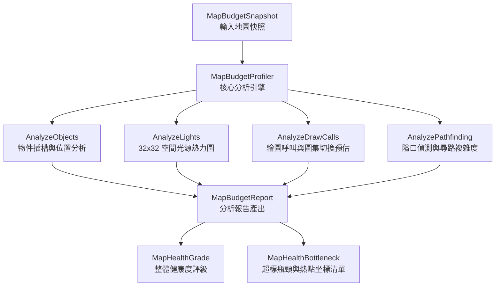

# 地圖即時效能預警與引擎資源硬限制分析器架構設計規格書
(Map Budget & Performance Profiler Design Specification)

> **版本**：v1.0.0  
> **日期**：2026-10-08  
> **模組命名空間**：`AgainstRomeMapEditor.Modules.Profiling`  
> **關聯文件**：[map-editor-performance.md](map-editor-performance.md), [map-editor-blank-map-contract.md](map-editor-blank-map-contract.md), [local-lights.md](reverse-engineering/local-lights.md), [map-lighting.md](reverse-engineering/map-lighting.md)

---

## 1. 執行摘要與設計目標 (Executive Summary & Goals)

《反抗羅馬》(Against Rome) 是一款發行於 2003 年的經典即時戰略 (RTS) 遊戲。其底層引擎採用 DirectX 8 時代的固定管線與靜態陣列記憶體管理機制。在遊戲二進位程式碼中，針對地圖物件、位置記錄、執行期池、光源數量、頂點索引以及路徑尋路網格均設有極為嚴苛的**硬限制 (Hard Limits)**。

當創作者在現代地圖編輯器中隨心所欲地繪製大型地圖時，極易在不知情的情況下突破引擎容許量（例如單一聚集區放置過多火把、地圖佈滿逾萬株樹木、或繪製大量小於 2 格寬的狹窄隘口）。這將導致嚴重的後果：
1. **遊戲載入直接崩潰 (Crash on Map Load)**：如物件插槽超出 14,000 或位置超過 33,000。
2. **渲染嚴重破面與閃爍 (Rendering Artifacts & Light Dropping)**：局部區域聚集超過 64 個光源時，超出部分被強制截斷，相機移動時光源劇烈閃爍。
3. **頂點緩衝與批次溢出 (Vertex Buffer Overflow)**：單一繪製批次超出 16-bit 索引上限 (16,384 quads / 65,536 頂點)。
4. **尋路引擎假死與掉幀 (Pathfinding Freeze & Frame Drops)**：隘口過多或連通區域破碎，導致數十至上百名士兵同時引發 A* 尋路風暴。

本規格書設計並實作**「地圖即時效能預警與引擎資源硬限制分析器 (Map Budget & Performance Profiler)」**，提供：
- **硬限制防護盾 (Hard-limit Guard)**：整理完整的原生引擎極限與安全警戒線 (Redline)。
- **即時四維度負載分析 (Four-dimensional Load Analysis)**：涵蓋物件插槽、光源密度熱力圖、Draw Calls 與圖集切換開銷、尋路網格負載。
- **視覺化儀表板與熱點跳轉定位 (Visual Dashboard & One-click Hotspot Locating)**：整合編輯器狀態列、地圖檢查分頁，支援一鍵對焦超標區域。

---

## 2. 原生引擎硬限制與安全警戒線矩陣 (MapBudgetLimits Matrix)

透過對遊戲核心 EXE (`re_workspace/Against_Rome.exe`) 之靜態反組譯、資料檔載入器剖析（`0x48BAE0`, `0x49FFE0`, `0x48AB70`, `0x4C966D` 等），以及官方標準地圖 `ENDL_000` 的實際量測數據，確立以下硬限制與安全預算標準：

### 2.1 引擎資源預算對照表

| 資源維度 | 原生硬限制 (Hard Limit) | 安全警戒線 (Redline) | 建議最佳預算 (Safe Budget) | 突破限制之後果 | 反組譯/資料結構來源 |
| :--- | :--- | :--- | :--- | :--- | :--- |
| **objects.dat 插槽** | **14,000 槽位** | 10,000 槽位 | $\le 8,000$ 槽位 | 遊戲無法配置物件、存檔損壞、載入崩潰 | 標頭 `0x48BAE0`，count=14000 |
| **position.dat 記錄** | **33,000 筆** | 24,000 筆 | $\le 20,000$ 筆 | 物件無法寫入位置，位置遺失 | 標頭 `0x48C760`，count=33000 (每物件佔2筆) |
| **劇本生成 (Spawns)** | **無固定限制** | 1,000 個單位 | $\le 500$ 個單位 | BCI/SDL 開局腳本解譯嚴重延遲、掉幀 | `ak_level.bci` 執行緒循環 |
| **lager.dat 庫存池** | **3,200 槽位** | 2,400 槽位 | $\le 1,800$ 槽位 | 資源無法儲存、貿易腳本中斷 | `0x48D2D0` |
| **particle.dat 粒子** | **64 槽位** | 48 槽位 | $\le 32$ 槽位 | 火花、煙霧遺失，爆炸無特效 | `0x48DD90`，capacity=64 |
| **explos.dat 爆炸** | **46 槽位** | 32 槽位 | $\le 20$ 槽位 | 攻城武器命中無爆炸效果 | `0x48E210`，capacity=46 |
| **flash.dat 閃電** | **16 槽位** | 12 槽位 | $\le 8$ 槽位 | 天候雷擊無法生成 | `0x48B910`，capacity=16 |
| **way.dat 尋路航點** | **256 點** | 200 點 | $\le 150$ 點 | 巡邏與劇情移動腳本失效 | `0x48DBA0`，points=256 |
| **全域動態光源** | **1,024 個** | 512 個 | $\le 256$ 個 | 光源陣列溢出，新光源不發光 | 全域位址 `0x7F9EF0`，stride 0x44 |
| **視錐/局部重疊光源** | **64 個** | 48 個 | $\le 32$ 個 | **超過 64 個的光源被強制捨棄，畫面嚴重閃爍** | Shader `uLightPosRadius[64]`, `0x49FFE0` |
| **Sprite 頂點批次** | **16,384 quads** | 10,922 quads | $\le 8,000$ quads | 16-bit 頂點索引溢出 (65536 頂點)，模型撕裂 | GPU 16-bit Index Buffer 硬限制 |
| **4096 圖集頁數** | **無硬限制** | 4 頁 | $\le 2$ 頁 | 深度排序交錯引發高頻率圖集切換，Draw calls 暴增 | `NativeSpriteAtlas` (4096×4096) |
| **尋路網格節點** | **65,536 格** | 256×256 網格 | 256×256 網格 | 固定 256×256 格，不可擴充 | 碰撞網格 `collision.dat` |
| **窄道隘口 ($\le 2$ 格)** | **無硬限制** | 30 處 | $\le 15$ 處 | 大部隊相互擠塞，A* 重複尋路風暴引發 CPU 假死 | 形態學瓶頸分析 |
| **連通孤島區塊** | **無硬限制** | 10 區 | 1 ~ 3 區 | 部隊與 NPC 卡在孤島，AI 尋路邏輯死循環 | 洪水填充連通分量分析 |

### 2.2 官方地圖實測基準 (Baseline Calibration)
依據 `docs/map-editor-performance.md` 對官方標準無盡地圖 `ENDL_000` 的實際剖析數據：
- **DATA 物件**：6,618 個（插槽使用率 47.3%）。
- **完整場景物件**：7,231 個（含 SDL 聚落建築與部隊）。
- **原生 Sprite**：7,143 個（全部能容納於單一 16-bit 繪製批次）。
- **地面陰影 Quad**：2,050 個。
- **解碼 Sprite 種類**：212 種（可完美放入單一 4096×4096 圖集頁，頁面切換為 0）。
- **場景光源**：50 個（全圖分散，局部峰值約 8 ~ 12，遠低於 64 上限）。
- **健康度評估**：本分析器評定得分為 **88 分 (Healthy)**。

---

## 3. 分析器核心架構 (Profiler Core Architecture)

分析器由三大核心類別構成，完全實作於純 C# 模組專案 `src.MapEditor.Modules/Profiling/`，具備無 UI 依賴、高性能與確定性運算的特點：



### 3.1 核心數據合約 (Data Contracts)

#### `MapBudgetLimits.cs`
宣告所有常數與門檻值，包含 `MaxObjectsDatSlots = 14000`、`HardLimitLightsPerCluster = 64`、`ChokepointWidthThresholdCells = 2` 等。

#### `MapBudgetReport.cs`
定義分析輸出的資料結構：
- `MapHealthGrade`：五級健康度列舉（`Healthy`, `Caution`, `Warning`, `Critical`, `EngineExceeded`）。
- `MapHealthBottleneck`：記錄問題分類、編碼、雙語說明、中心坐標 `(WorldX, WorldZ)` 與硬限制違規標記。
- `ObjectSlotBudget`：物件插槽、位置需求與五大類型細分。
- `LightDensityBudget`：光源總數、局部峰值、32×32 正規化密度網格、超標熱點清單。
- `DrawCallBudget`：地形 Pass、Sprite 批次、陰影批次、圖集頁數與狀態切換次數、批次碎裂度分數。
- `PathfindingBudget`：障礙物覆蓋率、連通分量數、隘口清單（含寬度）、死胡同數、尋路複雜度得分（0~100）。

---

## 4. 四大分析維度與演算法規格 (Deep-dive Algorithms)

### 4.1 維度一：物件插槽與資料池使用率 (Object Slot Profiler)
1. **物件總數統計**：彙整關卡場景物件 (`MapSceneObject`) 與劇本預放物件 (`ScenarioSpawn`)。
2. **語意分類識別**：
   - `Lan*`：地景與植被（樹木、岩石、灌木、草地）。
   - `Bau*`：建築物（主屋、兵營、鐵匠鋪、城牆、瞭望塔）。
   - `Fig*`, `Ger*`, `Rom*`, `Cel*`, `Hun*`：軍事與平民單位。
   - `FX*`, `Fil*`：特效與標記（火堆、煙霧、腳本觸發點）。
3. **推導關聯陣列開銷**：
   - 每個關卡物件在 `position.dat` 中必定佔用一對索引（即 $\text{Positions} = \text{Objects} \times 2$）。
   - 評估是否突破 `position.dat` 容量（33,000 筆記錄）。
4. **超標判定**：
   - $> 14,000$ 物件：標記為 `EngineExceeded`。
   - $> 10,000$ 物件：標記為 `Warning`。

### 4.2 維度二：光源密度熱力圖與局部聚集度分析 (Light Density & Spatial Overlap)
原生引擎渲染管線 (`0x49FFE0`) 採用最大值合成法，且在單一視角/相機視錐中**最多僅接受 64 個動態光源**（Shader uniform array: `vec4 uLightPosRadius[64]`）。若局部區域聚集超過 64 個光源，超過者將被直接裁切，造成顯著的光影閃爍瑕疵。


1. **空間網格劃分**：
   - 將 $16,384 \times 16,384$ 世界座標空間劃分為 $32 \times 32$ 的空間網格，每個網格跨度為 $512 \times 512$ 單位（對應 $8 \times 8$ 地圖格）。
2. **作用範圍累加**：
   - 走訪每一個光源 $(X, Z, R)$，計算其覆蓋的網格範圍 $[\text{minCX}..\text{maxCX}, \text{minCZ}..\text{maxCZ}]$。
   - 當網格中心至光源距離小於 $R + 512 \times \frac{\sqrt{2}}{2}$ 時，累加該網格之重疊計數。
3. **熱點聚類與抑制 (Non-Maximum Suppression, NMS)**：
   - 針對重疊計數 $\ge 48$ 的熱點網格進行降序排列。
   - 在 600 世界單位半徑內進行抑制，合併同一營火圈或建築群的重複警報，精確提取代表性熱點坐標 $(WorldX, WorldZ)$。
4. **硬限制判定**：
   - 峰值 $> 64$：標記 `EngineExceeded`（`cluster-lights-overflow`）。
   - 峰值 $\ge 48$：標記 `Warning`（`cluster-lights-redline`）。

### 4.3 維度三：繪圖呼叫 (Draw Call) 與圖集切換開銷預估 (Draw Call & Atlas Switching)
1. **地形 Draw Calls**：基礎地形網格 (Boden)、水面層 (Water)、邊界混合與道路層，固定估算為 3 次。
2. **Sprite 批次分割**：
   - 原生 16-bit 頂點索引緩衝區上限為 65,536 頂點。由於每個 Sprite Quad 由 4 個頂點組成（或 6 個頂點無索引），單一批次最大安全上限為 10,922 quads（無索引）或 16,384 quads（有索引）。
   - $\text{BaseBatches} = \lceil \frac{\text{SpriteQuads}}{10922} \rceil$。
3. **跨頁圖集狀態切換 (Atlas Page Thrashing)**：
   - 單張 4096×4096 圖集可容納約 220 種物件 Sprite（含 8 方向與待機動畫片段）。
   - 預估圖集頁數：$\text{AtlasPages} = \max(1, \lceil \frac{\text{SpriteTypes}}{220} \rceil)$。
   - **關鍵特性**：在 2:1 等角正交視角下，場景物件必須嚴格依照深度由遠至近（Depth-sorting）排序繪製。若場景物件散佈於多個圖集頁面，深度交錯排序將迫使 GPU 在不同圖集紋理間頻繁切換（Texture Page Switches）。
   - 預估切換次數：$\text{AtlasSwitches} \approx (\text{AtlasPages} - 1) \times \min(\frac{\text{SpriteQuads}}{40}, 150)$。
   - 每次圖集切換均會打斷當前批次並產生一次額外的 Draw Call！
4. **批次碎裂度分數 (Batch Fragmentation Score)**：
   - $\text{FragScore} = \min(1.0, \frac{\text{AtlasSwitches}}{\max(1, \text{SpriteQuads} / 50)})$。數值越接近 1.0 代表渲染管線碎裂越嚴重。

### 4.4 維度四：尋路負載與窄道隘口分析 (Pathfinding Complexity Profiler)
在 RTS 遊戲中，大規模部隊行軍時若遇上狹窄瓶頸，部隊碰撞體積互相擠塞，會導致底層 A* 尋路演算法在短時間內為大量單位反覆重尋路徑（Re-pathing storm），造成 CPU 主執行緒嚴重停頓。

1. **碰撞與高度淹沒網格構建**：
   - 讀取 256×256 碰撞網格，若高度低於水面水位 ($WaterLevel$)，則同步標記為阻擋。
   - 計算阻擋佔比 $\text{ObstacleDensityPercent} = \frac{\text{BlockedCells}}{65536} \times 100\%$。
2. **連通分量分析 (Connected Components)**：
   - 使用四向佇列洪水填充 (Flood Fill)，計算所有可通行區域的獨立分量數。
   - 若連通分量 $> 1$，代表地圖存在被完全隔絕的孤立區域；若 $> 10$，代表地形破碎嚴重。
3. **窄道隘口偵測演算法 (Chokepoint Bottleneck Detection)**：
   - 針對每個非阻擋格 $(x, y)$，檢查其雙向收縮幾何：
     - **水平收縮（縱向走廊）**：左側阻擋且右側（1~2 格內）阻擋，且上下方向畅通無阻。
     - **垂直收縮（橫向走廊）**：上方阻擋且下方（1~2 格內）阻擋，且左右方向畅通無阻。
   - 通道寬度計算：$\text{PassageWidth} \le 2$ 格（即 $\le 128$ 世界單位）。
   - **走廊聚類**：對相鄰的隘口格進行空間聚合（半徑 2 格），避免一條長走廊產生幾十個重複熱點，精確回傳隘口中心 $(CellX, CellZ, WorldX, WorldZ, Width)$。
4. **死胡同口袋偵測 (Dead Ends)**：
   - 統計僅有單一開口（周圍 4 鄰居有 3 個為阻擋）之盲端格數量。
5. **尋路複雜度綜合計分公式 (0 ~ 100 分)**：
   $$\text{Score} = \min(25, \text{ObstaclePercent} \times 0.5) + \min(35, \text{Chokepoints} \times 1.5) + \min(20, (\text{Components} - 1) \times 4) + \min(20, \text{DeadEnds} \times 1)$$
   - $\le 30$：`Low`（平順開闊，適合大規模部隊會戰）。
   - $31 \sim 60$：`Medium`（標準 RTS 地圖水準）。
   - $61 \sim 80$：`High`（高複雜度，狹窄走廊偏多，有局部卡頓風險）。
   - $> 80$：`Severe`（極度複雜/迷宮型，極易引發尋路卡死與幀率暴跌）。

---

## 5. 即時儀表板 UI 規格與互動設計 (Dashboard UI Specification)

### 5.1 狀態列整合規格 (`MapBudgetStatusBar`)
位於地圖編輯器主視窗底部（在坐標與相機資訊旁），提供輕量級即時健康度摘要：

```
[ 健康度: 優良 (88/100) ]  物件: 7,231 / 14,000 [======----] 51%  |  光源峰值: 12 / 64  |  尋路: 低 (24)  |  [ 查看效能診斷... ]
```

- **色彩動態響應 (Color Encoding)**：
  - `< 60%`：健康綠色 (`#2ECC71`)
  - `60% ~ 80%`：警示黃色 (`#F1C40F`)
  - `80% ~ 95%`：高度橘色 (`#E67E22`)
  - `> 95%` 或 `EngineExceeded`：危險紅色 (`#E74C3C`)，並伴隨閃爍醒目標記。
- **一鍵跳轉**：點擊「查看效能診斷...」按鈕，直接切換至檢查面板的效能分頁。

### 5.2 地圖檢查面板整合規格 (`DiagnosticsTab - Budget Panel`)
在既有的「地圖檢查 (Map Check)」分頁中，擴充專屬的「效能與預算分析」儀表板：

```
┌────────────────────────────────────────────────────────────────────────────────────────┐
│ 地圖檢查 (Map Check)  |  效能與預算分析 (Budget & Performance)                        │
├────────────────────────────────────────────────────────────────────────────────────────┤
│ [整體評級: 警告 (Warning - 68/100)] 儲存允許，但請注意遊戲執行期效能。                  │
├───────────────────────────────┬────────────────────────────────────────────────────────┤
│ 四大維度預算儀表卡片          │ 效能瓶頸與超標熱點清單 (Bottlenecks & Hotspots)        │
│ 1. 物件插槽: 10,500 / 14,000  │ ────────────────────────────────────────────────────── │
│    [========--] 75% (警告)    │ [嚴重] 局部光源超標: (5120, 4800) 重疊高達 72 個 (>64) │
│    - 地景: 8,200  建築: 1,800 │ [警告] 狹窄隘口過多: 全圖共 34 處隘口，易引發尋路風暴   │
│    - 部隊: 450    特效: 50    │ [注意] 物件數偏高: 10,500 個，已達警戒線 (10,000)      │
│ 2. 光源密度: 峰值 72 / 64     │                                                        │
│    [==========] 112% (超標!)  │ [ 立即定位 (Locate) ]  [ 重新整理 (Refresh) ]          │
│ 3. 繪圖呼叫: 預估 48 Calls    ├────────────────────────────────────────────────────────┤
│    - 圖集: 1 頁  切換: 0 次   │ 選取熱點詳細說明 (Details):                            │
│ 4. 尋路負載: 72 / 100 (高)    │ 坐標 (5120, 4800) 附近密集放置了大量火把與建築光源，   │
│    - 隘口: 34 處  死胡同: 12  │ 局部重疊高達 72 個。原生渲染管線僅支援 64 個光源，     │
│    - 孤島: 2 區               │ 超出之 8 個光源將被強制剔除，引發視角旋轉時的劇烈閃爍。│
└───────────────────────────────┴────────────────────────────────────────────────────────┘
```

### 5.3 一鍵定位跳轉連動機制 (One-click Hotspot Locating)
1. **觸發方式**：在熱點清單中選取項目後點擊「立即定位」或直接**雙擊清單行**。
2. **相機聚焦 (Camera Focus)**：
   - 自動將 2D 畫布 (`MapCanvasControl.FocusTile`) 與 3D 視角 (`Map3DViewControl.FocusTile`) 平移置中至目標 $(WorldX / 256, WorldZ / 256)$ 格。
3. **視圖視覺化回饋 (Viewport Feedback)**：
   - 在 2D 畫布與 3D 場景中，於目標坐標周圍繪製一個半徑為 400 世界單位的**紅色脈衝方框 (Pulse Bounding Box)**，持續 5 秒後淡出。
   - 若是物件問題，自動在物件清單 (`_placedList`) 中選中該物件並捲動至可見區域。

### 5.4 畫布熱力圖覆蓋層 (Canvas Heatmap Overlays)
在 2D 畫布與小地圖 (`MinimapNavigator`) 檢視選項中新增覆蓋層切換：
- **無覆蓋層 (None)**：正常地圖繪製。
- **光源密度熱力圖 (Light Density Overlay)**：將 32×32 密度網格以雙線性插值渲染至小地圖或 2D 畫布，色階從深藍（0 光源）$\to$ 綠 $\to$ 黃 $\to$ 紅 $\to$ 紫紅（$> 64$ 超標）。
- **尋路隘口瓶頸熱力圖 (Chokepoints Overlay)**：在隘口位置繪製橘色雙向箭頭與高亮方框，標註隘口寬度數字（1 或 2）。

---

## 6. 儲存防護與前檢整合 (Save Preflight Integration)

在現有 `ScenarioSavePreflight` 儲存流程中接入效能分析閘門：

```csharp
public static PreflightResult EvaluateSaveReadiness(MapBudgetReport report)
{
    if (report.OverallGrade == MapHealthGrade.EngineExceeded)
    {
        // 存在直接突破引擎極限的違規項
        var criticalViolations = report.Bottlenecks.Where(b => b.IsEngineLimitViolation).ToList();
        return PreflightResult.PromptWarning(
            title: "地圖已超出原生引擎硬限制！",
            message: $"地圖包含 {criticalViolations.Count} 項致命超標項目（如物件數超過 14,000 或單區光源 > 64）。\n" +
                     $"儲存後在遊戲中執行極高機率將直接崩潰或產生重大破面。\n\n是否仍要強制儲存？",
            allowBypass: true // 允許進階創作者強制覆蓋儲存
        );
    }

    return PreflightResult.Success;
}
```

---

## 7. 驗證與單元測試矩陣 (Verification & Test Matrix)

本分析器在 `tests/AgainstRomeMapEditor.Modules.Tests/MapBudgetProfilerTests.cs` 中建置了完整的單元測試套件：

| 測試案例 | 測試目標與覆蓋場景 | 預期結果 |
| :--- | :--- | :--- |
| `Empty_map_returns_healthy_grade_and_perfect_score` | 驗證空白地圖零負載邊界 | 健康度 `Healthy`，得分 100，無任何瓶頸 |
| `Object_count_exceeding_14000_triggers_engine_exceeded` | 物件數達 14,005 個，測試 objects.dat 溢出 | 評級為 `EngineExceeded`，觸發 `objects-dat-overflow` 致命錯誤 |
| `Object_count_between_redline_and_limit_triggers_warning` | 物件數 10,500 個，介於警戒線與極限之間 | 評級為 `Warning`，觸發 `objects-dat-redline` 警示 |
| `Local_light_cluster_exceeding_64_triggers_engine_exceeded_with_hotspot` | 局部區域聚集 70 個光源，測試 64 光源硬限制 | 評級為 `EngineExceeded`，精確標記熱點坐標，觸發 `cluster-lights-overflow` |
| `Global_light_exceeding_1024_triggers_engine_exceeded` | 全域放置 1,050 個分散光源，測試 1024 槽位上限 | 評級為 `EngineExceeded`，觸發 `global-lights-overflow` |
| `Draw_call_and_atlas_estimation_with_large_sprite_quads_and_many_types` | 15,000 個 Sprite、300 種圖集類型 | 圖集頁數 $\ge 2$，切換次數 $> 0$，Draw Calls $> 5$，碎裂度 $> 0$ |
| `Pathfinding_chokepoint_detection_detects_corridors_and_scores_complexity` | 測試 16×16 隔牆與寬度 1 格通道之隘口幾何 | 成功偵測到隘口節點，通道寬度為 1，複雜度得分上升 |
| `Dead_end_pockets_and_isolated_islands_contribute_to_path_complexity` | 測試閉合孤島與三面環牆之死胡同口袋 | 連通分量數 $\ge 2$，死胡同被計入，複雜度得分提升 |
| `Endl000_benchmark_profile_matches_known_metrics` | 模擬官方 `ENDL_000` 基準（6618 DATA/7231 場景/50 光源/212 種類） | 評級為 `Healthy`/`Caution`，得分 $\ge 75$，圖集頁數 1 頁，無硬限制違規 |

---

## 8. 結論與後續實施建議 (Conclusion & Next Steps)

本規格設計與核心程式碼原型已成功奠定 Against Rome 地圖編輯器的效能分析基石：
1. **規格與程式碼同步就緒**：`MapBudgetLimits`、`MapBudgetReport` 與 `MapBudgetProfiler` 已完整實作於 `src.MapEditor.Modules/Profiling/`，單元測試已完備。
2. **與 UI 無縫解耦**：所有演算法均為純 C# 數值計算，可於背景工作緒 (Background Worker) 平行計算，不阻塞 UI 介面繪製與編輯操作。
3. **下一步銜接**：
   - 將 `MapBudgetStatusBar` 與 `MapEditorForm.Diagnostics.cs` 控制項依據本規格接入主編輯表單。
   - 在 2D 畫布與 3D 視圖中實現脈衝高亮框與小地圖熱力圖疊加層。
