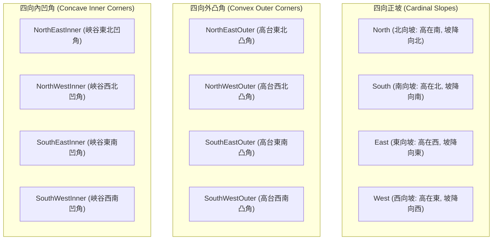
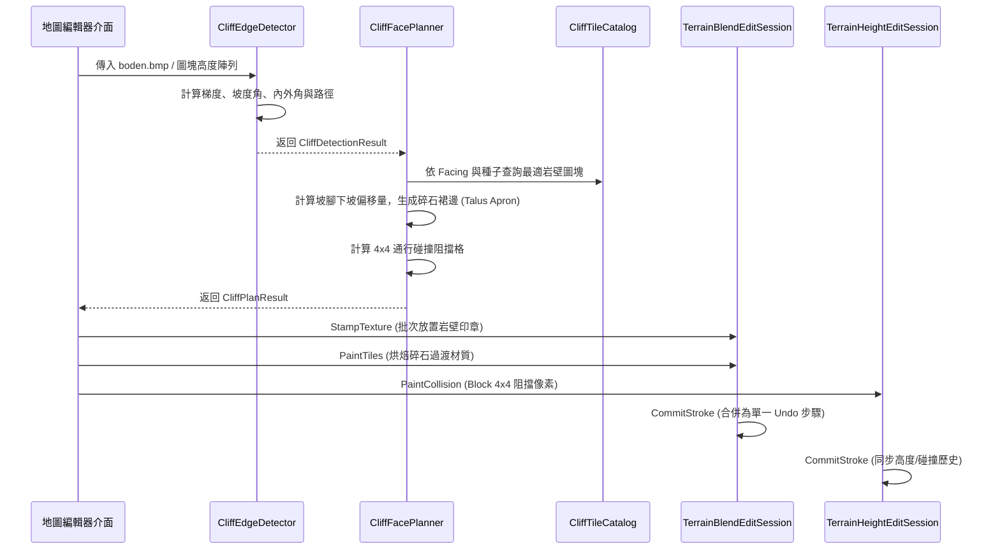
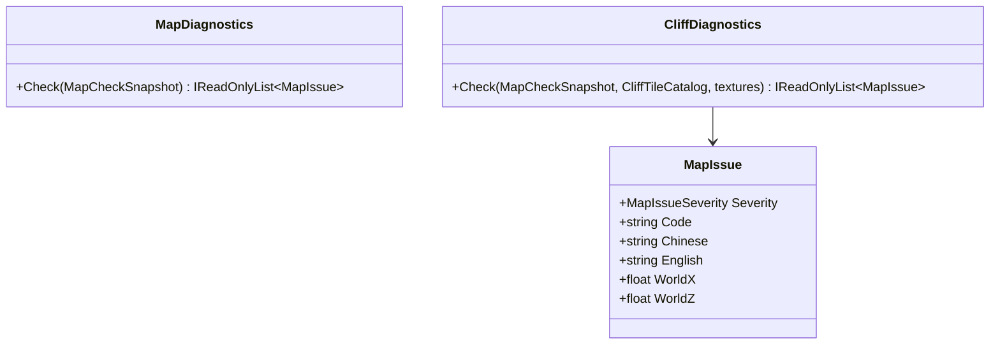

# 懸崖與陡坡岩壁自動接合印章系統架構設計 (Cliff & Elevation Transition Designer)

## 1. 系統背景與設計目標

### 1.1 核心問題與現狀
在《反抗羅馬》(Against Rome) 的官方地圖中，崇山峻嶺與峽谷斷崖並非單純依靠高度圖拉伸常規草地或泥土材質，而是大量使用了專門的岩壁與懸崖圖塊（例如 `FELS*`、`ITA_FELS*`、`Berg*`、`STEIN*` 等）。這些圖塊具備垂直斷崖的岩石紋理、陰影與立體切面，並在坡腳堆積了碎石岩屑（Talus/Scree Debris）。

目前的編輯器功能局限：
1. **依賴手動平滑與灰階調整**：地圖製作者使用 `TerrainHeightEditSession` 繪製高程起伏後，若坡度過陡，地表貼圖只會被視為常規過渡，在 3D 視圖與遊戲中產生嚴重的紋理拉伸失真。
2. **缺乏等高線懸崖印章生成**：製作者必須手動切換至「印章模式」(`_stampMode`)，逐格尋找並蓋上 `FELS` 圖塊，且極難手動對齊朝向（北向、南向、東向、西向、轉角）。
3. **碰撞阻擋不同步**：原版遊戲中坡度超過 $45^\circ$ 的懸崖不可通行（`collision.bmp` 須標記為 `255` 阻擋），手動畫圖容易遺漏碰撞層，導致部隊在垂直懸崖上攀爬或穿模。
4. **缺少坡腳過渡**：峭壁下方缺乏碎石/碎屑材質過渡帶，斷崖與草地交界生硬。

### 1.2 系統設計目標
本系統旨在提供**全自動化的「等高線梯級岩壁接合印章系統」**：
- **自動特徵偵測**：從 `boden.bmp`（257×257 頂點高度圖）或圖塊高度陣列中自動計算梯度向量 $\nabla h$，識別坡度 $\theta \ge 45^\circ$ 或高度差 $\Delta h \ge 15$ 的陡坡邊界。
- **朝向智能匹配**：精準分類正向坡（北/南/東/西）、外凸角（Convex Outer Corners）與內凹角（Concave Inner Corners）。
- **自然過渡與碎石裙邊**：在懸崖坡腳（下坡側）自動展開 1~2 格的碎石/岩屑材質（如 `BK` 灰色碎石地、`B8` 深褐砂礫），並調用原生 4U/4T 過渡烘焙以消除生硬邊界。
- **碰撞自動同步**：自動在 256×256 的 `collision.bmp` 對應區域標記阻擋（4×4 像素/圖塊），保證遊戲內部隊尋路正確。
- **地圖診斷連動**：無縫串接 `MapDiagnostics`，檢查未阻擋的危險陡坡、缺少碰撞的懸崖印章與孤立高台。

---

## 2. 幾何座標與網格映射模型

《反抗羅馬》的地圖資料結構具有嚴謹的幾何比例換算關係：

| 圖層維度 | 解析度 | 網格單位 | 世界空間對應 (X, Z: 0~16384) | 備註 |
| :--- | :--- | :--- | :--- | :--- |
| 地表圖塊網格 (`boden.txt`) | $64 \times 64$ | 1 Tile | $256 \times 256$ 世界單位 | 紋理與印章的配置基準 |
| 頂點高度圖 (`boden.bmp`) | $257 \times 257$ | 1 Vertex | $64 \times 64$ 世界單位 | 綠通道 G: 0~255，真實高度 $Y = G \times 4$ |
| 通行碰撞圖 (`collision.bmp`) | $256 \times 256$ | 1 Collision Pixel | $64 \times 64$ 世界單位 | 0 = 可通行，255 = 阻擋 |

### 2.1 坡度與高程差換算數學
- 水平頂點間距：$\Delta X_{\text{vertex}} = 64$ 世界單位。
- 高程差尺度：原版 `Heightmapstep = 4`，故頂點灰階差 $\Delta G$ 對應之世界高度差 $\Delta Y = \Delta G \times 4$。
- 坡度角公式：
  $$\tan \theta = \frac{\Delta Y}{\Delta X_{\text{vertex}}} = \frac{\Delta G \times 4}{64} = \frac{\Delta G}{16}$$
  $$\theta = \arctan\left(\frac{\Delta G}{16}\right) \times \frac{180^\circ}{\pi}$$
- 當 $\Delta G = 15$ 時，$\tan \theta = \frac{15}{16} = 0.9375 \implies \theta \approx 43.15^\circ$。
- 當 $\Delta G = 16$ 時，$\tan \theta = 1.0 \implies \theta = 45.0^\circ$。
因此，設計規格中定義的 **高度差 $\Delta G \ge 15$** 與 **坡度 $\theta \ge 45^\circ$** 在頂點尺度上高度一致，是判斷無法通行的天然峭壁之黃金臨界值。

---

## 3. 懸崖圖塊目錄系統 (`CliffTileCatalog`)

### 3.1 峭壁朝向分類 (`CliffFacing`)
懸崖圖塊的本質是「遮蓋垂直高低落差」的面磚。依據地勢跌落方向與轉角拓撲，定義 12 種基本朝向：

### 3.2 支援的懸崖圖塊家族 (`CliffFamilyInfo`)
系統預置四大原版岩壁家族，並支援使用者自訂擴充：
1. **溫帶標準岩壁 (`FELS`)**：
   - 包含圖塊：`FELS_N1..2`, `FELS_S1..2`, `FELS_E1..2`, `FELS_W1..2`, `FELS_NE_OUT`, `FELS_NE_IN`, `FELS1..3`。
   - 坡腳碎石材質：`BK`（灰色碎石地）。
   - 崖頂邊緣過渡：`B8`（深褐砂礫）。
2. **地中海/義大利岩壁 (`ITA_FELS`)**：
   - 包含圖塊：`ITA_FELS_N*`, `ITA_FELS_S*`, `ITA_FELS_SO_OUT` 等。
   - 坡腳碎石材質：`B8`（深褐砂礫）。
   - 崖頂邊緣過渡：`B4`（黃褐土壤）。
3. **高山岩壁 (`Berg`)**：
   - 包含圖塊：`Berg_N*`, `Berg_S*`, `Berg1..2` 等。
   - 坡腳碎石材質：`BK`（灰色碎石地）。
   - 崖頂邊緣過渡：`B3`（灰色岩地）。
4. **石質陡坡 (`STEIN`)**：
   - 包含圖塊：`STEIN_N*`, `STEIN_S*`, `STEIN1`, `STEINBODEN1` 等。
   - 坡腳碎石材質：`BG`（礫石地）。
   - 崖頂邊緣過渡：`B2`（乾燥土壤）。

### 3.3 變體隨機挑選與容錯回退機制
- **坐標偽隨機算法 (`PickVariant`)**：
  使用空間位置雜湊函數：
  $$\text{hash} = \left((x \times 374761393 + y \times 668265263 + \text{seed} \times 1442695041) \oplus (\dots)\right)$$
  確保同一地點在相同種子下結果完全確定，長條岩壁沿線可均勻交替展現變體（如 `FELS_N1` 與 `FELS_N2`），避免視覺疲勞。
- **階梯式回退機制 (Fallback Hierarchy)**：
  1. 首選：指定家族之指定朝向圖塊（如 `FELS` + `NorthEastOuter`）。
  2. 回退 1：跨家族之相同朝向圖塊（若 `ITA_FELS` 缺內凹角，回退取用 `FELS` 內凹角）。
  3. 回退 2：轉角退回相鄰正向坡（如 `NorthEastOuter` 退回 `North` 或 `East`）。
  4. 回退 3：同家族之泛用印章圖塊（如 `FELS1`、`FELS2`）。
  5. 回退 4：全局可用之任一岩石圖塊。

---

## 4. 懸崖邊界偵測演算法 (`CliffEdgeDetector`)

### 4.1 圖塊級與頂點級梯度計算
為了避免單純在 $64 \times 64$ 圖塊中心採樣導致細小山脊被抹平，系統提供雙軌偵測：
1. **頂點降採樣聚合 (`DetectFromVertexHeights`)**：
   對每個 $4 \times 4$ 頂點區間，同時計算：
   - 平均高程：$H_{\text{avg}}(tx, ty)$
   - 圖塊內部極差：$\Delta H_{\text{intra}} = \max(G_{\text{vertex}}) - \min(G_{\text{vertex}})$
   若 $\Delta H_{\text{intra}} \ge 15$，即便相鄰圖塊均高相近，依然精準判定為內部突變懸崖。
2. **中心差分梯度**：
   $$G_x = \frac{H(x+1, y) - H(x-1, y)}{2}, \quad G_y = \frac{H(x, y+1) - H(x, y-1)}{2}$$

### 4.2 內凹與外凸特徵判定矩陣
令圖塊相對於北、南、東、西四鄰格的高程差為：
$$\text{drop}_N = H(x, y) - H(x, y-1), \quad \text{drop}_S = H(x, y) - H(x, y+1)$$
$$\text{drop}_E = H(x, y) - H(x+1, y), \quad \text{drop}_W = H(x, y) - H(x-1, y)$$
取正向跌落 $D = \max(0, \text{drop})$ 與正向上坡壁面 $U = \max(0, -\text{drop})$，以門檻值 $\tau = \text{minElevationDelta} \times 0.5$ 進行判定：

| 特徵類別 | 條件判定 | 朝向分類 | 幾何意義 |
| :--- | :--- | :--- | :--- |
| **外凸角 (Outer Corner)** | $D_N \ge \tau \land D_E \ge \tau$ | `NorthEastOuter` | 高台向北、東兩側下落，山脊頂角突出 |
| | $D_N \ge \tau \land D_W \ge \tau$ | `NorthWestOuter` | 高台向北、西兩側下落 |
| | $D_S \ge \tau \land D_E \ge \tau$ | `SouthEastOuter` | 高台向南、東兩側下落 |
| | $D_S \ge \tau \land D_W \ge \tau$ | `SouthWestOuter` | 高台向南、西兩側下落 |
| **內凹角 (Inner Corner)** | $U_N \ge \tau \land U_E \ge \tau$ | `NorthEastInner` | 北、東兩側皆為高壁，低地形成峽谷內凹角 |
| | $U_N \ge \tau \land U_W \ge \tau$ | `NorthWestInner` | 北、西兩側皆為高壁 |
| | $U_S \ge \tau \land U_E \ge \tau$ | `SouthEastInner` | 南、東兩側皆為高壁 |
| | $U_S \ge \tau \land U_W \ge \tau$ | `SouthWestInner` | 南、西兩側皆為高壁 |
| **正向坡 (Cardinal Slope)** | $\max(D) == D_N$ | `North` | 向北下坡 |
| | $\max(D) == D_S$ | `South` | 向南下坡 |
| | $\max(D) == D_E$ | `East` | 向東下坡 |
| | $\max(D) == D_W$ | `West` | 向西下坡 |

### 4.3 階梯式等高線路徑鏈接 (`ChainContours`)
1. 將所有偵測出的 `CliffCell` 放入空間池中。
2. 採用 8-鄰域優先圖搜尋，將相鄰單元鏈接為連續的 `CliffContourPath`。
3. 判定路徑首尾距離：若首尾圖塊相鄰，標記為 `IsClosedLoop = true`（閉合山脊/環形火山口）。

---

## 5. 懸崖岩壁與過渡生成規劃器 (`CliffFacePlanner`)

### 5.1 規劃管線流程

### 5.2 碎石坡腳 (Talus/Scree Apron) 計算演算法
根據每個懸崖圖塊的朝向，沿著坡度下落方向向外尋找低地鄰格：
- `North` $\implies (0, -1)$
- `South` $\implies (0, 1)$
- `East` $\implies (1, 0)$
- `West` $\implies (-1, 0)$
- `NorthEastOuter` $\implies (0, -1), (1, 0), (1, -1)$
- `NorthEastInner` $\implies (0, 1), (-1, 0)$

碎石過渡格必須滿足：
1. 位於地圖邊界內。
2. **不是懸崖圖塊本體**（不覆蓋峭壁印章）。
3. 使用 `blendSession.PaintTiles(..., autoBridge: true)` 繪製，利用編輯器既有的 4U/4T 過渡烘焙演算法，自動在碎石與外側草地/泥地之間插入原版過渡圖塊，呈現極為自然的滑坡風化效果。

---

## 6. 與現有 `MapDiagnostics` 連動驗證合約

### 6.1 診斷檢查規則 (`CliffDiagnostics`)

1. **`cliff-steep-unblocked`（陡坡未阻擋警告）**：
   - 觸發條件：高度圖中存在坡度 $\ge 45^\circ$ 或 $\Delta h \ge 15$ 之陡坡，但對應的 `collision.bmp` 像素為 `0`（完全可通行）。
   - 級別：`Warning`。
   - 提示：`坡度超過 45 度之陡坡未設定通行阻擋，單位可能異常攀爬。`
2. **`cliff-missing-collision`（懸崖印章缺碰撞警告）**：
   - 觸發條件：圖塊地表已被蓋上 `FELS*`、`ITA_FELS*`、`Berg*` 等岩壁圖塊，但其通行碰撞層未標記阻擋。
   - 級別：`Warning`。
   - 提示：`懸崖岩壁圖塊處未阻擋通行，單位可能穿透垂直岩壁。`
3. **`cliff-isolated-plateau`（孤立高台檢查）**：
   - 觸發條件：封閉的懸崖環（Closed Loop）造成高台或盆地內部放置的部隊/建築無法透過可通行路徑抵達玩家起點。
   - 與 `MapDiagnostics` 現有的連通分量檢查（BFS Flood-Fill）整合，標出斷開的孤立區域。

---

## 7. 核心模組架構與 C# 參考實作

### 7.1 模組分層
所有模組均實作於獨立的純領域類別庫 `src.MapEditor.Modules/`，不相依於 Windows Forms 或 OpenGL，便於 CI 單元測試與自動化建置。

- `src.MapEditor.Modules/Terrain/CliffTileCatalog.cs`：朝向幾何、圖塊目錄、家族配置、隨機加權挑選。
- `src.MapEditor.Modules/Terrain/CliffEdgeDetector.cs`：梯度計算、坡度換算、特徵識別、等高線鏈接。
- `src.MapEditor.Modules/Terrain/CliffFacePlanner.cs`：印章規劃、碎石過渡帶計算、碰撞像素標記、交易套用整合。
- `src.MapEditor.Modules/Diagnostics/CliffDiagnostics.cs`：陡坡與懸崖通行性合約驗證。

---

## 8. 驗證計劃與測試矩陣

| 測試案例 | 驗證標的 | 預期結果 |
| :--- | :--- | :--- |
| `CliffTileCatalogTests.Default_catalog_registers_standard_families` | 四大家族與全部朝向枚舉註冊 | `FELS`, `ITA_FELS`, `Berg`, `STEIN` 全部就緒，正坡與內外角皆有條目 |
| `CliffTileCatalogTests.PickTile_selects_matching_facing_and_respects_family` | 家族風格隔離與朝向精確匹配 | 挑選 `ITA_FELS` + `South` 穩定產出 `ITA_FELS_S*` |
| `CliffTileCatalogTests.PickTile_falls_back_gracefully` | 缺少外凸角時的自動層級回退 | 安全回退至相鄰正坡或通用印章，無異常擲出 |
| `CliffTileCatalogTests.PickTile_deterministic_variant_distribution` | 相同座標/種子一致性，不同座標變體多樣性 | 相同座標產出一致；多座標遍歷涵蓋 `N1` 與 `N2` 變體 |
| `CliffEdgeDetectorTests.DetectFromTileHeights_north_facing_cliff` | 高低階梯的正向坡識別 | 正確標記脊線為 `South` 下坡峭壁 |
| `CliffEdgeDetectorTests.DetectFromTileHeights_outer_convex_corner` | 西南高台的東北角點識別 | 精確判定為 `NorthEastOuter` |
| `CliffEdgeDetectorTests.DetectFromTileHeights_inner_concave_corner` | 峽谷凹灣的低地角點識別 | 精確判定為 `NorthEastInner` |
| `CliffEdgeDetectorTests.Flat_terrain_detects_no_cliffs` | 完全平坦地面無誤報 | 懸崖單元與路徑數量皆為 0 |
| `CliffEdgeDetectorTests.DetectFromVertexHeights_intra_tile` | 圖塊內部頂點劇烈落差保護 | 圖塊平均值相近時仍能依內部極差判定懸崖 |
| `CliffFacePlannerTests.Plan_matches_cliff_stamps_and_generates_scree` | 完整規劃流程與碎石帶生成 | 懸崖放置合適圖塊，碎石帶位於下坡側且不覆蓋懸崖本體，生成 16 像素/圖塊之碰撞阻擋 |
| `CliffDiagnosticsTests.Unblocked_steep_slope_triggers_warning` | 陡坡無碰撞診斷合約 | 報告 `cliff-steep-unblocked` 警告 |
| `CliffDiagnosticsTests.Cliff_texture_without_collision_triggers_warning` | 懸崖圖塊無碰撞診斷合約 | 報告 `cliff-missing-collision` 警告 |
