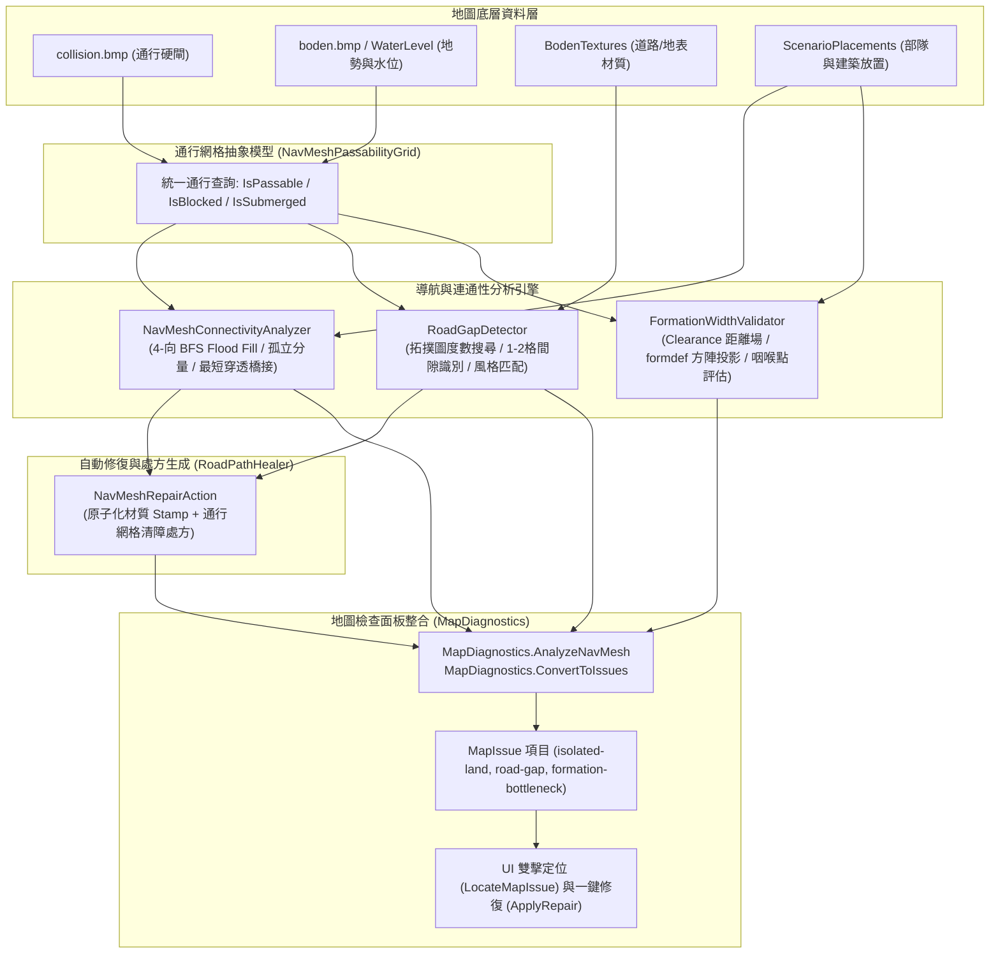

# 道路網尋路與通行網格連通性自動修復系統設計 (NavMesh & Pathfinding Connectivity Healer)

## 1. 系統背景與核心痛點

### 1.1 背景
在《反抗羅馬》(Against Rome) 的地圖系統中，單位導航與地圖可通達性高度依賴多層資料結構的協同配合：
1. **世界空間座標系**：
   - 地圖全域尺寸固定為 $16384 \times 16384$ 浮點世界單位（World Units），範圍為 $[0, 16383]$。
2. **通行網格 (`collision.bmp`)**：
   - 原始格式為 $256 \times 256$ 像素的 8-bit / 24-bit 點陣圖，每個像素對應地圖上一個 $64 \times 64$ 世界單位的邏輯格子（$16384 / 256 = 64$）。
   - 數值語意：像素非黑值（$(R+G+B)/3$ 或灰階值）代表通行阻擋硬閘；$0 = \text{Passable}$（可通行），$255 = \text{Blocked}$（完全阻擋）。
3. **水面高度阻擋**：
   - 地表頂點高度檔 `boden.bmp` 取綠通道高度值乘以 `Heightmapstep`（通常為 4.0 單位）。
   - 當地表世界高度低於地圖水位線（`WaterLevel`）時，即便 `collision.bmp` 數值為 0，單位仍無法下水行走，形成隱式自然阻擋。
4. **道路系統圖塊**：
   - 包含標準石道（`H_WEG1..5`, `V_WEG1..3`, `weg1..3`）、羅馬道路（`WEG_H1..2ROM`, `WEG_V1..4ROM`, `Pflaster_braun1..3`）以及邊界土路（`PFAD*` 系列）。道路通常需要平滑無中斷鋪設並配套通行網格清理。
5. **部隊方陣尺寸 (`formdef.dau`)**：
   - 部隊並非單兵行動，而是以 1~20 人的方陣為單位（`ScenarioSpawn.Count`）。原生幾何線段來自 `formdef.dau`（如預設 ID 0 `All_Haufen`，包含 9 條原生線段），以 `spacing = 320` 展開成員。10~20 人的大方陣在世界空間中橫向與縱向寬度達到 $280 \sim 480$ 世界單位（相當於 $4 \sim 8$ 個通行網格寬）。

### 1.2 製圖痛點
在地圖編輯器實際製圖流程中，設計師在繪製地形、山脈、河流、自然樹木、建築物與道路後，經常面臨以下痛點：
- **微小斷路 (Road Gaps)**：手動繪製或自動筆刷轉角接合時，道路端點之間經常殘留 1~2 格未鋪設圖塊或被周遭地形圖塊截斷，視覺與路網邏輯均產生斷裂。
- **孤立陸地區域 (Isolated Land Pockets)**：河流環繞、懸崖阻隔、森林密集封死或人工圍牆封閉，導致大片陸地或小片資源點無法自玩家主基地到達，造成戰役無法通關或單位受困。
- **方陣咽喉點卡死 (Formation Bottlenecks / Choke Points)**：狹谷、吊橋、隘口或林間小徑寬度僅有 1~2 格（$64 \sim 128$ 單位），單兵可通過，但 10~20 人部隊進入時引發原版遊戲尋路擠壓、陣型撕裂、單位卡在懸崖或原版引擎寻路逾時崩潰。
- **通行硬閘脫節**：繪製道路後未同步清除 `collision.bmp` 上的阻擋值，導致畫面上「看起來有路，但部隊走不過去」。

---

## 2. 系統架構概覽 (System Architecture)

本系統採模組化、管線化（Pipeline）架構設計，劃分為四個專門模組與一個診斷對接介面：



### 元件職責分工
1. **`NavMeshPassabilityGrid`**：封裝世界空間與網格座標轉換，綜合 `collision.bmp` 與水面高度判斷單元格通行性。
2. **`NavMeshConnectivityAnalyzer`**：全圖連通分量劃分，以玩家起始部隊/基地為種子，標記孤立陸地並計算最短障礙穿透點。
3. **`RoadGapDetector`**：建立道路拓撲圖，找出度數 $\le 1$ 的端點，偵測 1~2 格距離之微小中斷，匹配圖塊風格（標準、羅馬、土路）。
4. **`FormationWidthValidator`**：計算通行距離場（Clearance Transform），對照 `formdef.dau` 方陣幾何寬度，評估部隊行進關鍵走廊與幾何隘口。
5. **`RoadPathHealer`**：將間隙與斷橋轉為具備原子性、可 Undo/Redo 的 `NavMeshRepairAction` 修復動作。
6. **`MapDiagnostics` 擴展合約**：將上述分析輸出轉換為標準 `MapIssue`，提供地圖檢查面板的視覺呈現、相機定位與一鍵修復按鈕。

---

## 3. 核心資料結構與合約 (Contracts)

### 3.1 座標與通用類型 (`NavMeshRepairContracts.cs`)
```csharp
namespace AgainstRomeMapEditor.Modules.Pathfinding;

public enum NavMeshIssueKind
{
    IsolatedLand,        // 孤立無法通達陸地
    RoadGap,             // 道路微小中斷
    FormationBottleneck, // 部隊方陣通道瓶頸
    SubmergedPassage     // 水下淹沒阻斷
}

public readonly record struct NavMeshCoordinate(int TileX, int TileZ, float WorldX, float WorldZ);
```

### 3.2 孤立陸地區域模型 (`IsolatedRegion`)
```csharp
public sealed record IsolatedRegion(
    int ComponentId,
    int TileCount,
    NavMeshCoordinate Centroid,
    int MinTileX,
    int MinTileZ,
    int MaxTileX,
    int MaxTileZ,
    bool ContainsTroopOrBuilding,
    NavMeshCoordinate? RecommendedBridgePoint = null,
    int BridgeDistance = 0);
```

### 3.3 道路間隙候選模型 (`RoadGapCandidate`)
```csharp
public sealed record RoadGapCandidate(
    NavMeshCoordinate Start,
    NavMeshCoordinate End,
    IReadOnlyList<NavMeshCoordinate> GapTiles,
    int GapDistance,
    string SuggestedTexture,
    bool RequiresCollisionClear,
    string Style = "Standard");
```

### 3.4 方陣通道瓶頸模型 (`FormationChokePoint`)
```csharp
public sealed record FormationChokePoint(
    NavMeshCoordinate Location,
    int MeasuredClearanceTiles,
    float MeasuredWidthUnits,
    int RequiredClearanceTiles,
    float RequiredWidthUnits,
    int MaxSafeUnitCount,
    int BlockedTroopCount,
    string ChokeType = "Corridor");
```

### 3.5 原子化修復處方 (`NavMeshRepairAction`)
```csharp
public sealed record NavMeshTileChange(int TileX, int TileZ, string? NewTexture = null, byte? NewCollision = null);

public sealed record NavMeshRepairAction(
    string Id,
    NavMeshIssueKind Kind,
    string TitleZh,
    string TitleEn,
    string DescriptionZh,
    string DescriptionEn,
    IReadOnlyList<NavMeshTileChange> Changes,
    NavMeshCoordinate FocusLocation);
```

---

## 4. 演算法設計與數學原理

### 4.1 全域通行網格連通性分析 (BFS Flood Fill)
1. **單元格通行性判定**：
   給定座標 $(x, z) \in [0, \text{Size}-1] \times [0, \text{Size}-1]$：
   $$\text{IsPassable}(x, z) = (\text{Collision}[z \times \text{Size} + x] == 0) \land (H(x, z) \times \text{HeightStep} \ge \text{WaterLevel})$$
2. **連通分量劃分**：
   - 使用 4-正交鄰接（North, East, South, West），排除對角接觸（原版 Against Rome 引擎中對角相鄰且兩側阻擋時視為硬碰撞，無法穿透）。
   - 對未標記單元格執行 BFS，劃分連通分量標籤 $C_0, C_1, C_2, \dots$。
3. **主要通達區 vs 孤立區標記**：
   - 提取玩家起始部隊（`Team == 0` 且 `Count > 0`）與基地建築（`Team == 0` 且 `IsBuilding`）所在單元格，標記其所屬連通分量為 $\text{PrimaryComponents}$。
   - 所有不屬於 $\text{PrimaryComponents}$ 的通行分量皆為 $\text{IsolatedRegion}$。
4. **最短穿透障礙橋樑點演算法 (Obstacle Penetration Bridge)**：
   - 為了協助設計師快速修復孤立區域，演算法以該孤立區域的外圍邊界格為起點，啟動多源 BFS 穿透阻擋格（最大深度 12 格）。
   - 當 BFS 首次接觸到屬於 $\text{PrimaryComponents}$ 的邊界格時，記錄中點座標為 `RecommendedBridgePoint`，阻擋格數為 `BridgeDistance`。這提供了精確的開山挖道或架橋建議。

### 4.2 道路拓撲分析與微小中斷偵測 (RoadGapDetector)
1. **道路圖塊識別與風格推斷**：
   - 依圖塊名稱前綴過濾：標準石道（`H_WEG*`, `V_WEG*`, `weg*`）、羅馬道路（`WEG_*ROM`, `Pflaster_braun*`）、土路（`PFAD*`）。
2. **端點（Dead-ends）提取**：
   - 計算每個道路格 $p$ 在道路子圖中的 4-鄰接度數：
     $$\deg(p) = \sum_{d \in \text{Orthogonal}} [p + d \in \text{RoadTiles}]$$
   - 當 $\deg(p) \le 1$ 時，$p$ 被標定為道路端點或孤立道路格。
3. **間隙候選搜索 (Gap Search)**：
   - 對任意兩端點 $E_1, E_2$，檢查曼哈頓距離與切比雪夫距離：
     $$1 \le \|E_1 - E_2\|_1 \le \text{MaxGap} + 1 \quad \text{且} \quad \max(|dx|, |dz|) \le \text{MaxGap} + 1$$
   - 直線水平對齊 ($E_1.Z == E_2.Z$)：中斷點為中間 missing 的 1~2 格。
   - 直線垂直對齊 ($E_1.X == E_2.X$)：中斷點為中間 missing 的 1~2 格。
   - 轉角對齊：以 L 型轉彎路徑挑選非道路單元格。
4. **圖塊與碰撞推薦**：
   - 水平缺口推薦水平直線片（`H_WEG1` / `WEG_H1ROM`）。
   - 垂直缺口推薦垂直直線片（`V_WEG1` / `WEG_V1ROM`）。
   - 轉角缺口推薦轉角路口片（`weg1` / `Pflaster_braun1`）。
   - 檢查缺口格子之 `collision.bmp`；若非 0，標記 `RequiresCollisionClear = true`。

### 4.3 部隊方陣通道寬度評估 (FormationWidthValidator)
#### 4.3.1 `formdef.dau` 方陣寬度數學模型
依據 `FormationLayout.cs` 解析的 Against Rome 原生規範，部隊成員依線段參數化取樣，並乘以 `spacing = 320` 展開。方陣橫向與縱向最大跨距推導如下：
- **單兵 ($N = 1$)**：佔地 1 個單元格（$64$ 單位）。
- **小隊 ($N \le 5$)**：橫向跨距約 $160$ 單位，需至少 $2$ 格淨寬。
- **標準方陣 ($N \le 10$)**：取樣原生 9 線段中段，橫向跨距 $\approx 256$ 單位，加上碰撞半徑邊界緩衝，需至少 $4$ 格淨寬（$280$ 單位）。
- **滿編大方陣 ($N \le 20$)**：全展開 9 線段，橫向跨距 $\approx 384$ 單位，加上部隊外圍緩衝，需至少 $6$ 格淨寬（$440$ 單位）。

#### 4.3.2 距離場 (Clearance Transform / Brushfire Algorithm)
對整個通行網格計算每個通暢單元格到最近障礙物的切比雪夫距離（Clearance）：
$$C(x, z) = \min_{(ox, oz) \in \text{Obstacles}} \max(|x - ox|, |z - oz|)$$
- 實作上採用多源 BFS（Multi-Source Breadth-First Search），初始時將全圖所有阻擋格及邊界入隊（$C = 0$），向周圍擴散填入 $C = 1, 2, 3, \dots$。
- 單元格 $(x, z)$ 的淨空格數為 $C(x, z)$，代表以該格為中心，半徑為 $C(x, z)$ 的方塊內全部為通暢陸地。

#### 4.3.3 咽喉點 (Choke Point) 識別
1. **行軍走廊咽喉點**：
   - 針對地圖中已放置的 $N$ 人部隊（`ScenarioSpawn.Count > 1`），以 A* / BFS 搜尋其通往主要目標或敵方基地的行軍路徑。
   - 沿途檢查路徑上單元格的淨空值 $C(x, z)$。若 $\min C(x, z) < \text{RequiredClearance}(N)$，則該最小值所在位置即為行軍卡死咽喉點。
2. **拓撲幾何隘口 (Geometrical Chasms)**：
   - 掃描全圖，尋找兩側緊鄰障礙牆（水平夾縫：$x-1$ 與 $x+1$ 皆為障礙；或垂直夾縫：$z-1$ 與 $z+1$ 皆為障礙）且通道寬度不足以通過 10 人方陣的狹隘通道。

---

## 5. 與現有 MapDiagnostics 的無縫整合合約

### 5.1 診斷資料流與合約介面
在 `MapDiagnostics.cs` 中增加進階導航分析與問題轉換合約：

```csharp
public static class MapDiagnostics
{
    // 現有儲存前快速檢查維持不變
    public static IReadOnlyList<MapIssue> Check(MapCheckSnapshot map);

    // 新增：進階 NavMesh 深度連通性、間隙與方陣通道分析
    public static NavMeshAnalysisResult AnalyzeNavMesh(
        MapCheckSnapshot map,
        IReadOnlyList<string>? textures = null,
        int minIsolatedSize = 1);

    // 新增：將 NavMesh 分析結果轉為 MapIssue 清單
    public static IReadOnlyList<MapIssue> ConvertToIssues(NavMeshAnalysisResult navResult);
}
```

### 5.2 MapIssue 代碼規範
轉換後的 `MapIssue` 具有標準嚴重度與座標錨點，可被 `MapEditorForm.Diagnostics.cs` 的 `LocateMapIssue()` 精確定位：
| 代碼 | 嚴重度 | 中文摘要範例 | 英文摘要範例 | 世界座標 (WorldX, WorldZ) |
| :--- | :--- | :--- | :--- | :--- |
| `isolated-land` | Warning | 發現孤立無法通達的陸地區域（共 48 格），部隊無法前往。 | Isolated land region detected (48 tiles); troops cannot reach this area. | 孤立區域幾何重心 |
| `road-gap` | Warning | 偵測到道路中斷（間距 1 格，Standard 風格），建議補齊圖塊「H_WEG1」。 | Road gap detected (1 tiles, Standard style); recommend placing 'H_WEG1'. | 間隙單元格中心 |
| `formation-bottleneck` | Warning | 關鍵通道淨寬僅 1 格（約 64 單位），無法容納 10 人方陣通行（需 4 格，安全上限 1 人）。 | Choke point clearance is only 1 tiles (~64 units); cannot fit 10-man formation (requires 4 tiles, safe max 1). | 隘口最窄處單元格中心 |

### 5.3 編輯器 UI 交互與自動修復操作流 (Auto-Heal Workflow)
1. **檢驗觸發**：
   - 使用者在「地圖檢查 (Map Check)」分頁點擊「立即檢查」按鈕時，背景管線同時呼叫 `MapDiagnostics.Check` 與 `MapDiagnostics.AnalyzeNavMesh`。
2. **視圖定位**：
   - 使用者在問題清單雙擊 `road-gap` 或 `isolated-land` 時，`LocateMapIssue` 自動呼叫：
     `_canvas.FocusTile(issue.WorldX / 256, issue.WorldZ / 256);`
     `_view3d?.FocusTile(issue.WorldX / 256, issue.WorldZ / 256);`
3. **一鍵修復 (Heal / Apply Fix)**：
   - 於面板提供「自動修復此問題 (Auto-Heal)」按鈕。
   - 呼叫 `RoadPathHealer.ApplyRepair(action, _terrainBlendSession, _terrainLayers)`：
     - 自動在 `_terrainBlendSession` 調用 `StampTexture` 補齊圖塊。
     - 若需要清理碰撞，在 `_terrainLayers` 調用 `PaintCollision(x, z, 0.5f, Clear)`。
     - 提交為單一步驟的 Undo/Redo 交易，支援一鍵復原。

---

## 6. 效能評估與空間複雜度

在典型的 $256 \times 256$ 地圖（共 65,536 個單元格）下，本系統各模組的效能基準如下：

| 分析模組 | 演算法 | 時間複雜度 | 空間複雜度 | 預期執行時間 ($256 \times 256$) |
| :--- | :--- | :--- | :--- | :--- |
| `NavMeshConnectivityAnalyzer` | 4-向 BFS Flood Fill | $O(S^2)$ | $O(S^2)$ (整數陣列 $\approx 256\text{ KB}$) | $\approx 2.5 \sim 4.0\text{ ms}$ |
| `Obstacle Bridge Search` | 多源 BFS (限深 12) | $O(K \times \text{depth})$ | $O(K)$ | $\approx 0.5 \sim 1.0\text{ ms}$ |
| `RoadGapDetector` | 拓撲度數搜尋 + 局部半徑搜索 | $O(R + E \times r^2)$ | $O(R)$ ($R \le 5000$) | $\approx 0.8 \sim 1.5\text{ ms}$ |
| `FormationWidthValidator` | 多源距離場 BFS | $O(S^2)$ | $O(S^2)$ (距離場 $\approx 256\text{ KB}$) | $\approx 3.0 \sim 5.0\text{ ms}$ |
| **全套分析總計** | **組合管線** | **$O(S^2)$** | **$< 1\text{ MB}$ 記憶體配置** | **$< 12\text{ ms}$** |

> **結論**：全套 NavMesh 分析能在 12 毫秒內全圖完成，可在地圖編輯器存檔前、切換分頁或使用者點擊「立即檢查」時即時同步執行，完全不阻塞 UI 主執行緒。

---

## 7. 驗證與測試策略

### 7.1 單元測試覆蓋清單 (`NavMeshRepairTests.cs`)
1. **`ConnectivityAnalyzer_Detects_Isolated_Land_And_Finds_Bridge`**：
   - 驗證單一阻擋牆將地圖分割為左、右兩半時，右半部建築物被正確識別為孤立陸地，並精確找出穿透厚度為 1 格的橋接點。
2. **`RoadGapDetector_Finds_1Tile_And_2Tile_Gaps_With_Correct_Style`**：
   - 驗證水平 1 格標準石道間隙與垂直 2 格羅馬道路間隙的精確偵測，確認圖塊推薦（`H_WEG1`, `WEG_V1ROM`）與碰撞清障旗標標註。
3. **`FormationWidthValidator_Identifies_Choke_Points_For_Squads`**：
   - 驗證 1 格寬度的夾縫通道對 10 人方陣（需 4 格淨寬）精確觸發 `FormationChokePoint` 警告，且安全上限僅為 1 人。
4. **`RoadPathHealer_Creates_Actionable_Repairs`**：
   - 驗證將間隙候選轉為包含材質 Stamp 與通行清除之原子變更處方。
5. **`MapDiagnostics_Integration_Emits_NavMesh_Issues_Seamlessly`**：
   - 驗證全域分析結果無縫整合進 `MapDiagnostics.ConvertToIssues`，產生標準 `MapIssue` 並對齊世界空間座標。
