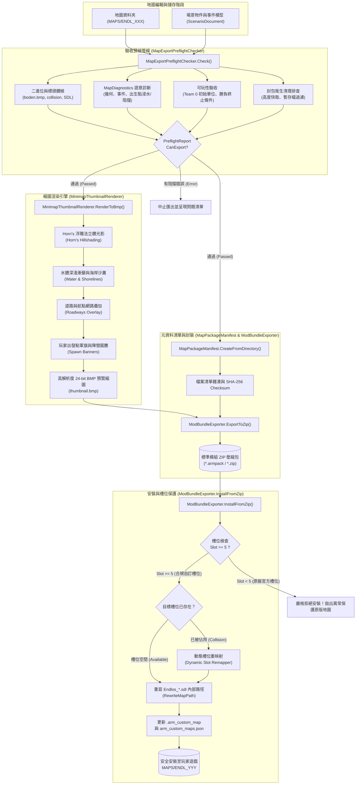

# 《反抗羅馬》(Against Rome) 地圖模組打包、元資料與發布匯出系統設計
## Map Packaging, Metadata & Mod Publishing Pipeline Architecture Design

> **文件狀態**：已審核並實作於核心模組原型 (`AgainstRomeMapEditor.Modules.Packaging`)  
> **適用版本**：Against Rome Modifier / Map Editor 1.0+  
> **主要語言**：繁體中文 (Traditional Chinese)，保留專業技術名詞、API 與檔案路徑  

---

## 1. 系統背景與核心挑戰 (Background & Challenges)

《反抗羅馬》(Against Rome, 2004) 作為經典即時戰略遊戲，其地圖系統在底層設計上具有高度的專有性與複雜性。當製圖者使用《反抗羅馬地圖編輯器》(Against Rome Map Editor) 完成一張自訂地圖時，整張地圖並非單一的資料檔案，而是由橫跨多個子目錄、數十個異質檔案組成的複雜集合：

```
MAPS/ENDL_005/
├── boden.bmp               # 257×257 24-bit BMP 地形高度圖（綠通道編碼高度）
├── boden.ini               # 水位高度、水面光照擾動、日夜時段參數
├── emboss.bmp              # 257×257 24-bit BMP 地形立體浮雕圖
├── collision.bmp           # 256×256 24-bit BMP 通行阻擋圖（0: 可通行，非0: 障礙）
├── minimap.bmp             # 256×256 24-bit BMP 遊戲內 HUD 小地圖
├── vertex.bmp              # 257×257 頂點光照著色圖
├── smooth.bmp              # 257×257 地形平滑權重圖
├── floortex.dat            # 地表紋理圖塊混合資料
├── skydens.dat             # 天空遮蔽快取（高度相依，引擎會自動重算）
├── visible.dat             # 視野可見性快取（高度相依）
├── cliprect.dat            # 視錐體裁剪矩形快取（高度相依）
├── shadows.dat             # 地面陰影烘焙快取（高度相依）
├── .arm_custom_map         # ARM 自訂地圖特徵標記 (JSON)
├── arm_scenario.json       # ARM 編輯器場景放置與觸發事件模型
├── Endlos_005_Siedlung*.sdl # 聚落建築與原生場景定義（內部硬編碼地圖路徑）
├── TEXT/US/briefing.put    # 英文地圖標題、簡報、各隊伍名稱字串
├── DATA/
│   ├── objects.dat         # 世界物件資料庫
│   ├── objdata.dat         # 物件擴充屬性
│   ├── pos.dat             # 物件三維空間坐標池
│   ├── way.dat             # 尋路航點與路徑網路
│   └── (其餘 12 個資料池)   # anim, gfxtype, action, hirarchy, formatio, lager 等
└── SCRIPT/
    ├── ak_level.bci        # 編譯後虛擬機位元組碼（關卡主邏輯）
    └── ak_level.arm_original
```

### 1.1 現存模組發布的核心痛點
1. **目錄繁雜且易缺漏**：若製圖者自行手動壓縮資料夾，極易遺漏 `TEXT/US/briefing.put`、`DATA/objects.dat` 或 `SCRIPT/ak_level.bci`，導致其他玩家載入時遊戲崩潰或黑畫面。
2. **槽位衝突與覆蓋原廠地圖的致命風險**：
   - 原廠官方戰役與無盡模式預設佔用 `ENDL_000` 至 `ENDL_004`。
   - 若製圖者隨意發布名為 `ENDL_000` 的壓縮包，一旦玩家解壓縮覆蓋，將直接摧毀官方內建地圖！
   - 自訂槽位若固定為 `ENDL_005`，多名製圖者的作品會在玩家電腦中互相踩踏覆蓋。
3. **SDL 內部硬編碼路徑死鎖**：`Endlos_005_Siedlung1.sdl` 檔案內部硬寫了 `name = MAPS/ENDL_005/Endlos_005_Siedlung1.sdl`。如果玩家手動將地圖資料夾重新命名為 `ENDL_008`，遊戲引擎在解析 SDL 時將無法正確識別相對路徑，造成建築與聚落失蹤。
4. **冗餘與污染快取外流**：地圖的高度相依快取（`skydens.dat`, `shadows.dat` 等）體積巨大（數 MB）且依賴生成時的高度總和雜湊；若外發到其他電腦，可能引發光影與可見度快取錯亂。
5. **缺乏標準元資料與高品質預覽縮圖**：社群分享缺少標題、多語系簡報、推薦人數、作者資訊等標準中繼資料；原生 `minimap.bmp` 解析度低且欠缺立體感與出發點標註，難以在模組管理器或社群網站中展現質感。

---

## 2. 總體架構概觀 (System Architecture Overview)

為了解決上述問題，本系統建立了標準化的「地圖模組打包、元資料與發布匯出系統 (Map Packaging, Metadata & Mod Publishing Pipeline)」，其四大核心組件與流轉關係如下：



---

## 3. MapPackageManifest：地圖元資料與雜湊校驗系統

`MapPackageManifest` 定義了地圖模組的標準數位身分證 (Digital Passport)。發布時以標準 JSON 格式儲存於壓縮包根目錄的 `manifest.json`。

### 3.1 JSON Schema 規格與資料模型
Manifest 涵蓋了模組識別、多語系資訊、玩家推薦配置、尺寸參數、相容性策略及檔案完整性清單：

```csharp
namespace AgainstRomeMapEditor.Modules.Packaging;

/// <summary>多語系簡報與標題資訊。</summary>
public sealed record MapPackageLocalization(
    string Title,
    string? Subtitle = null,
    string? BriefingText = null,
    IReadOnlyList<string>? TeamNames = null);

/// <summary>推薦玩家配置與人數。</summary>
public sealed record MapRecommendedPlayers(
    int MinPlayers = 1,
    int MaxPlayers = 4,
    int OptimalPlayers = 2,
    string TeamConfigurations = "1v1, 2v2, FFA",
    string FactionRestrictions = "Any");

/// <summary>地圖尺寸、坐標系與高度參數。</summary>
public sealed record MapPackageDimensions(
    int GridWidth = 256,
    int GridHeight = 256,
    float WorldUnitsWidth = 16384f,
    float WorldUnitsHeight = 16384f,
    float HeightStep = 4.0f,
    float WaterLevel = 0f);

/// <summary>模組封包內部檔案分類。</summary>
public enum MapFileCategory
{
    TerrainHeight, TerrainEmboss, TerrainVertex, TerrainSmooth,
    Collision, Minimap, TextureBlending, DataPool, Script,
    Localization, SettlementSdl, ScenarioJson, CustomMarker,
    Thumbnail, Documentation, Auxiliary
}

/// <summary>檔案清單中的單一檔案項目與校驗碼。</summary>
public sealed record MapPackageFileEntry(
    string RelativePath,
    long SizeBytes,
    string Sha256,
    MapFileCategory Category,
    bool IsRequired = true);

/// <summary>槽位相容性與執行策略。</summary>
public sealed record MapCompatibilityPolicy(
    int PreferredSlot = 5,
    bool AllowDynamicSlotRemapping = true,
    bool StandaloneLevel = false,
    string MinGameVersion = "1.0",
    string TargetPatch = "None");
```

### 3.2 組合雜湊校驗演算法 (Package Checksum)
為防止模組包在傳輸、下載或解壓過程中遭受篡改或損毀，`MapPackageManifest` 實作了決定性的 SHA-256 複合 Checksum 演算法：

$$\text{CanonicalString} = \text{PackageId} \parallel \text{Version} \parallel \text{Dimensions} \parallel \text{PreferredSlot} \parallel \sum_{f \in \text{SortedFiles}} (\text{path}_f : \text{size}_f : \text{sha256}_f)$$

```csharp
public string ComputePackageChecksum()
{
    var builder = new StringBuilder();
    builder.Append(PackageId).Append('|')
           .Append(Version).Append('|')
           .Append(Dimensions.GridWidth).Append('x').Append(Dimensions.GridHeight).Append('|')
           .Append(Compatibility.PreferredSlot).Append('|');

    foreach (MapPackageFileEntry file in Files.OrderBy(f => f.RelativePath, StringComparer.OrdinalIgnoreCase))
    {
        builder.Append(file.RelativePath.ToLowerInvariant()).Append(':')
               .Append(file.SizeBytes).Append(':')
               .Append(file.Sha256).Append(';');
    }

    byte[] hash = SHA256.HashData(Encoding.UTF8.GetBytes(builder.ToString()));
    return Convert.ToHexString(hash);
}
```

---

## 4. MinimapThumbnailRenderer：發布縮圖渲染引擎

為了擺脫原生 `minimap.bmp` 低解析度 (256×256) 且缺乏立體深度的限制，發布管線整合了純受控 C# 實作的 `MinimapThumbnailRenderer`。它不依賴任何圖形 API (OpenGL/DirectX/Vulkan) 或視窗控制項，能以極致效能產生高達 512×512 或 1024×1024 的精美預覽圖。

### 4.1 演算法原理與四大視覺圖層

#### 1. Horn's Hillshading 地貌立體浮雕演算法
取樣地形高度圖（`boden.bmp`），透過中心差分法計算各網格點之水平與垂直斜率梯度 $\frac{\partial z}{\partial x}$ 與 $\frac{\partial z}{\partial y}$：

$$\frac{\partial z}{\partial x} = \frac{(h_{x+1, y} - h_{x-1, y}) \cdot \text{HeightStep}}{2 \cdot \Delta x}, \quad \frac{\partial z}{\partial y} = \frac{(h_{x, y+1} - h_{x, y-1}) \cdot \text{HeightStep}}{2 \cdot \Delta y}$$

設定太陽光源方位角 $\theta_{\text{azimuth}} = 315^\circ$（標準製圖學的西北偏北光源），俯仰角 $\alpha_{\text{altitude}} = 45^\circ$，求得光線方向向量 $\vec{L}$ 與地表法向量 $\vec{N}$。藉由蘭伯特反射模型 (Lambertian Shading) 計算光影明暗因子 $S$：

$$S = \text{clamp}\left(0.35 + 0.65 \times \max(0, \vec{N} \cdot \vec{L}),\ 0.25,\ 1.75\right)$$

將該明暗因子乘上底層地形色相，立體山丘山脊立刻栩栩如生。

#### 2. 水體深度著色與海岸浪花邊界 (Water & Shorelines)
讀取 `boden.ini` 之 `Waterlevel`：
- 若地形高度低於水位，判定為水體。
- 計算浸水深度 $d = \text{Waterlevel} - \text{Elevation}$。
- 深淺水漸變：淺水區著以透亮天青色 $\text{RGB}(45, 140, 185)$，深水區著以深邃深藍 $\text{RGB}(15, 45, 95)$。
- 海岸線浪花 (Shoreline Fringe)：在水深 $0 < d \le 3.0$ 範圍內，平滑過渡至沙灘浪花色 $\text{RGB}(220, 205, 150)$，營造自然的海灘分界。

#### 3. 道路網絡覆蓋層 (Roadways Overlay)
讀取尋路航點與道路網 (`DATA/way.dat`)，使用具備厚度平滑的 Bresenham 折線演算法繪製溫暖的鋪石道路 $\text{RGB}(180, 168, 142)$，使戰略行軍動線一目了然。

#### 4. 玩家出發點軍旗與陣營圖騰 (Player Spawn Banners)
將世界坐標 $(X, Z) \in [0, 16384]$ 精確映射至縮圖像素空間 $(P_x, P_y)$：
- Team 0..7 專屬高對比色彩（P1 皇室藍、P2 緋紅、P3 翡翠綠、P4 琥珀金、P5 紫羅蘭、P6 青藍、P7 焰橘、P8 白銀）。
- 繪製三層向量標記：外圈柔和陰影、中央圓形盾牌/軍旗、內層高光十字圖騰。

```csharp
byte[] bmpBytes = MinimapThumbnailRenderer.RenderToBmp(
    heightGrid: heights,
    heightSize: 257,
    options: new ThumbnailRenderOptions
    {
        Width = 512,
        Height = 512,
        WaterLevel = waterLevel,
        SunAzimuthDegrees = 315f,
        ReliefStrength = 1.35f,
        ShowWater = true,
        ShowShorelines = true,
        ShowSpawnBanners = true
    },
    spawnPoints: playerSpawns);
```

---

## 5. MapExportPreflightChecker：發布前完整性驗收管線

在發布前，必須確保地圖絕對可玩、不缺資源、不含錯誤，且排除本地快取。`MapExportPreflightChecker` 執行嚴格的四階段驗收：

### 5.1 四階段驗收檢查體系

| 階段 | 檢查領域 | 檢查內容與關鍵規則 | 嚴重程度 |
| :--- | :--- | :--- | :--- |
| **一** | **二進位與檔案結構** | - 檢查 `boden.bmp`、`boden.ini`、`collision.bmp`、`TEXT/US/briefing.put`、`DATA/objects.dat`、`SCRIPT/ak_level.bci` 是否存在。<br>- 檢查 BMP 檔案頭是否具備 `BM` 魔數，尺寸是否精確符合（高度 257×257，碰撞 256×256）。<br>- 至少具備一個 `Endlos_*.sdl` 檔案。 | **Error (阻擋發布)** |
| **二** | **語意與空間診斷**<br>(整合 `MapDiagnostics`) | - 放置物件持久 ID 缺失或重複 (`identity`)。<br>- 坐標超出地圖 0–16383 範圍 (`coordinates`)。<br>- 物件別名未知或隊伍/人數超標 (`alias`, `team-count`)。<br>- 事件目標被刪除或事件邏輯損壞 (`event-target`)。<br>- **核心部隊/建築坐落於水下或通行阻擋區 (`blocked-start`, `blocked-building`)**。<br>- 建築與玩家出發點孤立不連通 (`isolated-building`)。 | **Error / Warning** |
| **三** | **可玩性與勝負條件** | - 檢查人類玩家（Team 0）是否擁有至少 1 支起始部隊或主基地建築。<br>- 若地圖包含腳本事件，檢查是否具備至少 1 個終止行動（勝利 `Victory` 或失敗 `Defeat`），防止玩家陷入無法通關的死局。 | **Warning** |
| **四** | **封包衛生清理排查** | - 排查並將高度相依快取檔案 (`skydens.dat`, `visible.dat`, `cliprect.dat`, `shadows.dat`) 列入**排除清單 (Excluded)**。<br>- 自動排除暫存檔與殘留檔 (`*.tmp_arm`, `*.bak`, `*.log`, `Thumbs.db`, `.DS_Store`, `sdl_placed_objects.put`)。 | **Info (自動排除)** |

### 5.2 預檢回傳模型
```csharp
public sealed class MapPreflightReport
{
    public bool CanExport => Issues.All(i => i.Severity != PreflightSeverity.Error);
    public List<MapPreflightIssue> Issues { get; } = [];
    public List<string> FilesToPackage { get; } = [];
    public List<string> FilesToExclude { get; } = [];
    public int ErrorCount => Issues.Count(i => i.Severity == PreflightSeverity.Error);
    public int WarningCount => Issues.Count(i => i.Severity == PreflightSeverity.Warning);
}
```

---

## 6. ModBundleExporter：一鍵匯出與槽位保護安裝器

`ModBundleExporter` 是整個發布管線的執行端，提供 ZIP 封裝、原子化檔案寫入、原生官方槽位保護與動態槽位重映射 (Dynamic Slot Remapping)。

### 6.1 標準模組 ZIP 封包規格
模組封裝採用標準 ZIP 格式（副檔名 `.armpack` 或 `.zip`），其內部檔案拓撲標準化如下：

```
MyCustomMap_v1.0.armpack
├── manifest.json              # 完整的 MapPackageManifest 元資料與 Checksum
├── thumbnail.bmp              # 由 MinimapThumbnailRenderer 渲染之 512×512 預覽圖
├── README.txt                 # 自動產生之可讀性文字說明（標題、作者、安裝導引）
└── map/                       # 經過 Preflight 清理之乾淨地圖檔案白名單
    ├── boden.bmp
    ├── boden.ini
    ├── collision.bmp
    ├── minimap.bmp
    ├── floortex.dat
    ├── .arm_custom_map
    ├── arm_scenario.json
    ├── Endlos_005_Siedlung1.sdl
    ├── TEXT/US/briefing.put
    ├── DATA/objects.dat ...
    └── SCRIPT/ak_level.bci
```

### 6.2 原廠官方地圖槽位絕對保護機制 (Native Slot Protection)
在任何情況下，**絕對禁止**覆蓋 `ENDL_000` 至 `ENDL_004`：

```csharp
public const int MinCustomSlot = 5;
public const int MaxCustomSlot = 999;

if (requestedSlot < MinCustomSlot)
{
    throw new InvalidOperationException(
        $"目標槽位 ENDL_{requestedSlot:000} 屬於原廠官方地圖 (ENDL_000 - ENDL_004)，系統嚴格保護，禁止覆蓋！");
}
```

### 6.3 衝突檢測與動態槽位重映射演算法 (Dynamic Slot Remapping)

當模組安裝至玩家電腦時，若該模組的偏好槽位（例如 `ENDL_005`）已被玩家本機的另一張自訂地圖佔用，系統提供自動無痛重組演算法：

```
[安裝流程演算法]
輸入：zipPath, gamePath, policy
1. 解析 ZIP 內的 manifest.json，獲取 PreferredSlot（例如 5）。
2. 檢查目標遊戲目錄 MAPS/ENDL_005 是否已存在：
   a. 若不存在：直接安裝至 ENDL_005。
   b. 若存在且策略為 AutoAllocateNextFree：
      - 掃描 MAPS/ 目錄下所有現存槽位。
      - 搜尋 >= 5 且未被佔用的最小連續整數 S_free（例如 6）。
      - 將安裝目標資料夾設為 MAPS/ENDL_006.tmp_arm。
3. 解壓縮 map/ 內容至暫存目錄。
4. 執行「內部路徑重組 (Path Remapping)」：
   - 遍歷所有 *.sdl 檔案。
   - 調用 sdl.RewriteMapPath("ENDL_005", "ENDL_006")。
   - 將內部文字替換：name = MAPS/ENDL_005/... -> name = MAPS/ENDL_006/...
5. 寫入 .arm_custom_map 標記：記錄 Slot = 6, SourceSlot = 5。
6. 將暫存目錄更名為正式目錄 MAPS/ENDL_006。
7. 載入 arm_custom_maps.json，向全域自訂地圖清單登記新槽位 6。
8. 交易確認 (Commit)。
```

### 6.4 交易式回滾保護 (`FileRollbackScope`)
所有安裝與覆蓋動作皆納入 `FileRollbackScope` 管理。若在解壓、SDL 重寫或 manifest 登記過程中遭遇磁碟已滿、權限不足或檔案損壞，交易將立即回復，自動刪除臨時建立的資料夾與檔案，保證玩家的遊戲目錄始終維持乾淨穩定。

---

## 7. API 使用範例與管線整合 (Integration & Usage Examples)

### 7.1 編輯器 UI 一鍵打包發布
```csharp
// 在 MapEditorForm 或工具列選單中點擊「發布模組 (Export Mod Package)」
string mapDirectory = _selected.DirectoryPath;
string outputZip = Path.Combine(Environment.GetFolderPath(Environment.SpecialFolder.Desktop), "MyMap_v1.0.armpack");

var exportOptions = new ModExportOptions
{
    PackageId = "epic_danube_crossing",
    Author = "TeutonChief",
    Version = "1.0.0",
    CleanCaches = true,          // 自動清理 height caches
    GenerateThumbnail = true,    // 自動生成高品質立體縮圖
    ThumbnailResolution = 512
};

try
{
    ModExportResult result = ModBundleExporter.ExportToZip(mapDirectory, outputZip, exportOptions);
    MessageBox.Show($"地圖發布成功！\n檔案已產生於: {result.OutputZipPath}\n封裝檔案數: {result.FileCount}\n大小: {result.TotalSizeBytes / 1024} KB");
}
catch (InvalidOperationException ex)
{
    MessageBox.Show($"發布預檢未通過：\n{ex.Message}", "無法匯出", MessageBoxButtons.OK, MessageBoxIcon.Warning);
}
```

### 7.2 模組管理器一鍵安裝（自動防覆蓋與重映射）
```csharp
// 在主介面或 ModManager 拖曳 ZIP 安裝
string zipPath = @"C:\Downloads\EpicDanube_v1.0.armpack";
string gamePath = _gamePath;

var installPolicy = new ModInstallPolicy(
    TargetSlot: null, // 自動使用模組推薦槽位，若衝突則重分配
    CollisionStrategy: SlotCollisionStrategy.AutoAllocateNextFree);

ModInstallResult result = ModBundleExporter.InstallFromZip(zipPath, gamePath, installPolicy);

if (result.RemappedFromSlot.HasValue)
{
    Console.WriteLine($"地圖原推薦槽位 ENDL_{result.RemappedFromSlot:000} 已被佔用，已智慧重分配至空閒槽位 ENDL_{result.InstalledSlot:000}！");
}
else
{
    Console.WriteLine($"地圖已成功安裝至槽位 ENDL_{result.InstalledSlot:000}。");
}
```

---

## 8. 測試與驗證策略 (Testing & Verification Strategy)

本發布管線於 `tests/AgainstRomeMapEditor.Modules.Tests/Packaging/MapPackagingTests.cs` 具備完整的單元測試覆蓋：

1. **Manifest 雙向序列化與雜湊穩定性測試** (`Manifest_RoundTripSerialization_PreservesAllMetadataAndChecksum`)：
   - 驗證包含多語系、維度、作者、檔案清單在內之模型完整 JSON Round-Trip。
   - 斷言重載後之 `PackageChecksum` 與原始計算值完全相符。
2. **官方槽位保護驗證** (`Manifest_Validation_RejectsForbiddenNativeSlots` & `ModBundleExporter_Install_RejectsNativeSlotsStrictly`)：
   - 驗證嘗試發布或安裝至槽位 `0..4` 時，系統必定拋出異常並拒絕執行。
3. **立體縮圖產出驗證** (`MinimapThumbnailRenderer_GeneratesValid24BitBmpWithReliefAndWater`)：
   - 構造合成高山與湖泊，驗證產出之 BMP 標頭具備合法 `BM` 魔數。
   - 斷言寬高、24bpp 深度與 Stride 邊界位元組精確無誤。
4. **預檢器結構與快取排除驗證** (`PreflightChecker_DetectsMissingFilesAndSanitizesHeightCaches`)：
   - 驗證缺檔時報告 `CanExport == false` 並列出具體缺失檔案代碼。
   - 驗證 `skydens.dat` 與 `shadows.dat` 準確納入 `FilesToExclude` 清單。
5. **完整匯出與槽位重映射安裝整合測試** (`ModBundleExporter_FullExportAndSlotRemappedInstall_Succeeds`)：
   - 真實構造包含 SDL、Boden、Briefing 之合成地圖。
   - 匯出為 ZIP 並檢驗包內拓撲。
   - 模擬目標環境槽位 5 被佔用，驗證自動重分配至槽位 6。
   - 斷言安裝後之 `Endlos_005_Siedlung1.sdl` 內部路徑已被動態重寫為 `MAPS/ENDL_006/`。
   - 斷言 `arm_custom_maps.json` 正確登錄新自訂槽位。

---
*設計文件編制完成於 2026-10-08，Against Rome 地圖編輯器架構委員會。*
