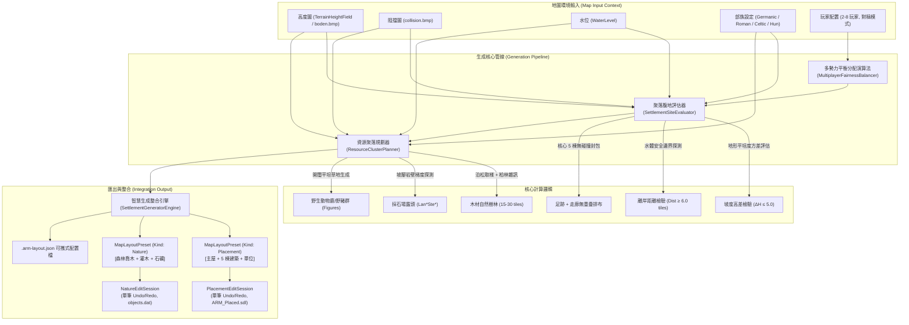
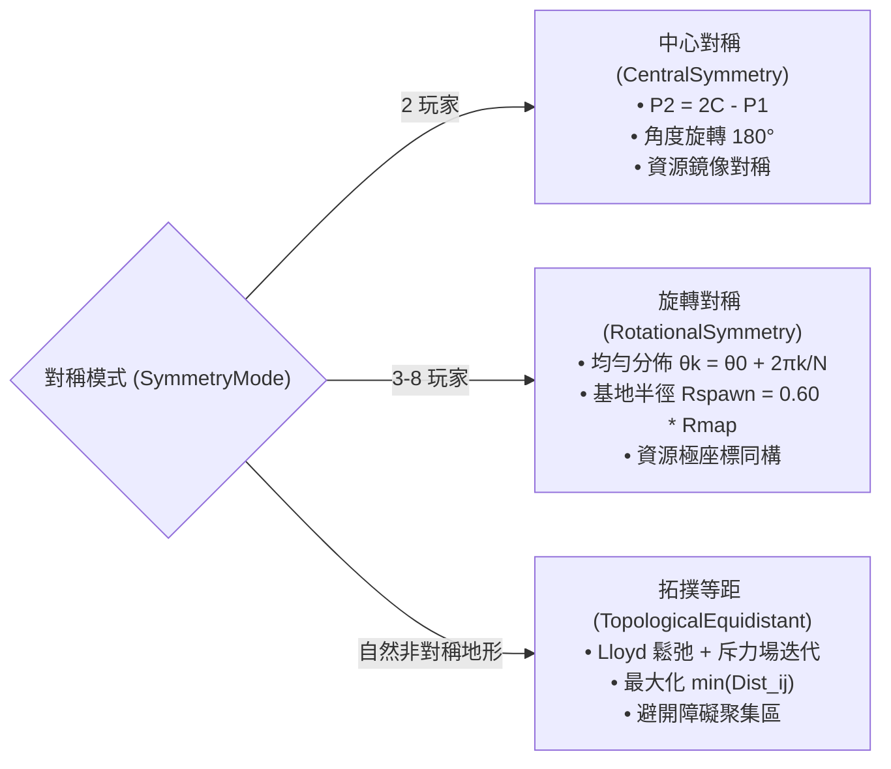
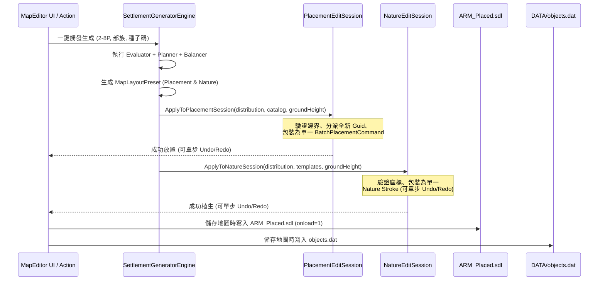

# 反抗羅馬 (Against Rome) 地圖編輯器：聚落選址與資源聚落智慧平衡生成演算法設計規格書
## Settlement & Resource Distribution Designer Architecture Specification

- **文件版本**: 1.0.0
- **設計日期**: 2026-10-08
- **模組路徑**: `src.MapEditor.Modules/Settlement/`
- **測試涵蓋**: `tests/AgainstRomeMapEditor.Modules.Tests/SettlementGeneratorTests.cs`
- **相容架構**: `AgainstRomeMapEditor.Modules.Placement`, `AgainstRomeMapEditor.Modules.Nature`, `AgainstRomeModifier.Maps`

---

## 1. 設計背景與總體架構 (Executive Summary & Architecture)

在《反抗羅馬》(Against Rome) 的對戰（Endless/Skirmish）與自訂戰役地圖製作中，地圖創作者常需要為各方勢力手動逐一放置主屋、核心建築群、伐木林區、採石場與初期狩獵糧食資源。傳統純手動操作耗時且難以精準保證多玩家對戰下的「幾何對稱」與「資源產能絕對公平」。

本模組設計並實作了一套**一鍵「智慧聚落與資源初始化」生成系統 (Settlement & Resource Distribution Designer)**，包含四大核心管線：
1. **聚落腹地評估器 (`SettlementSiteEvaluator`)**：負責對地形平坦度、坡度變異、水體安全距離、主屋（Haupthaus）及初始 5 棟核心建築的空間無碰撞無干擾排布進行多維適配評分。
2. **資源聚落規劃器 (`ResourceClusterPlanner`)**：模擬自然生態分佈，使用泊松採樣（Poisson-Disk Sampling）與柏林雜訊遮罩（Perlin Noise Mask）在基地外圍 15–30 格生成有機森林，依岩壁坡腳偵測生成石礦採石場，並於開闊平原分佈野生動物群。
3. **多勢力平衡分配器 (`MultiplayerFairnessBalancer`)**：支援 2–8 位玩家的中心對稱（1v1 Point Symmetry）、環狀旋轉對稱（3–8P Rotational Symmetry）與自然拓撲等距鬆弛（Topological Equidistant / Voronoi Relaxation），並輸出公平性度量預算報告。
4. **引擎與工作階段整合 (`SettlementGeneratorEngine`)**：將運算產物自動轉譯為標準 `MapLayoutPreset`（Placement 與 Nature 雙模態），無縫對接 `PlacementEditSession` 與 `NatureEditSession`，享有完整交易式單步 Undo/Redo 與 `.arm-layout.json` 匯入匯出。



---

## 2. 聚落腹地評估器 (SettlementSiteEvaluator)

### 2.1 評估指標與數學模型

候選位置 $(X_c, Z_c)$ 的總適配分數 $S_{total} \in [0, 100]$ 定義為多項加權和：
$$S_{total} = w_{flat} S_{flat} + w_{water} S_{water} + w_{space} S_{space} + w_{expand} S_{expand}$$
其中權重配置為：$w_{flat} = 0.35, w_{water} = 0.25, w_{space} = 0.20, w_{expand} = 0.20$。

#### 1. 地形平坦度 (Flatness Score, $S_{flat}$)
- **建築足跡硬性約束**：
  在主屋足跡圓形區域 $\Omega_{main} = \{ (x,z) \mid (x-X_c)^2 + (z-Z_c)^2 \le R_{main}^2 \}$ 內，高度差 $\Delta H = \max_{\Omega} H(x,z) - \min_{\Omega} H(x,z)$ 必須滿足：
  $$\Delta H \le \Delta H_{max} \quad (\text{預設 } 5.0 \text{ 單位高度})$$
  若超出則直接否決（`IsValid = false`）。
- **平坦度評分**：
  $$S_{flat} = \text{clamp}\left(100 - 15 \times \frac{1}{N_{bldg}} \sum_{i=1}^{N_{bldg}} \Delta H_i, 0, 100\right)$$

#### 2. 距水體安全距離 (Water Safety Score, $S_{water}$)
- 掃描候選點周圍半徑 $R_{scan} = 18$ 格內的水位高度：
  $$D_{water} = \min \{ \sqrt{(x - X_c)^2 + (z - Z_c)^2} \mid H(x,z) \le WaterLevel + 0.5 \}$$
- 若 $D_{water} < 6.0$ 格，判定為易淹水或水邊懸崖危險區，直接否決；
- 當 $D_{water} \ge 18.0$ 格時給予飽和滿分 90 分；在 $[6, 18]$ 間採線性插值。

#### 3. 初始核心 6 棟建築無碰撞空間排布 (Building Clearance Packing)
- 聚落標配包含：**主屋（MainHouse）+ 倉庫（Warehouse）+ 住宅（House）+ 食物設施（Farm／Hun 的 Butcher）+ 武器鍛造場（Blacksmith）+ 馬廄（Stable）+ 木工作坊（Workshop）**。
- 空間排布檢驗條件：
  任意兩棟已排布建築 $A_i$ 與 $A_j$，其中心歐幾里得距離必須大於各自足跡半徑加上走廊緩衝間隙 $C_{corridor}$：
  $$\| P_i - P_j \| \ge R_{footprint, i} + R_{footprint, j} + C_{corridor} \quad (C_{corridor} \ge 1.2 \text{ tiles})$$
- 演算法採用**自適應極座標發散搜尋**：以建築偏好距離與角度為基底，在角向 $\Delta \theta \in [0^\circ, \pm 15^\circ, \pm 30^\circ, \dots, \pm 90^\circ]$ 與徑向 $\Delta r \in [0, \pm 0.8, \pm 1.5]$ 空間尋找最近的平坦無障礙空位。若周圍無法容納全部 6 棟核心建築，則否決該腹地。

### 2.2 部族建築配置規格矩陣

名稱稽核（2026-10-08）：以 `ScriptObjectAliases.Load` 解讀唯讀 TEMP 副本
`%TEMP%\ArmGameCompare_20261007\SYSTEM\CLAK\cl_scint.ini`（235 個別名），
並以 `%TEMP%\ArmNativeAssets_20261007\objdef.txt` 第 52 欄核對地景。
建築與動物直接使用 alias；地景使用完整 `NameDef`，不推測後綴或部族前綴。

| 部族 | 主屋 | 倉庫 | 民宅 | 食物設施 | 武器鍛造場 | 馬廄 | 木工作坊 |
| :--- | :--- | :--- | :--- | :--- | :--- | :--- | :--- |
| Germanic | `GER_HAU00` | `GER_LAG00` | `GER_WOH00` | `GER_BAU00` 農場 | `GER_WAF00` | `GER_STA00` | `GER_SCHRE00` |
| Roman | `ROM_HAU00` | `ROM_LAG00` | `ROM_WOH00` | `ROM_BAU00` 農場 | `ROM_WAF00` | `ROM_STA00` | `ROM_SCHRE00` |
| Celtic | `KEL_HAU00` | `KEL_LAG00` | `KEL_WOH00` | `KEL_BAU00` 農場 | `KEL_WAF00` | `KEL_STA00` | `KEL_SCHRE00` |
| Hun | `HUN_HAU00` | `HUN_LAG00` | `HUN_WOH00` | `HUN_SCHLA00` 屠宰場 | `HUN_WAF00` | `HUN_STA00` | `HUN_SCHRE00` |

- Hun 目錄沒有 `HUN_BAU00`，不從其他部族複製不存在的農場。
- `ROM_HAU00`／`ROM_LAG00`／`ROM_WOH00` 是 `Hauptzelt`／`Lagerzelt`／`Wohnzelt`。
- 移除推測的 Kas／Sch／Tur，沒有宣稱這些設施等同兵營／哨塔。
- 每座基地總共 7 棟。足跡尺寸（主屋 4.2–4.5 格，核心 2.0–3.8 格）與距離仍是規劃估值，尚未以遊戲碰撞／建築功能驗證。
- Goldschmiede、Mine、Opferstaette 等雖存在於真實目錄，本次不納入初始核心。

---

## 3. 資源聚落規劃器 (ResourceClusterPlanner)

### 3.1 木材資源（森林生態群聚）
- **空間約束**：森林重心位於聚落主屋中心 $16 \sim 28$ 格之扇區，樹木距離主屋中心嚴格維持在 $13.5 \sim 32$ 格之間，既避免初期佔據建築腹地，又確保伐木工人步行效率。
- **柏林雜訊密度場 (Perlin Noise Density Field)**：
  $$D(x,z) = 0.6 \cdot \text{Noise}(x \cdot s + o_x, z \cdot s + o_z) + 0.4 \cdot \left(1 - \frac{d_{center}}{R_{cluster}}\right)$$
  採樣門檻值 $D(x,z) > 0.35$ 視為森林可生長區。
- **泊松碟盤取樣 (Poisson-Disk Sampling)**：
  在相鄰樹木間強制施加最小間距 $d_{min} \ge 0.85$ 格，並加入隨機小數抖動（Jitter $0.15 \sim 0.85$ 格），生成自然斑駁且不穿模重疊的林相。
- **生態邊緣過渡 (Ecotone Transition)**：
  - 核心林區：日耳曼／凱爾特／Hun 共用 `LanGerNad00_Tanne_gross`、`LanGerNad05_Tanne_gross`、`LanGerNad18_Tanne_klein`、`LanGerNad24_Tanne_mittel`；Roman 使用 `LanItaPin00_Pinie`、`LanItaPin01_Pinie`、`LanItaZyp00_Zypresse`、`LanItaZyp01_Zypresse`。
  - 外圍低密度邊界（$D < 0.45$）：自動過渡為 `LanGerNabu00_Nadelbusch`；Roman 使用 `LanItaBus08_Kleiner_Busch`。

### 3.2 採石場與礦物露頭（岩壁坡腳探測）
- **坡腳 (Cliff Foot) 地貌特徵演算法**：
  在距基地 $16 \sim 30$ 格方位掃描局部地形梯度。
  坡腳定義為：
  $$\text{IsCliffFoot}(x,z) \iff \left(|\nabla H(x,z)| \le 1.0\right) \land \left(\max_{d \le 2} H(x+dx, z+dz) - H(x,z) \ge 3.0\right)$$
  即本點平坦可供村民作業與放置採掘設施，但鄰近 2 格內存在 $\ge 3.0$ 單位高度的陡峭崖壁。
- **資源點生成**：在探測到的坡腳錨點半徑 4.5 格內，以間距 $\ge 1.3$ 格聚攏生成 5–8 塊自然岩石（`LanGerSte00_1Stein`、`LanGerSte01_1Stein`、`LanGerSte02_1Stein`、`LanGerSte05_1Stein`；Roman 使用 `LanItaSte00_1Stein`、`LanItaSte01_1Stein`、`LanItaSte02_1Stein`）。在完全平原地形下，自動退化為地質露頭模式生成。

岩石名稱存在僅證明可解析；一般石景不保證可採石。樹木的伐木產量、野豬的狩獵收益，以及資源點可達性仍需遊戲內驗證；公平性報告比較的是生成物件數量。

### 3.3 糧食與狩獵區（開闊平原野生動物群）
- **方位互斥**：在聚落周圍選取與森林（偏好 $30^\circ$）和石礦（偏好 $150^\circ$）錯開之剩餘方位（偏好 $250^\circ$）之開闊平坦草地。
- **野生動物群聚**：在半徑 5 格範圍內散佈 3–6 隻中立生物（隊伍代碼 `Team = -1`，`Count = 0`（單一動物以 `s_createObj` 建立，非部隊）），只使用真實別名 `ALL_EBE00`（`FigTieEbe00_Wildschwein`），旋轉角度隨機。不生成不存在的鹿型別，也不以狼／熊／大型貓科等掠食者當作食物群。

---

## 4. 多勢力平衡分配演算法 (MultiplayerFairnessBalancer)

### 4.1 對稱模式支援矩陣



#### 1. 中心對稱 (CentralSymmetry, 2P)
- 設地圖中心點座標為 $C = (Dimension/2, Dimension/2)$。
- 玩家 1 基地位置：$P_1 = C + (R \cos \theta, R \sin \theta)$。
- 玩家 2 基地位置：$P_2 = 2C - P_1 = C - (R \cos \theta, R \sin \theta)$。
- 雙方所有資源生成角度相差精確 $180^\circ$，確保 1v1 電競級對稱公平。

#### 2. 環狀旋轉對稱 (RotationalSymmetry, 3–8P)
- 玩家 $k \in \{0, \dots, N-1\}$ 的基地中心分佈於極坐標：
  $$\theta_k = \theta_0 + k \cdot \frac{2\pi}{N}, \quad P_k = C + R_{spawn} (\cos \theta_k, \sin \theta_k)$$
- 每個玩家的建築朝向與資源偏好方位均加上偏移 $\theta_k$ 進行同構旋轉。

#### 3. 拓撲等距/Voronoi 鬆弛 (TopologicalEquidistant)
- 針對不對稱河流、山脈切割的複雜地圖，執行 5 輪排斥場（Repulsion Field）動態鬆弛：
  $$\vec{F}_i = \sum_{j \ne i} \frac{K}{\|P_i - P_j\|^2} \frac{P_i - P_j}{\|P_i - P_j\|} + K_{orbit} (R_{spawn} - \|P_i - C\|) \frac{P_i - C}{\|P_i - C\|}$$
- 迭代推動各勢力中心遠離彼此，直到達到平衡。

### 4.2 公平性預算校驗 (Fairness Budget Verification)
系統生成後自動評估 `FairnessScoreReport`：
- **玩家間距離均勻度**：
  $$\text{DistanceDisparity} = \frac{\max D_{ij} - \min D_{ij}}{\bar{D}} < 0.35$$
- **資源數量方差**：
  - 木材樹木數方差 $\sigma^2_{wood} \le 9.0$
  - 石礦點數方差 $\sigma^2_{stone} \le 2.0$
  - 糧食生物數方差 $\sigma^2_{food} \le 1.0$
若全部通過則標記 `IsBalanced = true`。

---

## 5. 整合匯出機制 (PlacementEditSession & LayoutJson Integration)

本系統與地圖編輯器既有模組的對接流程完全依循現有架構：



### 5.1 C# 呼叫範例

```csharp
// 1. 初始化生成管線
var evaluator = new SettlementSiteEvaluator(dimension, sampleHeight, isBlocked, waterLevel);
var planner = new ResourceClusterPlanner(dimension, sampleHeight, isBlocked, waterLevel);
var balancer = new MultiplayerFairnessBalancer(evaluator, planner, dimension);

// 2. 執行 4 人旋轉對稱生成
var tribes = new[] { SettlementTribe.Germanic, SettlementTribe.Roman, SettlementTribe.Celtic, SettlementTribe.Hun };
var distribution = balancer.Generate(
    playerCount: 4, 
    mode: SymmetryMode.RotationalSymmetry, 
    tribes: tribes, 
    baseSeed: 1337);

// 3. 匯出為可攜式 JSON 檔案
var (placementJson, natureJson) = SettlementGeneratorEngine.ExportLayoutJsons(distribution);
File.WriteAllText("settlement-placement.arm-layout.json", placementJson);
File.WriteAllText("settlement-nature.arm-layout.json", natureJson);

// 4. 一鍵注入當前編輯會話（具備單步撤銷保證）
SettlementGeneratorEngine.ApplyToPlacementSession(distribution, objectCatalog, form.PlacementSession, groundHeight);
SettlementGeneratorEngine.ApplyToNatureSession(distribution, natureTemplates, form.NatureSession, groundHeight);
```

---

## 6. 驗證與測試覆蓋 (Verification & Testing Matrix)

測試以程式內的小型真實 alias／NameDef fixture 驗證，不讀遊戲素材，也不從生成結果反造目錄。
四族逐一驗證七種角色、所有 palette 項目、碰撞間距、JSON 往返、完整套用後的物件數與單步 Undo/Redo；
宿主 UI 測試確認每種日耳曼建築各放置兩座，並儲存驗證中立動物仍為 Count=0。保留不完整目錄的略過行為與舊短名 resolver 相容測試。

驗證命令（在獨立 worktree；PowerShell）：
```powershell
$env:DOTNET_ROLL_FORWARD = 'Major'
dotnet build AgainstRomeModifier.slnx -c Release -p:UseAppHost=false
dotnet test AgainstRomeModifier.slnx -c Release --no-build
```
遊戲內外觀、完工狀態、建築功能／招募、採集收益與實際對戰平衡未驗證；本稽核不存取或啟動安裝目錄。

模組測試實作於 `tests/AgainstRomeMapEditor.Modules.Tests/SettlementGeneratorTests.cs`，涵蓋以下關鍵驗收項：

1. **`Evaluator_rejects_steep_terrain_and_water_hazards`**：
   - 驗證陡坡高差超標時正確拒絕放置。
   - 驗證水體邊界過近（$< 6.0$ 格）或淹水時正確否決。
2. **`Evaluator_places_main_house_and_six_core_buildings_without_collisions`**：
   - 驗證成功規劃主屋與 6 棟核心建築。
   - 驗證全部建築彼此距離嚴格大於足跡半徑和，走廊無阻擋。
3. **`ResourcePlanner_generates_forest_quarry_and_wildlife_with_proper_constraints`**：
   - 驗證森林生成樹木位於基地外圍 $13.5 \sim 32$ 格。
   - 驗證採石場生成符合部族調色盤之岩石。
   - 驗證野生動物群為中立生物（`Team = -1`）。
4. **`Balancer_generates_perfect_2p_central_symmetry`**：
   - 驗證 2 玩家以地圖中心精確點對稱（中心坐標中點誤差 $< 0.1$ 格）。
   - 驗證雙方資源與建築數目完全平衡。
5. **`Balancer_generates_fair_4p_rotational_symmetry`**：
   - 驗證 4 玩家在旋轉對稱下均能找到合格基地，且最小相鄰間距大於安全值。
6. **`Engine_converts_to_presets_and_integrates_with_edit_sessions_and_json`**：
   - 驗證成果完整序列化為 JSON 並還原。
   - 驗證注入 `PlacementEditSession` 與 `NatureEditSession`，並經由 `Undo()` 與 `Redo()` 往返驗證狀態完整性。

---

## 7. 規範遵守宣告 (Compliance Statement)

- **遵循 `AGENTS.md`**：全案以繁體中文撰寫，保留技術名詞、API、檔案路徑；未存取遊戲安裝目錄；本稽核僅在 `wt/settle` 提交本機 commit，不 push 或 merge。
- **無依賴破壞**：完全遵循現有 `MapLayoutPreset` 規範與 `PlacementEditSession` 交易式原則，不修改原生資料結構簽名。
