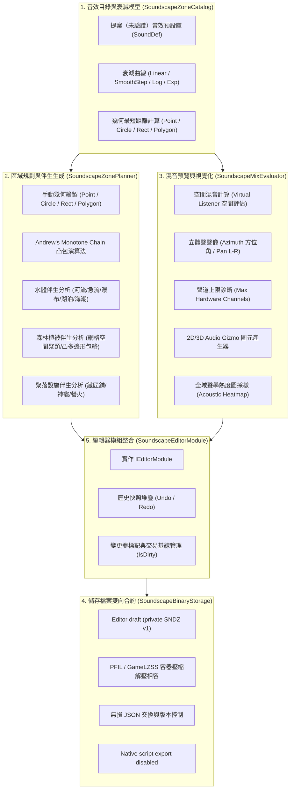

# 多層次環境音效與音頻區域分佈系統 (Ambient Audio & Soundscape Zone Designer) 架構設計

> **2026-10-08 status: experimental / unwired.** This is a prototype design, not a reverse-engineered game contract. See [real sound evidence](reverse-engineering/sound-zones.md). `SNDZ`, `DATA/sound.dat`, `Amb_*` / `Snd_*` IDs, attenuation curves and the script examples below are editor proposals only. Previous native-compatibility claims are withdrawn. `SaveToSoundDat` and `ExportToScript` now reject export; binary/JSON round trips preserve editor drafts only. No native map persistence or audio playback is connected.

> **模組名稱**：`AgainstRomeMapEditor.Modules.Soundscape`  
> **適用專案**：`AgainstRomeModifier.slnx`（核心實作位於 `src.MapEditor.Modules/Soundscape/`，整合測試位於 `tests/AgainstRomeMapEditor.Modules.Tests/SoundscapeTests.cs`）  
> **語言標準**：C# 12 / .NET 8.0，遵守無裝載遊戲目錄依賴與沙盒解耦原則  
> **狀態**：Experimental prototype only; native compatibility is unverified.

---

## 1. 背景與核心目標

在《反抗羅馬》(Against Rome) 的古典戰場與荒野地圖中，環境聲景（Soundscape）是塑造沉浸感與歷史氛圍的關鍵維度。本實驗性設計希望規劃下列音效；清單並非遊戲內播放行為或聲音素材的驗證結果：
- **廣域地表伴生音**：森林深處微風拂過樹梢的沙沙聲、晨間啼鳥、夜間鳴蟬與遠方狼嚎。
- **水體與地貌特徵音**：蜿蜒溪流潺潺流水、峽谷急流奔湧、斷崖瀑布萬鈞轟鳴、海平面開闊潮湧。
- **聚落與微型發聲點**：部族營火柴薪劈啪燃燒、鐵匠鋪鐵錘敲擊鐵砧的回響、祭司神龕神聖呢喃。
- **開闊地勢與天氣氛圍**：荒原平原長風呼嘯、阿爾卑斯雪山酷寒風暴、雷雨交加的電閃雷鳴。

**現狀痛點**：
先前地圖編輯器僅聚焦於地形高程（`boden.bmp`）、地表圖塊材質（`floortex.dat` / `boden.txt`）與世界物件擺放（`DATA/objects.dat`），此原型探索音效區域規劃與幾何混音預覽；目前沒有經驗證的原生地圖或腳本讀寫合約。

本系統旨在建立一套**高精確度、具備實時 3D 空間混音預覽能力、支援智慧生態伴生生成，原生輸出仍待逆向證據支持的實驗性音效區域規劃架構**。

---

## 2. 系統架構概覽

多層次環境音效架構遵循模組化解耦設計，核心劃分為五大子系統：



---

## 3. SoundscapeZoneCatalog：提案（未驗證）音效 ID 與空間衰減模型

### 3.1 提案（未驗證）音效定義（SoundDef）
提案（未驗證）環境音依據物理特質與生態維度分為七大類別（`AudioCategory`）：

| 類別 (`AudioCategory`) | 範例提案（未驗證） ID (`SoundId`) | 觸發模式 (`TriggerMode`) | 預設內半徑 ($R_{in}$) | 預設外半徑 ($R_{out}$) | 聲學特徵描述 |
| :--- | :--- | :--- | :---: | :---: | :--- |
| **Vegetation** (植被) | `Amb_Forest_Dense_Day` | ContinuousLoop | 300 | 1000 | 茂密森林日間鳥鳴、清風搖動樹梢（僅日間生效） |
| **Vegetation** (植被) | `Amb_Forest_Dense_Night` | ContinuousLoop | 300 | 1000 | 茂密森林夜間微風、蟋蟀唧唧與貓頭鷹啼（僅夜間生效） |
| **Vegetation** (植被) | `Amb_Forest_Light` | ContinuousLoop | 200 | 750 | 稀疏林地微風拂動落葉 |
| **Vegetation** (植被) | `Amb_Forest_Birds` | StochasticInterval | 150 | 600 | 間歇性林冠飛鳥鳴啼（間隔 6 ~ 22 秒隨機觸發） |
| **Hydrology** (水文) | `Amb_River_Gentle` | ContinuousLoop | 160 | 550 | 平緩河流潺潺流水聲 |
| **Hydrology** (水文) | `Amb_River_Rapid` | ContinuousLoop | 220 | 750 | 峽谷急流湍急奔騰咆哮 |
| **Hydrology** (水文) | `Amb_Waterfall_Roar` | ContinuousLoop | 350 | 1200 | 高地斷崖瀑布轟鳴雷動 |
| **Hydrology** (水文) | `Amb_Coast_Waves` | ContinuousLoop | 250 | 900 | 開闊海岸邊際浪濤拍岸 |
| **Hydrology** (水文) | `Amb_Pond_Marsh` | ContinuousLoop | 120 | 450 | 沼澤濕地水泡微聲與低沉蛙鳴 |
| **AmbientGlobal** (全域) | `Amb_Plains_Wind` | ContinuousLoop | 500 | 1800 | 開闊荒原荒漠長風呼嘯 |
| **AmbientZone** (氣候) | `Amb_Tundra_Blizzard` | ContinuousLoop | 400 | 1400 | 極北凍土暴風雪酷寒呼嘯 |
| **AmbientZone** (氣候) | `Amb_Mountain_Wind` | ContinuousLoop | 300 | 1100 | 高山險峰孤寂強風 |
| **PointEmitter** (定點) | `Snd_Campfire_Crackling` | ContinuousLoop | 80 | 350 | 營火柴薪劈啪燃燒與炭火微鳴 |
| **Settlement** (聚落) | `Snd_Blacksmith_Anvil` | StochasticInterval | 120 | 500 | 鐵匠鋪鍛鐵打砧回響（間隔 3 ~ 9 秒） |
| **Settlement** (聚落) | `Snd_Shrine_Chant` | ContinuousLoop | 100 | 400 | 部族神龕祭壇低語吟唱 |

### 3.2 空間衰減曲線模型（Attenuation Curves）
設距離為 $d$，內半徑為 $R_{in}$，外半徑為 $R_{out}$：
- 若 $d \le R_{in}$：衰減乘數 $f_{att} = 1.0$（核心無損區）。
- 若 $d \ge R_{out}$：衰減乘數 $f_{att} = 0.0$（靜音邊界）。
- 當 $R_{in} < d < R_{out}$ 時，定義歸一化距離因子 $t = \frac{d - R_{in}}{R_{out} - R_{in}} \in (0, 1)$：

1. **線性衰減 (`Linear`)**：
   $$f_{att} = 1 - t$$
2. **平滑 S 曲線 (`SmoothStep`)**（消弭耳機突變感與拐角破音）：
   $$f_{att} = 1 - (3t^2 - 2t^3)$$
3. **對數衰減 (`Logarithmic`)**（模擬近場能量迅速散逸的物理反平方規律）：
   $$f_{att} = 1 - \frac{\log_{10}(1 + 9t)}{\log_{10}(10)} = 1 - \log_{10}(1 + 9t)$$
4. **指數平方衰減 (`Exponential`)**（適合營火、火把等高衰減小音源）：
   $$f_{att} = (1 - t)^2$$

### 3.3 空間幾何最短距離計算公式
針對虛擬聆聽者坐標 $P(px, pz)$，計算其到各區域外邊界的最短歐幾里得距離 $d(P, \text{Zone})$：

- **點音源 (`Point`)**：
  $$d = \sqrt{(px - cx)^2 + (pz - cz)^2}$$
- **圓形區域 (`Circle`)**（基礎半徑 $R_{base}$）：
  $$d = \max\left(0, \sqrt{(px - cx)^2 + (pz - cz)^2} - R_{base}\right)$$
- **定向矩形 (`OrientedRectangle`)**（旋轉角 $\theta$，半寬 $hx$，半高 $hz$）：
  將世界坐標向量旋轉回局部軸對齊坐標系：
  $$\begin{bmatrix} lx \\ lz \end{bmatrix} = \begin{bmatrix} \cos(-\theta) & -\sin(-\theta) \\ \sin(-\theta) & \cos(-\theta) \end{bmatrix} \begin{bmatrix} px - cx \\ pz - cz \end{bmatrix}$$
  計算到局部 AABB 邊界的距離：
  $$qx = \max(0, |lx| - hx), \quad qz = \max(0, |lz| - hz)$$
  $$d = \sqrt{qx^2 + qz^2}$$
- **凸多邊形 (`ConvexPolygon`)**（頂點集合 $V_0, V_1, \dots, V_{n-1}$）：
  - 內部判斷：採用射線法（Ray-Casting Algorithm）。若 $P$ 位於多邊形內部，則 $d = 0$。
  - 外部點：遍歷多邊形全部邊線段 $(V_i, V_{i+1})$，計算點到線段的最短投影距離：
    $$t = \text{clamp}\left(\frac{(P - V_i) \cdot (V_{i+1} - V_i)}{\|V_{i+1} - V_i\|^2}, 0, 1\right)$$
    $$Q_i = V_i + t(V_{i+1} - V_i), \quad d = \min_{i} \|P - Q_i\|$$

---

## 4. SoundscapeZonePlanner：區域幾何與智慧伴生環境音生成

### 4.1 手動幾何區域繪製
規劃器支援快速建立各種幾何幾何圖元：
- `CreatePointZone(...)`
- `CreateCircleZone(...)`
- `CreateRectangleZone(...)`
- `CreateConvexPolygonZone(...)`：內建 Andrew's Monotone Chain 凸包演算法，自動自雜亂點陣列提取嚴謹的逆時針凸多邊形外框與幾何質心。

### 4.2 水體水文伴生環境音自動推導
演算法步驟：
1. **水格識別**：遍歷 $W \times H$（如 $256 \times 256$）地圖網格。若頂點高程均值 $< \text{WaterLevel}$ 或標記為河道材質圖塊（`FLUSS*`, `SEE*`, `ErdeFlussR*`），標記為水格。
2. **BFS 泛洪連通元件分割**：提取所有相互連通的水體群島/水路。
3. **水體拓撲特徵分類**：
   - **小池塘/沼澤**（格數 $< 20$）：於幾何中心生成圓形區域 `Amb_Pond_Marsh`。
   - **巨大海域/湖泊**（格數 $> 800$ 且接觸地圖邊界）：提取水陸交界之海岸邊界格點（Coastline），按步長（約 16 tile）散播 `Amb_Coast_Waves` 區域。
   - **河流與急流水系**：
     - **斷崖瀑布偵測**：檢查相鄰水格的高程差，若 $\Delta H \times \text{HeightMapStep} > 16.0$，識別為瀑布落差處，生成強效點音源 `Amb_Waterfall_Roar`（$R_{in}=350, R_{out}=1200, \text{Vol}=1.0$）。
     - **河道流動聲**：沿河流主幹每隔約 8~12 tile 散播 `Amb_River_Gentle`。

### 4.3 森林植被伴生環境音自動推導
演算法步驟：
1. **空間分箱聚類 (Spatial Grid Binning)**：以 $512 \times 512$ 世界單位（$8 \times 8$ tile）為一箱格，將地圖所有樹木物件（`LanGer*`, `LanRom*`, `Baum*` 等）投影至分箱中。
2. **密林與疏林判定**：
   - 若單元箱樹木數量 $\ge 8$ 株：判定為密集深林核心。使用 Andrew's Monotone Chain 計算外凸包，生成凸多邊形區域 `Amb_Forest_Dense_Day`（$R_{in}=250, R_{out}=850$），並在質心處掛載間歇鳥鳴點 `Amb_Forest_Birds`。
   - 若單元箱樹木數量為 $3 \sim 7$ 株：判定為疏林，生成圓形區域 `Amb_Forest_Light`。

### 4.4 聚落設施伴生音自動推導
掃描地圖建築物物件：
- 名稱含 `Schmied` / `Blacksmith`：掛載 `Snd_Blacksmith_Anvil`。
- 名稱含 `Feuer` / `Campfire`：掛載 `Snd_Campfire_Crackling`。
- 名稱含 `Tempel` / `Shrine` / `Heiligtum`：掛載 `Snd_Shrine_Chant`。

---

## 5. 2D/3D Audio Gizmo 與空間混音預覽 (Auditor)

### 5.1 Audio Gizmo 視覺化架構
供 2D 畫布（`MapCanvasControl`）與 3D 等角視圖（`Map3DViewControl`）呈現之空間標記：
- **核心全音量邊界 (`CoreBoundary`)**：實線顯示，代表 $V = 1.0$ 之全音量區間。
- **衰減外圍輪廓 (`FalloffBoundary`)**：虛線漸層顯示，代表 $V \to 0.0$ 之邊界。
- **色彩語義編碼**：
  - 水文水系 (`Hydrology`)：深天藍色 (`0xFF00BFFF`)
  - 森林生態 (`Vegetation`)：翠綠色 (`0xFF32CD32`)
  - 定點發聲源 (`PointEmitter`)：橙紅色 (`0xFFFF4500`)
  - 聚落設施 (`Settlement`)：暖金橙 (`0xFFFF8C00`)
  - 全域氛圍 (`AmbientGlobal`)：淡紫色 (`0xFFBA55D3`)
  - 游標選取中狀態：高亮亮金黃色 (`0xFFFFE000`)

### 5.2 實時 3D 空間混音預覽（SoundscapeMixEvaluator）
在虛擬聆聽者（Listener）坐標 $(X, Y, Z)$ 與朝向角度 $\text{Yaw}$ 處：
1. **空間距離與有效音量**：
   $$V_{eff} = V_{base} \times f_{att}(d)$$
2. **立體聲方位聲像 (Stereo Panning)**：
   計算相對聆聽者朝向之方位角 $\Delta \theta$：
   $$\text{Azimuth} = \text{NormalizeAngle}\left(\text{atan2}(dx, dz) - \text{Yaw}\right)$$
   推導左右聲道分配係數（含 5% 交叉互饋避免耳機死耳）：
   $$Pan_R = \text{clamp}(0.5 + 0.45 \cdot \sin(\Delta\theta), 0.05, 0.95), \quad Pan_L = 1 - Pan_R$$
3. **感知總響度 (Power Sum RMS)**：
   $$V_{total} = \min\left(1.0, \sqrt{\sum_{i} V_{eff, i}^2}\right)$$
4. **硬體聲道預算評估 (`ChannelBudgetExceeded`)**：
   原版遊戲音訊引擎硬體通道上限（預設 24 聲道）。當同區聽見音源數超過上限時，系統自動按 `Priority` 降序並以有效音量排序截斷，並標記聲道溢出警告。

### 5.3 全域聲學熱度圖採樣（Acoustic Heatmap）
支援以 $64 \times 64$ 或 $128 \times 128$ 網格全圖取樣空間響度，供編輯器提供「死區診斷（無任何環境音覆蓋之沉寂地帶）」與「聲學嘈雜區（多音源過度堆疊破音熱點）」之視覺熱圖層。

---

## 6. 編輯器私有草稿序列化（不屬於遊戲格式）

### 6.1 既有私有 SNDZ 草稿格式
檔案結構具備固定 64 位元組標頭與連續可變長度區域記錄：

```
+-------------------------------------------------------------------------+
| HEADER (64 Bytes)                                                       |
|   - Magic: 4 Bytes ASCII ('S', 'N', 'D', 'Z') = 0x5A444E53              |
|   - Version: 2 Bytes uint16 (1)                                         |
|   - ZoneCount: 2 Bytes uint16                                           |
|   - GlobalAmbienceVolume: 4 Bytes float32                               |
|   - GlobalAmbienceId: 32 Bytes null-terminated UTF-8                    |
|   - Padding / Reserved: 20 Bytes zeros                                  |
+-------------------------------------------------------------------------+
| ZONE RECORDS (ZoneCount * variable length)                              |
|   - ZoneId: 16 Bytes Guid                                               |
|   - Name: 32 Bytes null-terminated UTF-8                                |
|   - SoundDefId: 32 Bytes null-terminated UTF-8                          |
|   - ShapeType: 1 Byte (0=Point, 1=Circle, 2=Rect, 3=Polygon)            |
|   - AttenuationCurve: 1 Byte (0=Linear, 1=SmoothStep, 2=Log, 3=Exp)    |
|   - Category: 1 Byte (0..6)                                             |
|   - Padding: 1 Byte                                                     |
|   - Flags: 4 Bytes uint32                                               |
|   - Priority: 2 Bytes uint16                                            |
|   - Padding: 2 Bytes                                                    |
|   - BaseVolume: 4 Bytes float32                                         |
|   - InnerRadius: 4 Bytes float32                                        |
|   - OuterRadius: 4 Bytes float32                                        |
|   - CenterWorldX: 4 Bytes float32                                       |
|   - CenterWorldY: 4 Bytes float32                                       |
|   - CenterWorldZ: 4 Bytes float32                                       |
|   - ParamA: 4 Bytes float32                                             |
|   - ParamB: 4 Bytes float32                                             |
|   - ParamAngleDeg: 4 Bytes float32                                      |
|   - VertexCount: 2 Bytes uint16 (N)                                     |
|   - PolygonVertices: N * 8 Bytes (X float32, Z float32)                 |
+-------------------------------------------------------------------------+
```

### 6.2 舊草稿 PFIL 包裝讀取
`DeserializeFromBinary` 可以解開既有 PFIL 包裝後的私有 SNDZ 草稿。使用真實壓縮容器不代表內容符合遊戲格式；`SaveToSoundDat` 一律拋出 `NotSupportedException`，不建立或覆寫檔案。

### 6.3 原生腳本匯出停用
`ExportToScript` 一律拋出 `NotSupportedException`。舊 `s_playVoiceSampleMP` 範例沒有實證；`s_setVoiceSubGroup` 也不是音效 ID 與音量的介面。移除誤導範例，正確證據及尚缺契約見逆向報告。

### 6.4 無損 JSON 交換合約
提供 `ExportToJson` 與 `ImportFromJson`，使地圖製作者能透過 Git 等版本控制系統清晰比對音效區域與伴生配置的每一項參數。

---

## 7. 編輯器模組整合（SoundscapeEditorModule）

### 7.1 模組生命週期與交易契約
`SoundscapeEditorModule` 實作標準 `IEditorModule<SoundscapeSnapshot>`：
- `ModuleId`：固定為 `"SoundscapeZones"`。
- `IsDirty`：依據目前編輯狀態與前次儲存成功後之 `_baseline` 進行全深度欄位比對。
- `Capture()`：深層複製目前全圖音效狀態產生不可變快照。
- `AcceptChanges()`：確認實驗性編輯狀態的基線；目前未接入主編輯器磁碟交易。
- `Reset()`：在使用者取消或交易回滾時復原至 `_baseline`。

### 7.2 歷史記錄（Undo / Redo）
內建專屬快照堆疊：
- 執行 `AddZone`、`RemoveZone`、`UpdateZone`、`AddAutoGeneratedZones`、`ClearAutoGeneratedZones` 或調整全域底層音量時，自動推入 Undo 堆疊並清空 Redo 堆疊。
- 提供單一交易式復原與重做支援。

---

## 8. 驗證與測試覆蓋報告

單元測試套件 `tests/AgainstRomeMapEditor.Modules.Tests/SoundscapeTests.cs` 涵蓋全部 5 大維度：

1. **Catalog 與衰減幾何測試**：
   - 提案（未驗證）預設項目註冊完整性。
   - `Linear`, `SmoothStep`, `Logarithmic`, `Exponential` 內外門檻精確驗證。
   - 圓形、定向矩形、凸多邊形點內為 0、點外歐幾里得距離驗證。
2. **規劃器與智慧伴生生成測試**：
   - 手動幾何建造器參數正確性。
   - Andrew's Monotone Chain 凸包過濾內部點驗證。
   - 水體伴生分析：高地小池塘識別 `Amb_Pond_Marsh`、垂直落差瀑布識別 `Amb_Waterfall_Roar`。
   - 森林伴生分析：樹木空間分箱密林生成凸多邊形與隨機鳥鳴發聲點。
   - 聚落設施分析：鐵匠鋪與營火伴生音識別。
3. **混音評估器與立體聲方位測試**：
   - 虛擬聆聽者右側音源之立體聲 Panning 權重平衡（右聲道顯著大於左聲道）。
   - 超過 16 聲道之硬體預算溢出與優先級截斷驗證。
   - Gizmo 核心與衰減幾何圖元生成，以及聲學熱度圖矩陣數值檢驗。
4. **二進位儲存與合約讀寫測試**：
   - 私有 SNDZ 草稿二進位 Round-Trip 欄位驗證，不代表遊戲相容性。
   - JSON 草稿交換及原生檔案／腳本匯出拒絕驗證（不覆寫既存檔案、不建立 DATA 目錄）。
5. **EditorModule 契約與 Undo/Redo 測試**：
   - `IsDirty` 狀態轉換、`AcceptChanges`、`Reset` 回滾、單步 `Undo` / `Redo` 堆疊機制完整性。
