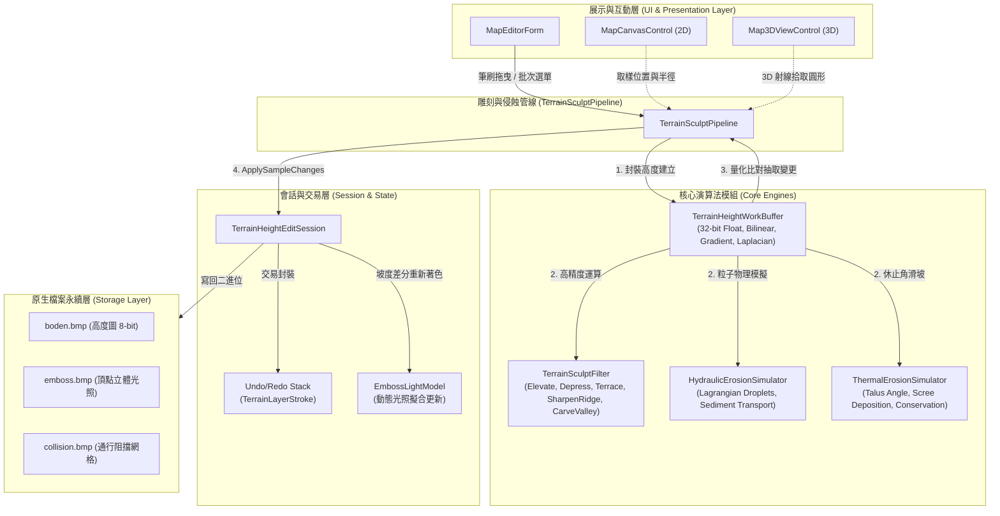
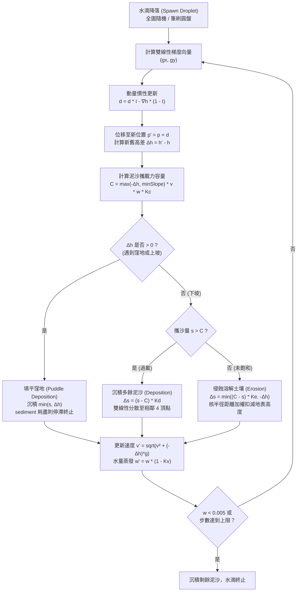

# 地形起伏智慧雕刻與水力/熱力侵蝕演算法系統架構設計
# (Terrain Sculpting & Hydraulic/Thermal Erosion Designer)

> **版本**：v1.0.0  
> **日期**：2026-10-08  
> **模組路徑**：`src.MapEditor.Modules/Terrain/`  
> **狀態**：核心架構已實作與單元測試完畢，待 UI 整合  

---

## 1. 背景與設計目標 (Background & Objectives)

### 1.1 現有地形編輯之瓶頸
《反抗羅馬》(Against Rome) 地圖編輯器採用高程圖網格（`(64 * Heightmapstep + 1)²`，儲存於 `boden.bmp` 綠通道），原生高度以 8-bit 整數（$0 \sim 255$）表示。目前編輯器僅提供基礎的「升高 (Raise)」、「降低 (Lower)」、「平滑 (Smooth)」、「整平 (Flatten)」與「粗糙化 (Roughen)」工具。

在實務製作自然地貌（如阿爾卑斯山脈、冰蝕谷地、喀斯特階梯台地、峽谷斷崖與沖積扇）時，現有工具有三大根本缺陷：
1. **難以雕刻出物理真實的高山結構**：傳統平滑工具會把所有銳利特徵磨圓，使高山變成像麵包般的渾圓丘陵；缺乏能夠收斂山脊（Arête）、凸顯角峰（Horn）與深切峽谷的幾何濾鏡。
2. **缺乏水力侵蝕（Hydraulic Erosion）**：自然山脈是經由千萬年雨水匯流沖刷而成，雨水在陡坡溶解表土形成溝壑（Rills/Gullies），並在坡度平緩處沉積泥沙形成沖積扇（Alluvial Fan）。手動以小筆刷繪製溝壑極其費時且難以保證物理連續性。
3. **缺乏熱力重力滑坡（Thermal Erosion）**：在重力作用下，過於垂直的懸崖會自然風化崩塌，碎石崩落並堆積在坡腳，其斜率嚴格受限於自然休止角（Talus Angle / Angle of Repose，約 $35^\circ \sim 40^\circ$）。手工繪製極難維持休止角的坡度一致性。
4. **8-bit 整數量化階梯化（Quantization Artifacts）**：直接在整數空間進行迭代侵蝕模擬時，微小的雨滴溶解量（如 $0.05$ 高度單位）若每次取整，會立即截斷為 $0$（侵蝕停滯），或累積出不自然的人工階梯條紋。

### 1.2 系統設計目標
本系統旨在為《反抗羅馬》地圖編輯器引入一套專業級的**智慧地形雕刻與物理侵蝕模擬管線**：
- **`TerrainHeightWorkBuffer`**：提供 32-bit 高精度浮點數工作緩衝區，支援雙線性插值（Bilinear Interpolation）、連續坡度梯度（Gradient）、二階拉普拉斯曲率（Laplacian Curvature）與高效差異提取。
- **`TerrainSculptFilter`**：提供隆起（Elevate）、下壓（Depress）、高原平頂化（Terrace）、山脊尖銳化（Ridge Sharpening）與山谷凹雕（Valley Carving）等幾何濾鏡。
- **`HydraulicErosionSimulator`**：實作連續拉格朗日粒子級水力侵蝕，模擬雨滴降雨、沿梯度滑落加速、動能搬運泥沙、窪地填平與沖積扇沉積。
- **`ThermalErosionSimulator`**：實作基於物理休止角（Talus Angle）的元胞滑坡擴散，質量守恆地將過陡岩壁崩塌轉移為山腳碎石坡（Scree Slope）。
- **無縫整合現有架構**：所有模擬結果均透過 `TerrainSculptPipeline` 轉換為 `TerrainSampleChange` 批次樣本，無縫整合 `TerrainHeightEditSession` 的單步 Undo/Redo 歷史棧與 Emboss 光照動態更新。

---

## 2. 總體架構設計 (System Architecture)

### 2.1 模組分層架構


### 2.2 核心資料流動流程
1. **初始化與緩衝抽取**：
   使用者在 2D/3D 視圖中使用雕刻筆刷或觸發全域侵蝕時，管線從 `TerrainHeightEditSession` 的 `Heights`（`byte[]`）讀取數據，建立高精度的 `TerrainHeightWorkBuffer`（`float[]`）。
2. **連續高精度模擬**：
   在 32-bit 浮點數空間中連續執行多步物理模擬或濾鏡計算。所有泥沙攜帶量、蒸發、微量侵蝕、多項式台階化均以浮點數進行，完全消除量化噪聲。
3. **差異提取（Delta Extraction）**：
   計算完成後，工作緩衝區將計算結果四捨五入箝位至 $[0, 255]$，並與原始高度陣列對比，僅抽出具有實質變化的頂點索引與前後值（`TerrainSampleChange`）。
4. **會話與歷史提交**：
   呼叫 `session.ApplySampleChanges(changes)`，將樣本納入待提交筆畫（Pending Stroke），最後呼叫 `session.CommitStroke()` 壓入 Undo 棧。
5. **立體光照與視圖同步**：
   坡度改變的頂點標記為 Dirty，視圖（2D 等高線與 3D 頂點緩衝區）即時刷新；存檔時透過 `EmbossLightModel` 依坡度變化動態更新 `emboss.bmp`。

---

## 3. 高精度浮點工作緩衝區 (`TerrainHeightWorkBuffer`)

### 3.1 為什麼需要浮點數緩衝區？
在自然物理侵蝕中，一顆雨滴在單個網格單元上的表土溶解量通常在 $0.01 \sim 0.1$ 單位之間。
若直接在整數 byte 陣列（$0 \sim 255$）上累加：
$$\text{round}(h_{\text{current}} - 0.04) = h_{\text{current}}$$
所有侵蝕效果會被瞬間「吞掉」，導致水滴無法溶解土壤；反之，若雨滴攜帶 $0.6$ 泥沙，會突然沉積整整 $1$ 個整數高度，在地表留下突兀的尖刺。
因此，所有物理與高階幾何計算必須在 **連續浮點數空間** 完成。

### 3.2 關鍵功能與數學模型
- **雙線性插值取樣 (`SampleBilinear`)**：
  在連續座標 $(x, y)$ 處取得平滑地形高度：
  $$x_0 = \lfloor x \rfloor, \quad y_0 = \lfloor y \rfloor, \quad u_x = x - x_0, \quad u_y = y - y_0$$
  $$h(x, y) = (1 - u_x)(1 - u_y) h_{00} + u_x (1 - u_y) h_{10} + (1 - u_x) u_y h_{01} + u_x u_y h_{11}$$
- **數值坡度梯度向量 (`CalculateGradient`)**：
  $$\nabla h(x, y) = \left( \frac{\partial h}{\partial x}, \frac{\partial h}{\partial y} \right)$$
  沿下坡流動方向為負梯度 $-\nabla h$。
- **離散拉普拉斯曲率算子 (`CalculateLaplacian`)**：
  $$\nabla^2 h(x, y) = h(x+1, y) + h(x-1, y) + h(x, y+1) + h(x, y-1) - 4 h(x, y)$$
  - $\nabla^2 h < 0$：中心點高於四周鄰居平均值 $\to$ **凸起地形（山脊、山頂）**
  - $\nabla^2 h > 0$：中心點低於四周鄰居平均值 $\to$ **凹陷地形（山谷、坑洞）**

---

## 4. 幾何雕刻濾鏡庫 (`TerrainSculptFilter`)

### 4.1 衰減曲線模式 (Falloff Types)
筆刷支援多種半徑邊界衰減曲線 $W(t)$，其中 $t = \frac{\text{dist}}{\text{radius}} \in [0, 1]$：
1. **Smoothstep**：$W(t) = 1 - (3t^2 - 2t^3)$（經典平滑三次多項式，銜接無稜角）
2. **Cosine**：$W(t) = \frac{1}{2}(1 + \cos(\pi t))$（圓滑過渡）
3. **Spherical**：$W(t) = \sqrt{\max(0, 1 - t^2)}$（半球形隆起，適合圓拱火山與丘陵）
4. **Gaussian**：$W(t) = \exp(-3.5 t^2)$（高聳尖峰）
5. **Linear**：$W(t) = 1 - t$（錐狀尖峰）
6. **Plateau**：$t < 0.4$ 時保持 $1.0$，隨後平滑衰減（平頂山丘）

### 4.2 高原平頂化 / 階梯化濾鏡 (`Terrace`)
- **地質原理**：
  在沉積岩層中，堅硬岩層（如砂岩、石灰岩）抗風化能力強，形成平坦開闊的台地面；鬆軟泥岩容易剝蝕，形成陡立邊界。
- **數學塑形模型**：
  給定台階間距 $S$（Step Interval）、平坦度 $w_f \in [0, 1]$ 與邊緣銳度 $p \ge 1$：
  1. 正規化高度：$u = \frac{h - h_{\text{base}}}{S}$
  2. 整數階數：$k = \lfloor u \rfloor$，小數部分 $f = u - k \in [0, 1)$
  3. S 形高階多項式轉移函數：
     $$f' = \begin{cases} 
     \frac{1}{2} (2f)^p & \text{if } f < 0.5 \\
     1 - \frac{1}{2} (2(1 - f))^p & \text{if } f \ge 0.5
     \end{cases}$$
  4. 目標台階高度：
     $$h_{\text{target}} = h_{\text{base}} + \Big(k + (1 - w_f) f + w_f f'\Big) \cdot S$$
  5. 依筆刷衰減權重平滑內插回到地表。

### 4.3 山脊尖銳化濾鏡 (`SharpenRidge`)
- **地貌原理**：
  高山受到雙側冰川下切侵蝕後，山峰頂部收縮聚攏為鋒利的山脊（Arête / 刀刃狀刃脊）與角峰（Horn）。
- **拉普拉斯逆向增益演算法**：
  1. 取樣點 $(x, y)$ 的局部拉普拉斯曲率 $\nabla^2 h$。
  2. 若為凸起區域（$\nabla^2 h < 0$）：
     $$\Delta h = - \text{gain} \cdot \nabla^2 h \quad (\Delta h > 0)$$
     中心頂部向上聚攏拉伸，側面斜率變陡。
  3. 若 `ridgeOnly == false`，凹陷區域（$\nabla^2 h > 0$）向下加深；若為 `true`，僅強調山脊頂峰。

---

## 5. 粒子級水力侵蝕演算法 (`HydraulicErosionSimulator`)

本模擬器基於連續拉格朗日流體粒子系統（Lagrangian Droplet Hydrodynamics）：

### 5.1 水滴物理狀態 (`ErosionDroplet`)
每顆水滴為一獨立運行的物理粒子：
- 連續空間座標 $\mathbf{p} = (x, y) \in \mathbb{R}^2$
- 速度方向 $\mathbf{d} = (d_x, d_y)$，流速標量 $v$
- 當前水量 $w$（初始 $1.0$）
- 攜帶泥沙量 $s$（初始 $0.0$）

### 5.2 模擬步驟與動力學方程


### 5.3 關鍵細節：侵蝕核分散（Erosion Kernel）
若侵蝕只扣減單一整數頂點，地形會出現許多針狀深坑（Pitting artifacts）。
本模擬器預先計算侵蝕半徑核 $R_e$（預設 $2$ 格）：
$$W(dx, dy) = \max(0, R_e + 1 - \sqrt{dx^2 + dy^2})$$
總侵蝕量 $\Delta s$ 依照正規化權重分散扣減至半徑內所有頂點，完美形成光滑連續的 V 型河道與侵蝕沖刷溝。

---

## 6. 熱力滑坡侵蝕演算法 (`ThermalErosionSimulator`)

### 6.1 物理休止角（Talus Angle / Angle of Repose）
砂土、碎石等散粒物料在重力堆積時存在極限坡度 $\theta_{\text{talus}}$。
若相鄰格點的高差超過此極限，表層岩石將發生崩塌滑動：
- 水平/垂直相鄰距離 $d_1 = 1.0 \times \text{GridSpacing}$，臨界高差 $T_{\text{ortho}} = \tan(\theta_{\text{talus}}) \cdot d_1$
- 對角線相鄰距離 $d_2 = \sqrt{2} \times \text{GridSpacing}$，臨界高差 $T_{\text{diag}} = \tan(\theta_{\text{talus}}) \cdot d_2$

### 6.2 質量守恆滑坡轉移演算法
針對每個頂點 $(x, y)$，檢查 8 個鄰居：
1. 計算超額落差：
   $$\text{excess}_i = \max(0, h(x, y) - h_i - T_i)$$
2. 若 $\sum \text{excess}_i > 0$，計算轉移量：
   $$\Delta M = \min\left(\frac{h(x, y) - \min(h_i)}{2}, \; K_{\text{rate}} \cdot \sum \text{excess}_i\right)$$
   （限制 $\le \frac{\Delta h_{\max}}{2}$ 可嚴格防止數值振盪）。
3. 質量轉移：
   - 中心頂點：$h(x, y) \leftarrow h(x, y) - \Delta M$
   - 鄰居頂點：$h_i \leftarrow h_i + \Delta M \cdot \frac{\text{excess}_i}{\sum \text{excess}}$
4. **雙緩衝技術（Ping-pong Buffering）**：
   在掃描時只在暫存 delta 陣列累加轉移量，整輪完成後統一套用，徹底消除自左上至右下的方向性偏斜（Directional Sweeping Bias）。
5. **碎石累積圖（Scree Accumulation Map）**：
   滑落的土石在坡腳沉積的厚度被記錄在 `screeAccumulationMap` 中，未來可作為自動噴塗「碎石地 (Geröll/Scree)」材質的遮罩！

---

## 7. 浮點緩衝與 `TerrainHeightEditSession` / Undo-Redo 整合

### 7.1 管線整合 API (`TerrainSculptPipeline`)
提供簡潔的高階靜態方法：
```csharp
// 1. 幾何雕刻
TerrainSculptPipeline.Elevate(session, cx, cy, radius, strength, TerrainFalloffType.Smoothstep);
TerrainSculptPipeline.Terrace(session, cx, cy, radius, stepInterval: 24f, flatness: 0.9f);
TerrainSculptPipeline.SharpenRidge(session, cx, cy, radius, gain: 0.6f, ridgeOnly: true);

// 2. 物理侵蝕
TerrainSculptPipeline.HydraulicErosion(session, new HydraulicErosionParams { DropletCount = 50000 });
TerrainSculptPipeline.ThermalErosion(session, new ThermalErosionParams { TalusAngleDegrees = 36f });
```

### 7.2 單步 Undo/Redo 交易機制
- 侵蝕或濾鏡計算會改變成千上萬個頂點。
- 管線執行 `buffer.ExtractChanges(session.Heights)`，將所有改變提取為 `IReadOnlyList<TerrainSampleChange>`。
- 透過 `session.ApplySampleChanges(changes)` 寫入會話的 `_pendingHeights`。
- 呼叫端呼叫 `session.CommitStroke()`，即可將整張地圖的侵蝕過程打包為**單一復原步驟**！
- 使用者按下 `Ctrl+Z`，即瞬間還原所有侵蝕，完美保持編輯體驗的流暢度與可逆性。

### 7.3 動態立體光照更新 (`EmbossLightModel`)
《反抗羅馬》使用 `emboss.bmp` 為地形繪製方向性光影。
當地形經由侵蝕產生新溝壑或山脊時，`TerrainHeightEditSession` 標記 `HeightsDirty = true`。
存檔或烘焙時調用 `session.BuildEmboss()`，利用開圖時擬合的光照回歸係數：
$$\text{Emboss}' = \text{Emboss} + c_x (\Delta g_x) + c_y (\Delta g_y)$$
僅在坡度改變處即時調整光照亮度，未修改的平地與手工修飾光影完全保持原樣。

---

## 8. 驗證與測試策略 (Verification & Tests)

本設計方案已具備完整的單元測試覆蓋（`tests/AgainstRomeMapEditor.Modules.Tests/TerrainSculptErosionTests.cs`）：
1. **`WorkBuffer_handles_bilinear_and_gradients_correctly`**：
   驗證雙線性插值在亞像素級精度下的數值穩定性，以及傾斜平面上的偏導數與梯度向量準確性。
2. **`WorkBuffer_extracts_only_modified_changes`**：
   驗證量化邊界與無效浮點數微動不會觸發偽變更，僅精準抽取實質修改點。
3. **`SculptFilter_Elevate_and_Depress_modify_heights_within_brush`**：
   驗證筆刷半徑外的嚴格邊界保護，以及衰減曲線平滑度。
4. **`SculptFilter_Terrace_creates_stepped_flat_plateaus`**：
   驗證斜坡經台階化後，階面中央的斜率顯著趨平，邊界陡峭化。
5. **`SculptFilter_SharpenRidge_enhances_convex_peaks`**：
   驗證拉普拉斯凸面山脊經銳化後向上拉升，突出刃脊特徵。
6. **`HydraulicErosion_carves_valleys_and_deposits_sediment`**：
   驗證圓錐孤峰受水力侵蝕後，山峰被沖刷下切，沉積物在山麓堆積。
7. **`ThermalErosion_relaxes_vertical_cliff_to_talus_angle_with_mass_conservation`**：
   驗證 $90^\circ$ 垂直斷崖經熱力侵蝕後平滑收斂至休止角，懸崖頂部崩塌、山腳堆積，且全圖質量在邊界內**嚴格守恆**。
8. **`TerrainSculptPipeline_integrates_seamlessly_with_session_and_undo_redo`**：
   驗證透過管線執行雕刻與侵蝕後，`session.Undo()` 與 `session.Redo()` 能完全且精確地復原與重做。

---

## 9. 未來 UI 整合藍圖 (Future UI Roadmap)

1. **筆刷工具箱擴充 (`MapEditorForm.Terrain.cs`)**：
   - 高程操作下拉選單新增：「台地階梯化 (Terrace)」、「山脊銳化 (Ridge Arête)」、「水力侵蝕 (Hydraulic)」與「碎石滑坡 (Thermal)」。
   - 提供專屬參數微調滑桿（階梯高度、銳化強度、休止角、水滴密度）。
2. **全圖侵蝕一鍵生成對話框 (Full-map Erosion Dialog)**：
   - 提供預設情境集：
     - *阿爾卑斯冰蝕山脈* (High Sharpening + Medium Thermal + Strong Hydraulic)
     - *科羅拉多峽谷台地* (Strong Terrace + High Hydraulic)
     - *荒蕪碎石風化丘陵* (Strong Thermal 32° + Gentle Hydraulic)
   - 支援後台非同步進度條（`BackgroundWorker` / `Task`）與 3D 視圖即時預覽更新。
3. **地表材質智慧鋪設聯動 (Texture Integration)**：
   - 結合 `ScreeAccumulationMap`，在熱力滑坡累積超過閾值的坡腳自動覆蓋碎石紋理；
   - 結合侵蝕流速地圖，在水流密集衝刷的溝壑底部自動鋪設濕土（Erde）或河砂（Sand）材質。
