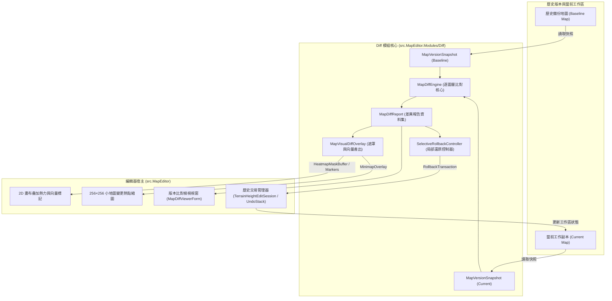

# 《反抗羅馬》(Against Rome) 地圖編輯器：地圖歷史版本差異比對與視覺化檢視系統設計方案
**文件版本**：v1.0.0  
**適用架構**：`src.MapEditor.Modules/Diff`、`src.MapEditor` (2D Canvas / 3D View / Minimap)  
**狀態**：核心架構已實作並通過單元測試  

---

## 1. 系統背景與核心設計目標

### 1.1 業務痛點與使用場景
在《反抗羅馬》(Against Rome) 的自製地圖創作過程中，地圖的反覆調校、多人協作分工（例如一人雕刻地形、一人鋪設聚落與事件）、以及 AI 智慧製圖代理的局部編修，常產生以下難題：
1. **修改無痕跡，難以追溯**：微調了山脈坡度或河道邊緣後，難以直觀得知與上一版備份的差異幅度。
2. **誤刪或誤改難以定位**：在大型地圖（例如包含數千個物件、64×64 材質格）中，特定哨塔、野怪巢穴或劇本事件被誤移或刪除時，人工逐一核對極為耗時。
3. **全盤還原代價高昂**：製圖者若只想復原東南方被改壞的丘陵，但西北方新鋪設的道路與堡壘需要保留，現有系統的全面復原（Revert Map）會抹除所有成果。

### 1.2 系統核心目標
本系統專注於提供一套純模組化、高效能且具備豐富視覺化交互的地圖版本比對與局部還原機制：
- **MapDiffEngine**：逐圖層深度精確比對，涵蓋高度起伏（Heightmap）、地表材質（Floor Materials）、通行碰撞（Collision）、場景實體（LevelObjects）與劇本腳本（ScenarioEvents）。
- **MapVisualDiffOverlay**：在 2D 畫布與 256×256 小地圖上即時疊加「紅色（刪除/下陷）、綠色（新增/抬升）、黃色（修改/材質轉換）」之高亮熱力遮罩與向量軌跡。
- **SelectiveRollbackController**：支援「局部空間矩形框選」與「指定圖層過濾」之選擇性復原，搭配邊界餘弦羽化（Edge Blending）演算法，無縫恢復歷史狀態並與 Undo/Redo 交易機制對接。

---

## 2. 系統總體架構藍圖

系統遵循 `src.MapEditor.Modules` 的純粹模組原則（純 `net8.0`，不直接依賴 WinForms 控制項、OpenGL 上下文或實體磁碟 I/O），透過明確的快照（Snapshot）輸入與報告（Report）輸出，由宿主編輯器（`src.MapEditor`）負責裝配與呈現。



---

## 3. 圖層比對機制 (MapDiffEngine)

### 3.1 地形高度圖層 (Heightmap Diff)
Against Rome 的地形高度由 `boden.bmp` 綠通道（頂點解析度通常為 $65 \times 65$ 或 $257 \times 257$）結合 `boden.ini` 的 `Heightmapstep`（世界單位高度比率，預設 4.0）決定。
- **比對運算**：
  $$ \Delta H(x, y) = H_{\text{current}}(x, y) \times \text{Step}_{\text{current}} - H_{\text{baseline}}(x, y) \times \text{Step}_{\text{baseline}} $$
- **雙線性自動重採樣 (Bilinear Resampling)**：
  若歷史版本與當前版本的高度圖尺寸不同（例如進行過解析度升級），引擎自動以目標最高解析度進行四點插值對齊，避免尺寸不一致引發索引越界。
- **統計量產出**：
  - 最大抬升高度 $\max(\Delta H)$ (Raise, 綠色色階)。
  - 最大下陷深度 $\max(-\Delta H)$ (Lower, 紅色色階)。
  - 淨體積變化 $\sum \Delta H$。
  - 顯著變更頂點採樣清單 `SampleChanges`。

### 3.2 地表材質圖層 (Floor Textures Diff)
地表材質由 `boden.txt` 的 $64 \times 64$ 圖塊名稱矩陣定義（如 `GRAS01`, `PFAD01`, `H_WEG1`, `Pflaster_braun1`）。
- **逐格判定**：比對相同坐標 $(x, y)$ 的材質名稱（不分大小寫）。
- **材質轉移矩陣 (Transition Matrix)**：
  統計由材質 A 轉移至材質 B 的次數（例如 `GRAS01 -> PFAD01: 42 格`），方便製圖者迅速掌握本次修改主要鋪設了哪些道路或農田。

### 3.3 通行碰撞圖層 (Collision Mask Diff)
由 `collision.bmp`（$256 \times 256$ 像素）定義：$0$ 為通行，$255$ 為阻擋。
- **新增阻擋 (Newly Blocked)**：歷史為通行，當前為阻擋（紅色警戒，可能造成尋路斷線）。
- **新增通行 (Newly Cleared)**：歷史為阻擋，當前為通行（天藍色標記）。

### 3.4 場景實體物件圖層 (LevelObjects & Spawns Diff)
針對地圖中的數千個場景物件（DATA 世界物件、部隊生成、建築物），採取**四階段多維度比對演算法**：
1. **持久 GUID 匹配**：編輯器專屬的 `ScenarioSpawn.Id`，若兩端皆具備且吻合，直接配對。
2. **Slot / UID 槽位匹配**：針對原版 `DATA/objects.dat` 世界物件，以槽位編號與動態 UID 精確對齊。
3. **啟發式空間鄰近度配對 (Heuristic Spatial Matching)**：
   對於無 GUID 或經過重新排序的自然物件（樹木、石頭），若類型別名（`Alias`）或 `TypeId` 相同，且歐幾里得距離小於設定半徑（`SpatialMatchRadius`，預設 150 世界單位），依最小距離進行雙射配對。
4. **狀態分類與屬性差分**：
   - `Added`（新增）：存在於當前但不在歷史版本（標示為綠色）。
   - `Deleted`（刪除）：存在於歷史但不在當前版本（標示為紅色幽靈物件）。
   - `Modified`（修改）：
     - 坐標位移 $\sqrt{\Delta X^2 + \Delta Z^2} > \text{PositionTolerance}$（標記為移動向量）。
     - 旋轉角度 $\Delta \theta > \text{RotationTolerance}$。
     - 隊伍所屬 (`Team`)、部隊編制人數 (`UnitCount`) 或完工狀態 (`Prebuilt`) 異動。

### 3.5 劇本腳本事件 (ScenarioEvents Diff)
比對 `arm_scenario.json` / `ak_level.bci` 注入之腳本事件：
- 依事件名稱（`Name`）索引配對。
- 逐項分析：延遲秒數 (`DelaySeconds`)、循環標記 (`Repeat`)、啟用狀態 (`Enabled`)。
- 深度比對觸發條件清單 (`Conditions`) 與執行動作清單 (`Actions`) 之增刪修。

---

## 4. 視覺化檢視遮罩系統 (MapVisualDiffOverlay)

### 4.1 色彩語意規範
遵循行業標準的直覺配色方案：

| 狀態類別 | 標記顏色 | 16 進位 ARGB | 視覺呈現型態 | 意義說明 |
| :--- | :--- | :--- | :--- | :--- |
| **新增 (Added)** | 鮮豔綠色 | `0xA000E676` | 半透明綠色填充 / 實線邊框 | 新增的建築、單位、物件，或抬升之地形 |
| **刪除 (Deleted)** | 警示紅色 | `0xA0FF1744` | 半透明紅色填充 / 虛線幽靈框 | 被移除的物件（標示歷史原點）、下陷之地形 |
| **修改 (Modified)** | 琥珀黃色 | `0xB0FFD600` | 半透明黃色覆蓋 / 雙層邊框 | 材質替換、物件旋轉、隊伍或屬性微調 |
| **移動 (Moved)** | 亮橘黃色 | `0xC0FFA000` | 起訖點連線箭頭向量 | 物件坐標位移，從舊位置指向新位置 |
| **新增阻擋 (Blocked)** | 深紅高亮 | `0xA0D50000` | 256×256 碰撞點陣格 | 尋路阻擋增加，需注意隘口是否被封死 |
| **新增通行 (Cleared)** | 天藍高亮 | `0xA000B0FF` | 256×256 碰撞點陣格 | 原有障礙被清除 |

### 4.2 點陣熱力遮罩緩衝區 (HeatmapMaskBuffer)
- 輸出格式為 32 位元 `uint[] Pixels`（`0xAARRGGBB`），可直接透過 `Marshal.Copy` 寫入 GDI+ `Bitmap` 或上傳至 OpenGL 紋理。
- **Alpha 混合演算法 (Alpha Blending)**：
  遮罩產生器內建軟體混合函數，使多個圖層（地形高度差 + 材質變更網格 + 碰撞遮罩）能在單一緩衝區內平滑複合，並支援全域透明度滑桿（`GlobalOpacity`，預設 0.7f）。

### 4.3 小地圖 (Minimap) 256×256 縮圖遮罩
- 自動對齊 Against Rome 原生地圖坐標系（$0 \sim 16384$ 世界坐標對應 $256 \times 256$ 像素）。
- 在小地圖縮圖中將新增、刪除、移動物件以 $2 \times 2$ 高亮像素方塊渲染，製圖者可一眼縱覽全圖變更熱區。

### 4.4 向量指標與移動軌跡 (DiffOverlayMarker)
在 2D 畫布與 3D 視圖中繪製：
- **移動向量箭頭**：自歷史坐標 $(X_{\text{base}}, Z_{\text{base}})$ 繪製連線箭頭指向當前坐標 $(X_{\text{cur}}, Z_{\text{cur}})$，並標註位移距離（例如 `-> 羅馬步兵隊 [移動 45.2m]`）。
- **幽靈實體框 (Ghost Box)**：為已刪除物件在歷史位置繪製紅色線框與叉號。

---

## 5. 局部選擇性復原控制器 (SelectiveRollbackController)

### 5.1 空間區域與圖層過濾
製圖者可在 2D 畫布上以滑鼠拖曳矩形選區 $(MinWorldX, MinWorldZ) \sim (MaxWorldX, MaxWorldZ)$，並透過核取方塊自由勾選要復原的圖層：
```csharp
[Flags]
public enum RollbackLayerFlags
{
    None = 0,
    Height = 1 << 0,     // 僅復原地貌高度
    Textures = 1 << 1,   // 僅復原地表材質
    Collision = 1 << 2,  // 僅復原通行碰撞
    Objects = 1 << 3,    // 僅復原實體物件
    All = Height | Textures | Collision | Objects
}
```

### 5.2 地形邊界羽化平滑過渡 (Edge Blending)
局部復原地形高度時，選區邊界若直接斷開會形成垂直陡峭斷崖。本控制器實作**邊界餘弦羽化（Cosine Blend Margin）**：
- 設選區邊界寬度為 $R$（頂點格數，預設 2 格）。
- 頂點 $(vx, vz)$ 到選區外緣的最小距離為 $d$。
- 若 $d < R$，計算羽化加權係數 $w$：
  $$ t = \frac{d}{R}, \quad w = \frac{1}{2} \left(1 - \cos(\pi \cdot t)\right) $$
  $$ H_{\text{blended}} = \text{round}\left( H_{\text{baseline}} \cdot w + H_{\text{current}} \cdot (1 - w) \right) $$
- 若 $d \ge R$，則直接完全還原為 $H_{\text{baseline}}$。
- 此演算法確保選區核心完全恢復為歷史高度，同時邊界平滑過渡至未還原的當前地表。

### 5.3 交易式封裝與 Undo/Redo 整合
`RollbackTransaction` 輸出結果包含：
- `IReadOnlyList<DiffTerrainSampleChange> HeightChanges`：可直接調用 `ToTerrainSampleChanges()` 輸入 `TerrainHeightEditSession`，形成單步 Undo 交易。
- `IReadOnlyList<TileTextureChange> TextureChanges`：可直接注入 `TerrainBlendAuthoringMap`。
- `ObjectsToRestore`、`ObjectsToRemove`、`ObjectsToRevert`：可由 `PlacementEditSession` 統一執行。
- 若使用者在復原後發現不滿意，按下 `Ctrl+Z` 即可單步復原，保證零資料遺失風險。

---

## 6. 核心資料結構與 API 規格

### 6.1 MapDiffTypes.cs 核心型別
```csharp
namespace AgainstRomeMapEditor.Modules.Diff;

public sealed record MapVersionSnapshot(
    string VersionLabel,
    int TileDimension,
    int HeightDimension,
    IReadOnlyList<byte>? Heights,
    float HeightStep = 4.0f,
    IReadOnlyList<string>? Textures = null,
    int CollisionDimension = 0,
    IReadOnlyList<byte>? Collision = null,
    IReadOnlyList<DiffObjectItem>? Objects = null,
    IReadOnlyList<ScenarioEvent>? Events = null
);

public sealed record DiffObjectItem(
    Guid Id,
    int Slot,
    uint Uid,
    string Alias,
    int TypeId,
    int Team,
    float X,
    float Y,
    float Z,
    float Rotation = 0f,
    int UnitCount = 0,
    bool Prebuilt = false
);

public sealed record MapDiffReport(
    DateTimeOffset ComparedAt,
    string BaselineLabel,
    string CurrentLabel,
    HeightDiffRecord Height,
    TextureDiffRecord Textures,
    CollisionDiffRecord Collision,
    ObjectDiffRecord Objects,
    EventDiffRecord Events
);
```

### 6.2 MapDiffEngine.cs 比對入口
```csharp
namespace AgainstRomeMapEditor.Modules.Diff;

public static class MapDiffEngine
{
    public static MapDiffReport Compare(
        MapVersionSnapshot baseline,
        MapVersionSnapshot current,
        MapDiffOptions? options = null);
}
```

### 6.3 MapVisualDiffOverlay.cs 視覺遮罩入口
```csharp
namespace AgainstRomeMapEditor.Modules.Diff;

public static class MapVisualDiffOverlay
{
    public static HeatmapMaskBuffer GenerateHeatmapMask(
        MapDiffReport diff,
        int outputWidth,
        int outputHeight,
        DiffOverlayOptions? options = null);

    public static HeatmapMaskBuffer GenerateMinimapOverlay(
        MapDiffReport diff,
        int minimapWidth = 256,
        int minimapHeight = 256,
        DiffOverlayOptions? options = null);

    public static IReadOnlyList<DiffOverlayMarker> GenerateVectorMarkers(
        MapDiffReport diff,
        DiffOverlayOptions? options = null);
}
```

### 6.4 SelectiveRollbackController.cs 局部還原入口
```csharp
namespace AgainstRomeMapEditor.Modules.Diff;

public static class SelectiveRollbackController
{
    public static RollbackTransaction ComputeRollback(
        MapVersionSnapshot baseline,
        MapVersionSnapshot current,
        MapDiffReport diff,
        RollbackRegionScope scope);
}
```

---

## 7. 編輯器 UI 整合設計提案 (MapEditorForm & DiffViewerForm)

### 7.1 使用者操作流程
```
[選單: 檔案 -> 歷史版本比對 (Ctrl+Shift+D)]
  │
  ├─> 彈出「選擇對照備份 (Select Baseline Map)」對話框
  │     - 支援挑選自動備份目錄 (.bak) 或其他自製地圖資料夾
  │
  ├─> 開啟專屬「版本差異檢視面板 (Diff Viewer Panel)」
  │     - 頂部：圖層開關 [☑ 地形起伏 (綠/紅)] [☑ 地表材質 (黃)] [☑ 物件變更] [☑ 軌跡連線]
  │     - 滑桿：遮罩透明度 (Opacity 0% ~ 100%)
  │     - 左側：2D 畫布直接渲染半透明熱力與移動向量
  │     - 右側：差異清單 (TreeView: 地形 24 頂點 / 材質 12 格 / 物件 +2 -1 ~3 / 事件)
  │     - 雙擊清單項目：2D 畫布與相機即時平移居中聚焦
  │
  └─> 點擊「框選局部還原 (Rollback Selection)」
        - 在畫布上拉出矩形選區
        - 彈出確認對話框：「即將還原選區內 16 個地形頂點與 2 個物件至備份版本」
        - 點擊確定 -> 寫入單筆 Undo 記錄並即時刷新視圖
```

---

## 8. 測試驗證矩陣 (Test Matrix)

本系統於 `tests/AgainstRomeMapEditor.Modules.Tests/MapDiffEngineTests.cs` 中建構完整單元測試，涵蓋各圖層與邊界情況：

| 測試案例名稱 | 驗證範疇 | 預期斷言 |
| :--- | :--- | :--- |
| `MapDiffEngine_IdenticalSnapshots_ReportsNoDifferences` | 相同版本無差異防護 | `HasDifferences = false`，各圖層變更數均為 0 |
| `MapDiffEngine_HeightDifferences_DetectsRaiseLowerAndVolume` | 高度起伏數值精確度 | 正確捕捉抬升 +40、下陷 -20，淨體積 +20，DeltaGrid 對齊 |
| `MapDiffEngine_TextureDifferences_DetectsChangedTilesAndTransitions` | 64×64 材質轉換矩陣 | 正確捕捉 `GRAS01 -> PFAD01` (2格) 與 `GRAS01 -> H_WEG1` (1格) |
| `MapDiffEngine_CollisionDifferences_DetectsBlockedAndCleared` | 通行遮罩狀態翻轉 | 正確分辨 NewlyBlocked 與 NewlyCleared 格位 |
| `MapDiffEngine_ObjectDifferences_DetectsAddedDeletedMovedModified` | 物件多狀態配對 | 正確識別新增、刪除、位移 >100m、角度及編制人數變更 |
| `MapDiffEngine_EventDifferences_DetectsEventChanges` | 劇本腳本事件比對 | 正確捕捉新增 BossFight、刪除 Wave1、延遲修改之 Intro |
| `MapVisualDiffOverlay_GeneratesHeatmapAndMinimapBuffer` | 點陣遮罩與小地圖渲染 | 輸出 256×256 ARGB 陣列，非零像素存在，向量標記正確產出 |
| `SelectiveRollback_RegionHeightRollbackWithEdgeBlend` | 局部高度還原與邊界羽化 | 中心頂點 100% 恢復為 Baseline，邊界平滑過渡，選區外保持現狀 |
| `SelectiveRollback_TextureAndObjectRollback_RespectsScopeAndFilters` | 材質與物件選區過濾 | 僅選區內之材質與物件被納入還原交易，選區外被嚴格排除 |

---

## 9. 結論與後續演進規劃

本設計完成了《反抗羅馬》地圖歷史版本差異比對與視覺化檢視系統的底層核心架構：
1. **零外部依賴、純模組化**：置於 `src.MapEditor.Modules/Diff`，與 WinForms / OpenGL / 檔案系統完全解耦。
2. **完整覆蓋遊戲 5 大核心圖層**：高度圖、地表材質、通行遮罩、實體物件、劇本事件。
3. **優異的視覺表現力**：RGB 色彩遮罩搭配向量軌跡，小地圖同步概覽。
4. **精準安全的手術刀式局部復原**：選區框選、圖層過濾與餘弦羽化，保障製圖成果不被誤抹除。
