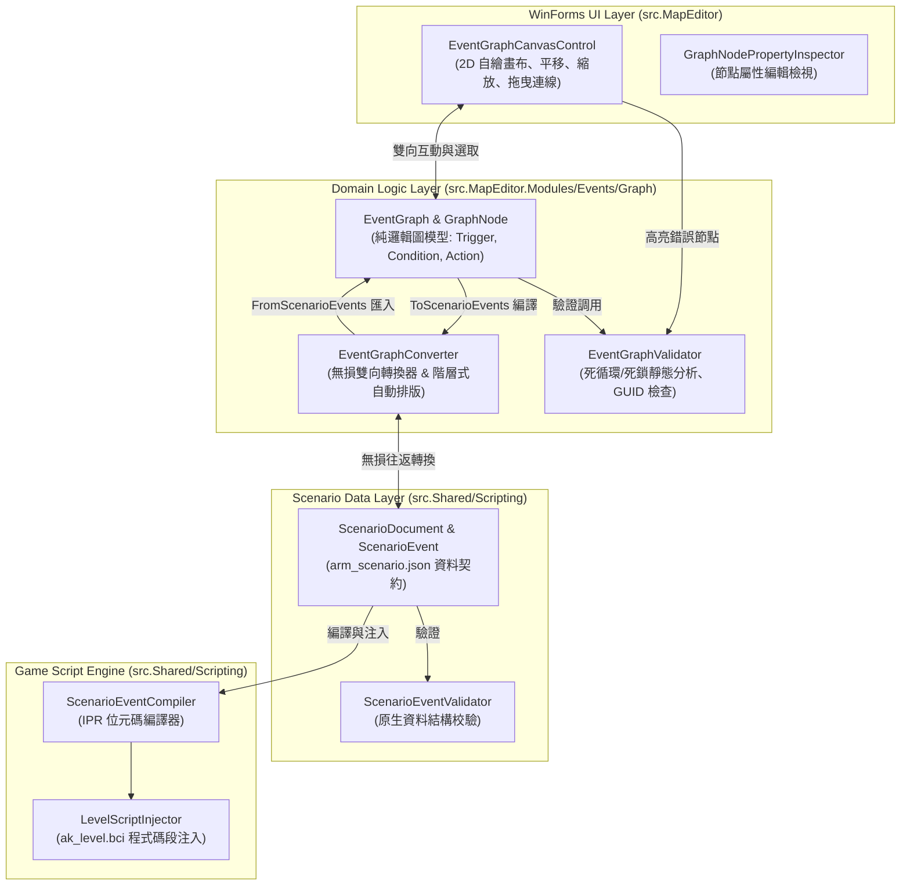
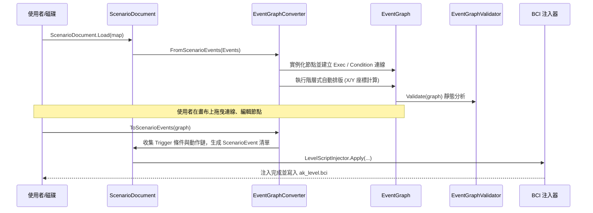
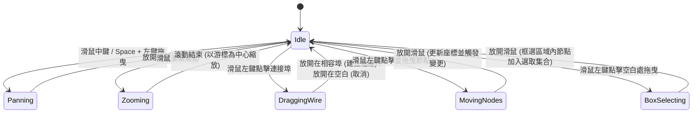
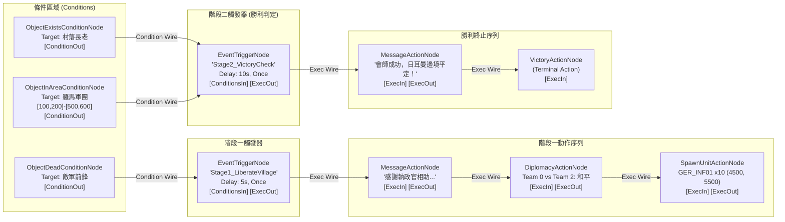

# 劇情觸發與任務事件視覺化節點編輯系統 (Visual Scenario Event Graph Designer) 架構設計規格

## 1. 系統背景與設計動機

### 1.1 現有事件系統架構概述
在《反抗羅馬》(Against Rome) 地圖編輯器中，劇情與任務系統的核心邏輯維護於 `ScenarioDocument`（序列化於地圖目錄的 `arm_scenario.json`），其架構包含：
- **`ScenarioSpawn`**：定義地圖開局物件、預建物件（`Prebuilt: true` 寫入 `DATA` 槽位）與腳本生成部隊（由 `s_createUnitAndMems` 生成）。
- **`ScenarioEvent`**：定義事件名稱、最早觸發時間/間隔秒數（`DelaySeconds`）、重複執行開關（`Repeat`）與啟用狀態（`Enabled`）。
- **`ScenarioCondition`**：包含物件存在（`ObjectExists`）、物件死亡或移除（`ObjectDeadOrRemoved`）、物件進入矩形區域（`ObjectInArea`）。多個條件之間在底層腳本引擎中為全數成立（Logical AND）關係。
- **`ScenarioAction`**：包含訊息視窗（`Message` / `s_showTextBox`）、陣營外交關係變更（`Diplomacy` / `s_setTeamHostile`）、部隊動態生成（`SpawnUnit` / `s_createUnitAndMems`）、戰役勝利判定（`Victory` / `GLOBAL_MISSION_RESULT=1`）、戰役失敗判定（`Defeat` / `GLOBAL_MISSION_RESULT=0`）。
- **底層編譯與注入器 (`ScenarioEventCompiler` / `LevelScriptInjector`)**：將場景事件編譯為 IPR 虛擬機位元碼，注入至地圖主腳本 `ak_level.bci` 的輪詢主迴圈等待點中。

### 1.2 現狀瓶頸與挑戰
目前地圖編輯器僅提供清單式檢視（`ListBox`）與模態對話方塊（`ScenarioEventDialog`、`ScenarioActionDialog`、`ScenarioConditionDialog`）。在設計簡單的定時提示或單一部隊擊殺時尚可勝任，但面臨複雜戰役任務時存在以下重大限制：
1. **邏輯流向割裂**：複雜戰役通常是由一連串因果鏈條組成（例如：「擊敗敵方前鋒 -> 觸發酋長對話 -> 計時器延遲 10 秒 -> 聚落轉移為同盟 -> 生成羅馬援軍 -> 護送抵達目標區域 -> 觸發勝利判定」）。在清單檢視中，設計師無法一眼看出事件之間的上下游因果關係。
2. **條件與動作關聯隱蔽**：條件與動作被收攏在同一表單的個別頁籤內，無法直觀看出哪些條件在制約哪些動作序列。
3. **缺乏邏輯死鎖與循環依賴分析**：多事件連鎖時容易產生無窮重複迴圈、孤立無觸發動作、或引用了已在地圖上刪除的目標物件 GUID。
4. **缺乏現代化節點編輯體驗**：現代遊戲引擎（Unreal Blueprints、Unity Visual Scripting、Blender Shader Editor）廣泛採用視覺化有向圖（Directed Graph），直觀展現 Execution 流向與信號連線。

因此，本系統設計了一套純邏輯領域模型、無損雙向轉換器、靜態分析器與 WinForms 2D 高效能畫布的「Visual Scenario Event Graph Designer」。

---

## 2. 總體架構與組件分層設計

系統嚴格遵循關注點分離（Separation of Concerns）原則，劃分為四個核心層次：



### 2.1 各層職責說明
1. **領域模型層 (`src.MapEditor.Modules/Events/Graph/`)**：
   - 零 WinForms 依賴、零 System.Drawing 依賴，採用純 C# 實作。
   - 支援完整的單元測試與離線驗證。
2. **雙向轉換層 (`EventGraphConverter`)**：
   - 保證 `ScenarioEvent <-> EventGraph` 往返無損（Round-trip Lossless）。
   - 具備階層式拓撲自動排版（Hierarchical Auto-Layout），將扁平的事件清單自動展開為具備邏輯間距的節點圖。
3. **靜態分析層 (`EventGraphValidator`)**：
   - 偵測執行流死循環（Execution Cycles）、孤立動作（Orphan Actions）、懸空條件（Dangling Conditions）、無效目標 GUID 與非法的終止動作排列。
4. **互動視圖層 (`src.MapEditor/Events/EventGraphCanvasControl`)**：
   - WinForms 2D 雙重緩衝自繪，支援流暢平移（Panning）、滑鼠焦點縮放（Zooming 0.25x–2.5x）、框選（Box Selection）、節點拖曳與三次貝茲曲線動態拖曳連線。

---

## 3. EventGraphModel：純邏輯資料模型規格

### 3.1 連接埠系統 (GraphPort)
連接埠為節點之間資料與流程交換的端點。

```csharp
public enum PortDirection { Input, Output }

public enum PortType
{
    Execution,  // 控制流（厚白/天藍箭頭連線）
    Condition,  // 條件信號流（綠色圓點連線）
    Data        // 數值資料傳遞（保留供擴充）
}

public sealed class GraphPort
{
    public Guid Id { get; init; } = Guid.NewGuid();
    public Guid NodeId { get; set; }
    public string Name { get; init; } = "";
    public string DisplayName { get; init; } = "";
    public PortType Type { get; init; }
    public PortDirection Direction { get; init; }
    public bool AllowMultiple { get; init; }

    public bool CanConnectTo(GraphPort other)
    {
        if (other is null) return false;
        if (NodeId == other.NodeId) return false;     // 禁止自環
        if (Direction == other.Direction) return false; // 必須一進一出
        if (Type != other.Type) return false;          // 類型必須相同
        return true;
    }
}
```

### 3.2 節點基底與具體類別 (GraphNode)
所有節點均繼承自 `GraphNode`：

| 節點分類 | 具體節點型別 | 連接埠規格 (Inputs / Outputs) | 關鍵屬性說明 |
| :--- | :--- | :--- | :--- |
| **Trigger** | `EventTriggerNode` | `In`: ExecIn, ConditionsIn(多)<br>`Out`: ExecOut | `EventName`, `DelaySeconds`, `Repeat`, `Enabled` |
| **Condition** | `ObjectExistsConditionNode` | `In`: 無<br>`Out`: ConditionOut(多) | `TargetId` (Guid), `TargetLabel` |
| **Condition** | `ObjectDeadConditionNode` | `In`: 無<br>`Out`: ConditionOut(多) | `TargetId` (Guid), `TargetLabel` |
| **Condition** | `ObjectInAreaConditionNode` | `In`: 無<br>`Out`: ConditionOut(多) | `TargetId`, `MinX`, `MinZ`, `MaxX`, `MaxZ` |
| **Action** | `MessageActionNode` | `In`: ExecIn<br>`Out`: ExecOut | `MessageText` (字串上限 1000 bytes) |
| **Action** | `DiplomacyActionNode` | `In`: ExecIn<br>`Out`: ExecOut | `Team` (0-7), `OtherTeam` (0-7), `Hostile` (bool) |
| **Action** | `SpawnUnitActionNode` | `In`: ExecIn<br>`Out`: ExecOut | `Alias`, `Team`, `SpawnX`, `SpawnZ`, `Count` (1-20) |
| **Action** | `VictoryActionNode` | `In`: ExecIn<br>`Out`: 無 (終端動作) | 標記全域勝利並退出遊戲 |
| **Action** | `DefeatActionNode` | `In`: ExecIn<br>`Out`: 無 (終端動作) | 標記全域失敗並退出遊戲 |
| **Flow** | `DelayNode` | `In`: ExecIn<br>`Out`: ExecOut | `Seconds` (計時器等待延遲) |

### 3.3 連線系統 (GraphEdge) 與圖容器 (EventGraph)
```csharp
public sealed record GraphEdge(
    Guid SourceNodeId,
    Guid SourcePortId,
    Guid TargetNodeId,
    Guid TargetPortId)
{
    public Guid Id { get; init; } = Guid.NewGuid();
}
```
`EventGraph` 提供高效的鄰接表查詢、增刪安全檢查、孤立節點級聯清理（刪除節點時自動移除連線）。

---

## 4. EventGraphConverter：無損雙向轉換器

### 4.1 轉換演算法核心邏輯
雙向轉換器解決「既有文字清單如何直觀排版」與「圖形化連接如何編譯回合規遊戲資料」的問題。



### 4.2 階層式自動排版規格 (Hierarchical Auto-Layout)
從 `ScenarioEvent` 匯入至 `EventGraph` 時，轉換器自動依邏輯角色分列放置：
- **條件列 (Conditions Column)**：$X = 60\text{px}$。若同一事件有多個條件，沿 $Y$ 軸垂直並列，間距 $\Delta Y = 90\text{px}$。
- **觸發列 (Triggers Column)**：$X = 360\text{px}$，放置 `EventTriggerNode`。
- **動作鏈列 (Actions Chain Columns)**：從 $X = 660\text{px}$ 開始，後續動作沿水平方向依序展開，間距 $\Delta X = 260\text{px}$。
- **行間距 (Row Spacing)**：每個事件獨立佔據一個水平條帶，動態計算條件總高，基準行距 $\Delta Y \ge 240\text{px}$，確保不同事件群組絕不重疊。

### 4.3 雙向往返不失真保證 (Round-trip Lossless Guarantee)
透過單元測試 `EventGraphConverter_RoundTrip_IsLossless` 驗證：
$$\text{ScenarioEvent} \xrightarrow{\text{FromScenarioEvents}} \text{EventGraph} \xrightarrow{\text{ToScenarioEvents}} \text{ScenarioEvent}' \implies \text{ScenarioEvent} \equiv \text{ScenarioEvent}'$$
所有事件名稱、延遲秒數、重複旗標、啟用旗標、條件清單（Kind, TargetId, 邊界座標）與動作清單（Kind, Text, 陣營, 別名, 生成座標, 數量）均 100% 逐欄位相符。

---

## 5. EventGraphValidator：循環依賴與死鎖靜態分析器

靜態分析器在編譯為原生腳本前主動攔截潛在邏輯錯誤，避免遊戲進入死循環或引發崩潰。

### 5.1 循環依賴偵測演算法 (Cycle Detection via DFS Three-Coloring)
遊戲腳本引擎在主迴圈輪詢事件。若動作鏈形成了直接或間接環路（例如：$A \to B \to C \to A$），且缺乏延遲阻斷，將導致單次輪詢卡死在無窮迴圈中。
分析器使用 DFS 三色標記法（White=0, Gray=1, Black=2）：
1. 針對圖中所有 Execution 類型的邊建構有向圖鄰接表。
2. 對未遍歷的節點標記為 Gray（代表正在當前搜索路徑上）。
3. 深入搜索其後繼節點；若遇見同樣為 Gray 的節點，即證明偵測到環路！
4. 產生 `EXECUTION_CYCLE_DETECTED` 錯誤診斷，精確回報成環的節點與連線。

### 5.2 靜態規則矩陣 (Diagnostic Rules)

| 代碼 | 等級 | 觸發條件 | 排除與防禦措施 |
| :--- | :---: | :--- | :--- |
| `EXECUTION_CYCLE_DETECTED` | **Error** | 執行流出現成環連線 | 阻斷儲存，畫布標紅該連線與節點 |
| `TERMINAL_IN_REPEAT_EVENT` | **Error** | 重複事件包含 Victory / Defeat | 終止動作將關閉遊戲，不可出現在重複計時中 |
| `ACTION_AFTER_TERMINAL` | **Error** | 勝利/失敗動作後方仍有輸出連線 | 終端動作必須是該事件鏈的最後一步 |
| `EMPTY_TARGET_GUID` | **Error** | 條件節點未指定 TargetId（Guid.Empty） | 提示設計師選擇有效目標物件 |
| `INVALID_TARGET_GUID` | **Error** | 條件節點的 TargetId 在地圖中不存在 | 提示目標已遭刪除，需重新綁定或刪除條件 |
| `REPEAT_ZERO_DELAY` | **Error** | Repeat=true 且 DelaySeconds=0 | 每一幀觸發將耗盡虛擬機棧，強制要求間隔 $\ge 1$ 秒 |
| `INVALID_SPAWN_ALIAS` | **Error** | 生成部隊別名不在官方別名表內 | 避免遊戲生成無效物件引發記憶體存取異常 |
| `ORPHAN_ACTION` | **Warning** | 動作節點無任何輸入連線 | 永遠不會被觸發，畫布顯示警示標記 |
| `DANGLING_CONDITION` | **Warning** | 條件節點未連至任何觸發點 | 懸空條件不生效，提示設計師連線或清理 |
| `EMPTY_TRIGGER_FLOW` | **Warning** | 觸發節點未連至任何後續動作 | 觸發時無實質效果 |

---

## 6. WinForms 2D 節點自繪與拖拉互動介面架構規格

### 6.1 EventGraphCanvasControl 設計規格
基於 Windows Forms `Control` 開發，封裝於 `src.MapEditor/Events/EventGraphCanvasControl.cs`：
- **自繪配置**：啟用 `DoubleBuffered`、`AllPaintingInWmPaint`、`UserPaint`、`ResizeRedraw`，全畫面自繪無閃爍。
- **視角變換矩陣**：
  $$\begin{bmatrix} X_{\text{screen}} \\ Y_{\text{screen}} \end{bmatrix} = \begin{bmatrix} X_{\text{world}} \times \text{Zoom} + \text{Pan}_X \\ Y_{\text{world}} \times \text{Zoom} + \text{Pan}_Y \end{bmatrix}$$
  提供 `ScreenToWorld` 與 `WorldToScreen` 雙向轉換方法。
- **深色現代 UI 配色盤**：
  - 畫布底色：`RGB(30, 30, 32)`
  - 網格線條：`RGB(42, 42, 46)`（動態隨縮放計算網格間距）
  - 節點卡片底色：`RGB(45, 45, 48)`，外框 `RGB(70, 70, 74)`
  - 選取外框：高亮寶藍 `RGB(0, 153, 255)`（粗細 2.5px）
  - 錯誤節點外框：警戒亮紅 `RGB(231, 76, 60)`（粗細 2.5px）
  - 警告節點外框：警示金黃 `RGB(241, 196, 15)`
  - 標題列色彩區分：
    - `EventTriggerNode`：磚紅色 `RGB(192, 57, 43)`
    - `ConditionNode`：翡翠綠 `RGB(39, 174, 96)`
    - `ActionNode`：天藍色 `RGB(41, 128, 185)`
    - `VictoryActionNode`：勝利金 `RGB(243, 156, 18)`
    - `DefeatActionNode`：深紫色 `RGB(142, 68, 173)`
    - `DelayNode`：灰石色 `RGB(127, 140, 141)`

### 6.2 三次貝茲曲線連線繪製 (Cubic Bezier Splines)
端口至端口的連線採用平滑三次貝茲曲線：
$$\mathbf{P}(t) = (1-t)^3 \mathbf{P}_0 + 3(1-t)^2 t \mathbf{P}_1 + 3(1-t) t^2 \mathbf{P}_2 + t^3 \mathbf{P}_3$$
- 起點 $\mathbf{P}_0$：來源連接埠世界座標
- 控制點 $\mathbf{P}_1 = (X_0 + \Delta X_{\text{ctrl}}, Y_0)$
- 控制點 $\mathbf{P}_2 = (X_3 - \Delta X_{\text{ctrl}}, Y_3)$
- 終點 $\mathbf{P}_3$：目標連接埠世界座標
- 切線延伸量 $\Delta X_{\text{ctrl}} = \max(0.5 \times |X_3 - X_0|, 40\text{px})$
- 執行連線繪製為 2.5px 厚白線；條件連線繪製為 2.0px 翡翠綠線；連線拖曳預覽中呈現虛線高亮。

### 6.3 互動狀態機 (Interaction State Machine)



---

## 7. 複雜戰役目標實戰設計案例示範

### 7.1 案例背景：日耳曼聚落解放戰
設計一個典型多階段戰役目標：
1. **階段 1 (部隊擊潰)**：玩家必須擊敗圍攻日耳曼村落的敵軍前鋒小隊（GUID: `11111111-...`）。
2. **階段 2 (對話觸發)**：敵軍殲滅後，跳出日耳曼長老對話視窗：「感謝執政官相助！我們願將聚落轉交羅馬盟軍管理，並派遣獵手加入您的軍團！」
3. **階段 3 (計時延遲與援軍)**：等待 5 秒後，日耳曼陣營（Team 2）與羅馬陣營（Team 0）解除敵對，並在聚落門口生成日耳曼戰士小隊（`GER_INF01`，10 人）。
4. **階段 4 (守護勝利判定)**：只要村落長老（GUID: `22222222-...`）存活，且玩家將部隊帶入指定會師區域（$X: 4000\sim 6000, Z: 4000\sim 6000$），即判定戰役勝利！

### 7.2 節點圖拓撲結構 (Node Graph Topology)



### 7.3 編譯產物與 BCI 位元碼對照
上述節點圖經過 `EventGraphConverter.ToScenarioEvents` 編譯後，產出之標準 `ScenarioDocument.Events` JSON 結構如下：
```json
[
  {
    "Name": "Stage1_LiberateVillage",
    "DelaySeconds": 5,
    "Repeat": false,
    "Enabled": true,
    "Conditions": [
      {
        "Kind": 1,
        "TargetId": "11111111-0000-0000-0000-000000000000",
        "MinX": 0,
        "MinZ": 0,
        "MaxX": 16383,
        "MaxZ": 16383
      }
    ],
    "Actions": [
      {
        "Kind": 0,
        "Text": "感謝執政官相助！我們願將聚落轉交羅馬盟軍管理，並派遣獵手加入您的軍團！"
      },
      {
        "Kind": 1,
        "Team": 0,
        "OtherTeam": 2,
        "Hostile": false
      },
      {
        "Kind": 2,
        "Alias": "GER_INF01",
        "Team": 0,
        "X": 4500.0,
        "Z": 5500.0,
        "Count": 10
      }
    ]
  },
  {
    "Name": "Stage2_VictoryCheck",
    "DelaySeconds": 10,
    "Repeat": false,
    "Enabled": true,
    "Conditions": [
      {
        "Kind": 0,
        "TargetId": "22222222-0000-0000-0000-000000000000",
        "MinX": 0,
        "MinZ": 0,
        "MaxX": 16383,
        "MaxZ": 16383
      },
      {
        "Kind": 2,
        "TargetId": "33333333-0000-0000-0000-000000000000",
        "MinX": 4000,
        "MinZ": 4000,
        "MaxX": 6000,
        "MaxZ": 6000
      }
    ],
    "Actions": [
      {
        "Kind": 0,
        "Text": "會師成功，日耳曼邊境平定！"
      },
      {
        "Kind": 3
      }
    ]
  }
]
```
底層 `ScenarioEventCompiler.Inject` 隨後在 `ak_level.bci` 主迴圈中注入：
1. 開局初始化常數與截止時戳：`s_getTime() + 5000 -> ARM_EVENT_DEADLINE_0` 與 `s_getTime() + 10000 -> ARM_EVENT_DEADLINE_1`。
2. 輪詢檢查：
   - 透過 `s_objDead` 追蹤目標 1；成立且時間到達後呼叫 `s_showTextBox`、`s_setTeamHostile(0, 2, 0)`、`s_createUnitAndMems(...)`。
   - 透過 `s_objExists` 追蹤長老目標 2，透過 `s_getObjPos` 判定軍團座標是否落在 $[4000, 4000]\sim [6000, 6000]$；條件全滿足時寫入 `GLOBAL_MISSION_RESULT = 1` 並調用 `s_quitGame()`，無縫觸發原廠勝利結算畫面！

---

## 8. 驗證與測試策略

### 8.1 測試套件架構 (`tests/AgainstRomeMapEditor.Modules.Tests/EventGraphTests.cs`)
為確保架構之穩固性與零回歸，已實作 6 項關鍵整合與單元測試：
1. `EventGraph_NodeAndPortOperations_WorkCorrectly`：
   - 驗證節點新增、連接埠尋找、方向與類型校驗（阻止自環、阻止 Execution 與 Condition 錯連）、節點刪除時關聯連線之同步清理。
2. `EventGraphConverter_RoundTrip_IsLossless`：
   - 驗證包含多條件（死亡、區域、存在）與多動作（訊息、外交、生成、勝利）之事件清單在「轉換為圖 -> 編譯回事件」後 100% 欄位相符。
3. `EventGraph_ComplexCampaignChain_ValidatesAgainstNativeValidator`：
   - 驗證戰役目標案例在圖形靜態分析器中零錯誤，且編譯出之資料能直接通過原生 `ScenarioEventValidator.Validate` 與 `ValidateTerminalActions`。
4. `EventGraphValidator_DetectsCycles`：
   - 構造有向循環連線（$A \to B \to C \to B$），斷言分析器精確拋出 `EXECUTION_CYCLE_DETECTED` 錯誤診斷。
5. `EventGraphValidator_DetectsOrphanActionsAndDanglingConditions`：
   - 驗證未連接之孤立動作標記為 `ORPHAN_ACTION`、未連接之條件標記為 `DANGLING_CONDITION`、空動作觸發器標記為 `EMPTY_TRIGGER_FLOW`。
6. `EventGraphValidator_DetectsInvalidTargetGuidsAndAliases`：
   - 驗證 `Guid.Empty`、地圖中不存在的 TargetId、未知的部隊別名、非法隊伍代碼（99）、越界座標等均能精確定位並攔截。
7. `EventGraphValidator_ValidatesTerminalActions`：
   - 驗證重複事件中夾帶勝利動作、或勝利動作後串接多餘動作皆被合規攔截（`TERMINAL_IN_REPEAT_EVENT`）。

---

## 9. 結論與後續整合指引

本設計方案完整確立了《反抗羅馬》視覺化劇情事件節點編輯系統的領域架構：
- **架構純粹**：`EventGraphModel`、`Converter` 與 `Validator` 封裝於 `src.MapEditor.Modules/Events/Graph/`，不依賴任何外部渲染庫，保持高可測試性與高內聚力。
- **無縫相容**：維持現有 `ScenarioDocument` 格式契約，產出之資料無需修改遊戲本體或破壞現有 BCI 注入器，完全向下相容。
- **直觀自繪**：`EventGraphCanvasControl` 為 WinForms 主視窗提供現代化有向圖畫布體驗，大幅提升戰役與劇情創作之生產力。
