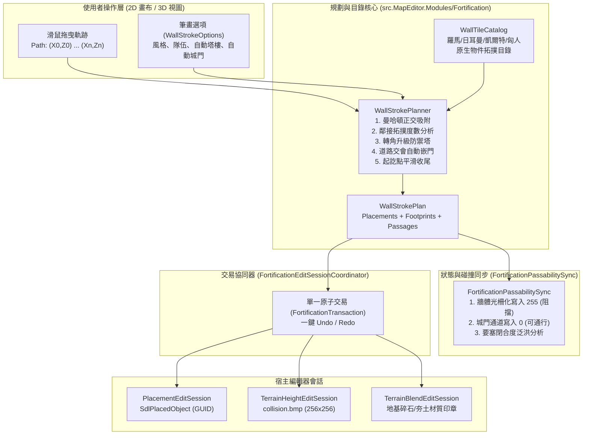
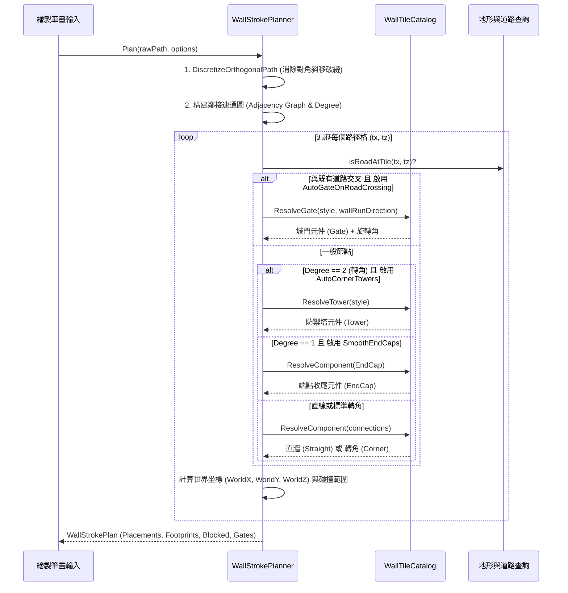

# 《反抗羅馬》(Against Rome) 地圖編輯器：城牆與防禦工事自動連接系統架構設計

> **文檔狀態**：架構設計規範與核心原型已實現  
> **模組路徑**：`src.MapEditor.Modules/Fortification/`  
> **單元測試**：`tests/AgainstRomeMapEditor.Modules.Tests/FortificationTests.cs`  
> **對應版本**：Against Rome Modifier / Map Editor 2026.10 模組架構

---

## 1. 系統背景與設計動機 (Background & Motivation)

在原版即時戰略遊戲《反抗羅馬》（Against Rome）中，防禦工事（Fortifications）具有極為核心的戰術與視覺地位：
- **羅馬文明 (Romans)**：擁有雄偉的石砌城牆（`BauRomPal00` / `BauRomMauer`）、方型石砌拐角（`BauRomPal02_Palisadenecke`）、石質城門（`BauRomMauertor` / `BauRomPalTor`）與宏偉的石製防禦塔（`BauRomTur00_Turm`）。
- **日耳曼蠻族 (Germanic)**：依託茂密的森林建造尖銳的原木柵欄（`BauGerPal00`）、轉角木樁（`BauGerPal02_Palisadenecke`）、木造吊門（`BauGerPalTor` / `Palisadentor`）與原木防禦角樓（`BauGerTur00`）。
- **凱爾特 (Celtic) 與匈人 (Hun)**：亦擁有風格鮮明的木質拒馬、石木土壘與野戰哨塔。

### 既有地圖編輯器的痛點
1. **手工逐塊擺放繁複呆板**：以往地圖作者若要建造一段環城城牆，必須在「放置物件」面板手動點擊數十至上百次，且必須手動在旋轉角度（0°、90°、180°、270°）之間反覆切換調整，極易出現方向接反或破洞。
2. **缺乏智慧轉折與樞紐識別**：一般直線牆體轉折 90 度時，外觀需要專屬的轉角圖塊（Corner piece）；當三條或四條城牆匯聚時，需要 T 型或十字型樞紐。手動配對極其低效。
3. **道路與城門切換斷層**：城牆遇到主要幹道或土路時，必須在此處嵌合「城門 (Gate)」。缺乏自動化工具時，作者常忘記開門導致交通阻斷，或者城門朝向與城牆走線垂直脫節。
4. **通行性網格 (`collision.bmp`) 脫節**：遊戲的寻路與物理碰撞依賴 `collision.bmp`（256×256 灰階圖，0=通行，255=阻擋）。純粹放置 SDL 建築物件若未同步刷新碰撞圖層，單位將會穿牆而過；反之，若手動塗抹阻擋，又難以精確配置城門中央通道的受控通行性（Open/Closed）。
5. **起訖點破面**：一般直線城牆若突兀中斷，截面會露出空心破綻，缺少平滑封閉的收尾端柱（EndCap）。

本系統專為解決上述痛點而設計，提供如同《世紀帝國 II》(Age of Empires II) 般流暢的「拖曳滑鼠即自動規劃連續防禦工事、自動昇華拐角塔樓、自動道路嵌門、起訖平滑收尾，並同步烘焙通行網格」的完整解決方案。

---

## 2. 系統總覽與四本柱架構 (Four Pillars Architecture)



---

## 3. 柱一：防禦工事圖元與元件目錄 (`WallTileCatalog`)

### 3.1 文化風格分類 (`FortificationStyle`)
系統支援四個民族的專屬建築規範：
1. `RomanStoneWall`：羅馬大理石/切石城牆、石階城樓、厚重石垛與金屬合頁城門。
2. `GermanicPalisade`：日耳曼原木柵欄、深坑削尖拒馬、木造角樓。
3. `CelticPalisade`：凱爾特原木石塊複合障礙、編籬牆。
4. `HunBarricade`：匈人野戰營地木拒馬、輕型觀測塔。

### 3.2 拓撲元件種類 (`WallComponentKind`) 與連通遮罩
每個圖元元件綁定四向正交位元遮罩 `WallConnections`：
- `North` = $1$ (Z - 1)
- `East` = $2$ (X + 1)
- `South` = $4$ (Z + 1)
- `West` = $8$ (X - 1)

元件種類分類：
| 元件分類 (`WallComponentKind`) | 典型連通遮罩 | 佔地 (Tile) | 說明 |
| :--- | :--- | :--- | :--- |
| `Straight` (直牆) | `East\|West` 或 `North\|South` | 1×1 | 標準雙向直牆，旋轉 0° 或 90° |
| `Corner` (拐角) | `North\|East`, `East\|South`, `South\|West`, `West\|North` | 1×1 | 90° 直角轉彎，旋轉 0°, 90°, 180°, 270° |
| `TJunction` (T型牆) | 任意 3 向組合 | 1×1 或 2×2 | 三通匯流處 |
| `CrossJunction` (十字接頭) | `North\|East\|South\|West` (4向) | 1×1 或 2×2 | 四方交會十字樞紐 |
| `Gate` (城門) | `East\|West` 或 `North\|South` | 1×1 或 1×2 | 門扇與雙側門柱，具備開閉通道 |
| `Tower` (防禦塔) | `All` (全向) | 2×2 | 堅固石塔/木樓，具備視野與射擊能力 |
| `EndCap` (平滑收尾端) | 單一方向 (Degree 1) | 1×1 | 端點平滑垛口或石墩，向外封閉截面 |

### 3.3 原生物件對照表與安全回退機制 (Native Mapping & Fallback)
在 Against Rome 原版二進位資產（`objdef.dau`）中，不同民族的元件完整度有所差異。`WallTileCatalog` 建立了精確的映射表與優雅降級回退（Fallback）：

```csharp
// 羅馬風格對照範例
Straight      -> "BauRomPal00",           Angle: 0° (EW) / 90° (NS)
Corner        -> "BauRomPal02_Palisadenecke", Angle: 0° (NE), 90° (ES), 180° (SW), 270° (WN)
Tower         -> "BauRomTur00_Turm",      Footprint: 2x2, Angle: 0°
Gate          -> "BauRomMauertor",        Angle: 0° (南北通) / 90° (東西通)
EndCap        -> "BauRomPalEnd",          Angle: 朝向單一開口之反向
TJunction     -> 若無專屬 T 型塊，自動升級為 "BauRomTur00_Turm" (防禦塔) 作為堅固節點
CrossJunction -> 自動升級為 "BauRomTur00_Turm" 作為核心樞紐
```

---

## 4. 柱二：筆畫路徑規劃與平滑收尾演算法 (`WallStrokePlanner`)

當使用者在視圖中點擊滑鼠並拖曳路徑時，輸入為連續採樣點集合 $P = \{ (x_0, z_0), (x_1, z_1), \dots, (x_k, z_k) \}$。演算法執行五階段處理：



### 4.1 正交離散化（曼哈頓走線，消除破縫）
滑鼠快速拖曳會產生對角線跨度 $(\Delta x \ne 0 \land \Delta z \ne 0)$。若直接依此放置，牆體會呈現僅有角點接觸的斷裂外觀。
`DiscretizeOrthogonalPath` 演算法會在每對非正交相鄰點之間，自動插入共邊直角點：
$$\text{Next} = (x + \text{sign}(\Delta x), z) \to (x_{\text{target}}, z + \text{sign}(\Delta z))$$
保證整條城牆在網格上形成嚴格四向四鄰接（Von Neumann 鄰域）的連續城體。

### 4.2 拓撲鄰接度數分析 (Node Degree Analysis)
對路徑中每個節點 $(x, z)$，計算其度數 $\deg(x, z) = \text{Count}(\text{Active Connections})$：
1. **$\deg = 1$ (端點)**：
   - 啟用 `SmoothEndCaps` 時，指派 `EndCap`。
   - 計算面向端點開口反向之閉合角度 $\theta_{\text{end}}$，封閉城牆側向空腔。
2. **$\deg = 2$**：
   - 若為對向相反（North + South 或 East + West）：指派 `Straight`。
   - 若為相鄰垂直（如 North + East）：判定為轉角。
     - 若 `AutoCornerTowers == true`：自動升級為佔地 2×2 的防禦塔（`Tower`），創造出宏偉城堡外觀！
     - 否則：指派 `Corner` 轉角牆，角度根據向限旋轉（0°, 90°, 180°, 270°）。
3. **$\deg = 3$ (T型分岔)**：
   - 分配 T型牆或以防禦塔作為三通樞紐。
4. **$\deg = 4$ (十字相交)**：
   - 分配十字接頭或以中央主樓防禦塔樞紐錨定。

### 4.3 道路交會自動嵌門 (Road-Crossing Gate Insertion)
當城牆繪製軌跡經過現有石道（`H_WEG`, `V_WEG`）或土路（`PFAD`）時：
- 演算法自動偵測 `isRoadAtTile(x, z) == true`。
- 自動將此節點切換為 `WallComponentKind.Gate`。
- 門向旋轉角演算法：
  - 城牆若為東西走線，門洞朝向南北，城門 Angle = 0°。
  - 城牆若為南北走線，門洞朝向東西，城門 Angle = 90°。
- 門戶中央通道保持可通行，實現「城牆自動讓路，保證交通網暢通」。

---

## 5. 柱三：通行性與碰撞網格自動同步 (`FortificationPassabilitySync`)

### 5.1 空間幾何對齊與光柵化 (Rasterization)
- **地圖網格尺寸**：標準地圖為 $64 \times 64$ tile。
- **碰撞圖層尺寸 (`collision.bmp`)**：$256 \times 256$ 像素。
- **解析度倍率**：
  $$\text{Scale} = \frac{256}{64} = 4\text{ 像素 / Tile}$$
  即每一個地圖格在 `collision.bmp` 上對應一個 $4 \times 4$ 的像素矩形。

### 5.2 牆體與城門受控通行狀態 (Controlled Gate Passability)
城牆是軍事障礙物，必須精準反映於尋路網格中：
- **普通牆體 / 拐角 / 防禦塔**：
  - 將對應的 $4 \times 4$ 像素（防禦塔為 $8 \times 8$ 像素）全部寫入 `255`（`CollisionBlocked`，阻擋）。
- **城門 (Gate)**：
  - 門柱區域（外側邊緣 1 像素）：固定寫入 `255`（阻擋）。
  - 中央通道區域（中央 2 像素）：
    - `GatePassabilityState.Open`：寫入 `0`（`CollisionPassable`，完全可通行）。友軍與平民自由穿越。
    - `GatePassabilityState.Closed`：寫入 `255`（`CollisionBlocked`，阻擋）。戰時城門閉鎖，敵軍無法突破。
- 提供 `SetGateState` API，能在遊戲事件觸發或編輯器屬性變更時，僅以微秒級速度動態切換門戶像素。

### 5.3 要塞閉合性診斷演算法 (Fortress Enclosure Analysis)
如何判斷玩家繪製的城牆是否成功圍出了一座「完整防禦城池」？
`AnalyzeFortressEnclosure` 演算法利用 **邊界外側泛洪填充 (Boundary Flood Fill)**：
1. 在 $64 \times 64$ 網格中標記所有城牆實體格與不可穿越之深水/懸崖自然屏障。
2. 從地圖四個邊緣的所有非阻擋格發起 BFS / 泛洪佇列，走訪所有可自外側地圖直接到達的格子，標記為 `ReachableFromOutside`。
3. 統計剩餘未被訪問、且本身非障礙物的內部陸地格子數量：
   $$\text{EnclosedArea} = \sum_{\text{grid}} (\neg \text{Obstacle} \land \neg \text{ReachableFromOutside})$$
4. 若 $\text{EnclosedArea} > 0$，判定為 `IsFullyEnclosed = true`；若圍牆存在缺口，外側泛洪將灌入城內，系統將偵測出缺口坐標（Gaps），提示設計師進行補修。

---

## 6. 柱四：跨模組協同架構與複合原子事務

城牆繪製並非單一模組的孤立行為，而是涉及三大編輯器核心的複合操作：

```
               ┌────────────────────────────────────────────────────────┐
               │    FortificationEditSessionCoordinator (協同器)        │
               └───────────────────────────┬────────────────────────────┘
                                           │
         ┌─────────────────────────────────┼────────────────────────────────┐
         ▼                                 ▼                                ▼
┌───────────────────────┐       ┌───────────────────────┐       ┌───────────────────────┐
│ PlacementEditSession  │       │TerrainHeightEditSession│       │TerrainBlendEditSession│
│ 放置物件管理 (SDL)    │       │ 碰撞與高度圖層        │       │ 地表材質與印章        │
├───────────────────────┤       ├───────────────────────┤       ├───────────────────────┤
│ + Add(SdlPlacedObject)│       │ + SynchronizePassability│     │ + StampFoundation     │
│   - Category: Building│       │   - collision.bmp 255 │       │   - 鋪設碎石/夯土地基 │
│   - ScenarioId (GUID) │       │   - 門戶受控 0 / 255  │       │     (Pflaster / Erde) │
│   - Angle & World XYZ │       │                       │       │                       │
└───────────────────────┘       └───────────────────────┘       └───────────────────────┘
```

### 6.1 放置物件會話 (`PlacementEditSession`) 整合
- 每一塊生成的牆體、防禦塔或城門，均包裝為 `SdlPlacedObject`：
  - `Category`：`SdlObjectCategory.Building`
  - `ScenarioId`：唯一持久 GUID（相容場景腳本目標，如「摧毀特定城門」事件條件）
  - `Team`：設定為所屬部族/玩家隊伍編號（0..7）
  - `onload = "1"`：儲存進地圖時於遊戲開局即刻建造完成。

### 6.2 地表基座材質 (`TerrainBlendEditSession`) 整合
- 當啟用 `options.StampFoundations == true` 時：
  - 羅馬石牆底座自動印染 `Pflaster_braun1` 碎石地基。
  - 日耳曼/凱爾特木柵欄底座自動印染 `Erde` 夯土基座。
  - 消除自然草皮從石牆模型穿模露出的不自然視覺。

### 6.3 複合原子交易 (`FortificationTransaction`)
為了保障使用者隨時可以 `Ctrl+Z` 撤銷與 `Ctrl+Y` 重做，協同器建立了 `FortificationTransaction`：
```csharp
public sealed record FortificationTransaction(
    IReadOnlyList<FortificationPlacement> Placements,
    IReadOnlyList<CollisionPixelChange> CollisionChanges,
    IReadOnlyList<(int TileX, int TileZ, string BeforeTexture, string AfterTexture)> TextureChanges);
```
- **執行筆畫 (`CommitStroke`)**：原子性執行物件新增、網格像素寫入、地基材質印章，並推入 `_undoStack`。
- **撤銷筆畫 (`Undo`)**：倒序移除物件、將變更的碰撞像素逐一還原為 `Before` 值、將地基材質還原為原始貼圖。
- **重做筆畫 (`Redo`)**：重新套用完整變更。
- 絕不留下「刪除了模型卻殘留隱形碰撞阻擋」或「撤銷了碰撞卻殘留孤兒牆體」的狀態不一致漏洞！

---

## 7. 驗證與測試矩陣 (Verification & Testing Matrix)

在 `tests/AgainstRomeMapEditor.Modules.Tests/FortificationTests.cs` 中建立了嚴密的單元測試套件：

| 測試案例 | 驗證範疇 | 驗收條件 |
| :--- | :--- | :--- |
| `WallTileCatalog_Resolves_Roman_and_Germanic_Straight_And_Corner_Components` | 目錄匹配 | 驗證東西向直牆（Angle 0°）、南北向直牆（Angle 90°）、轉角牆與轉角升級防禦塔正確解析 |
| `WallTileCatalog_Resolves_Gate_Orientation_Correctly` | 城門朝向 | 驗證東西走向城牆對應南北出入城門（0°）、南北走向城牆對應東西出入城門（90°） |
| `WallStrokePlanner_Plans_Orthogonal_L_Turn_With_Corner_Tower_And_EndCaps` | 筆畫規劃 | 驗證 L 形軌跡規劃出轉角防禦塔（Tower）與起訖兩端 EndCap 平滑收尾 |
| `WallStrokePlanner_Auto_Inserts_Gate_At_Road_Crossing` | 道路交會 | 驗證直線城牆穿過道路網格時，交點自動嵌合為 Gate 並標記通行通道 |
| `FortificationPassabilitySync_Synchronizes_Wall_And_Gate_Passability` | 通行網格 | 驗證牆體寫入 255、開放城門中央通道保留 0、切換為關閉時通道更新為 255 |
| `FortificationPassabilitySync_Analyzes_Fortress_Enclosure` | 圍城分析 | 驗證 5×5 封閉矩形城牆成功識別出 9 格受保護之內部城區 |
| `FortificationEditSessionCoordinator_Executes_And_Undoes_Composite_Transaction` | 複合交易 | 驗證提交筆畫、一次 Undo 全數還原（物件、碰撞像素、材質）、Redo 完整恢復 |

---

## 8. 後續整合路徑與 UI 接入規劃 (Next Steps)

1. **2D 畫布與 3D 視圖筆刷接入 (`MapEditorForm.Authoring.cs`)**：
   - 在「放置物件」面板新增「防禦工事自動連接 (Auto Fortifications)」模式。
   - 滑鼠左鍵拖曳時調用 `WallStrokePlanner.Plan`，在 3D 視圖與 2D 畫布中即時顯示半透明預覽。
   - 放開滑鼠時調用 `FortificationEditSessionCoordinator.CommitStroke` 提交至地圖。
2. **快捷鍵支援**：
   - 繪製過程中按 `Escape` 立即調用 `CancelStroke()` 取消筆畫。
   - `Space` 鍵切換起訖點風格（端柱收尾 vs 終端防禦塔）。
3. **遊戲內實機驗收**：
   - 透過自製地圖於遊戲中測試部隊在城門開放時之穿越尋路，以及城門關閉時敵軍之阻擋行為。
