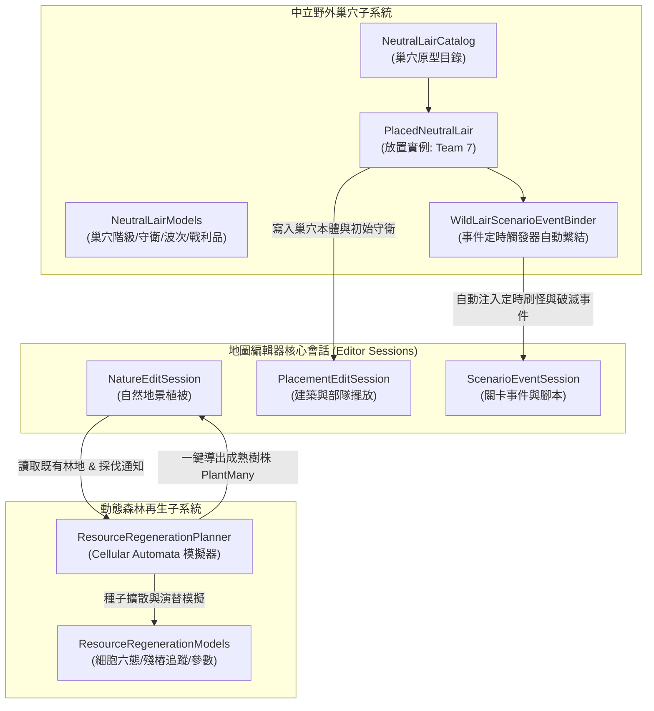
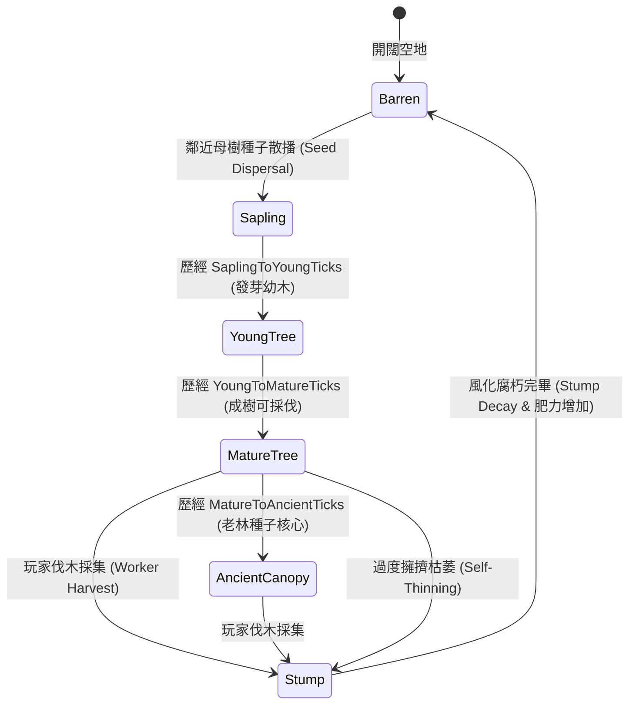

# 《反抗羅馬》地圖編輯器：中立野外巢穴與動態資源再生生態系統設計

本文件詳細規範《反抗羅馬》(Against Rome) 地圖編輯器中**中立野外巢穴 (Neutral Wild Lair)** 與**動態資源再生生態系統 (Dynamic Resource Regeneration Ecosystem)** 的架構設計、核心資料結構、演算法模型以及與遊戲原生關卡事件（`ScenarioEvent`）定時觸發器的自動繫結合約。

---

## 1. 系統願景與核心設計理念 (Vision & Core Concepts)

在原版《反抗羅馬》地圖中，野外地貌多為純靜態點綴，森林砍伐完畢後即成為永久荒地，且地圖缺乏自發性的野外威脅，導致單人戰役長盤或多人 RPG 探險地圖在進入中後期時策略深度與趣味度顯著下降。

為解決上述限制，本系統引入兩大核心機制：
1. **中立野外巢穴系統 (Neutral Wild Lair System)**：
   - 於地圖各荒野區域部署野獸洞窟（狼穴、熊洞、野豬林）與流寇營地（蠻族掠奪者大營、羅馬逃兵要塞、匈奴遊牧哨站、凱爾特狂戰士石陣）。
   - 歸屬於原版中立敵對陣營（**Team 7 Neutral Hostile**），配置常駐警戒守衛，並定期產生動態襲擾波次。
   - 與遊戲原生關卡架構嚴密結合：當巢穴本體建築被摧毀時，自動中斷刷怪定時器，並發放破滅戰利品與通報訊息。
2. **森林細胞自動機動態再生系統 (Forest Cellular Automata Regeneration System)**：
   - 工人伐木採集後留下「殘樁 (Stump)」，殘樁記錄採伐時點並在風化分解過程中釋放高肥力腐殖質。
   - 採用**二維細胞自動機（Cellular Automata）**模擬成熟母樹向周圍 Moore 八鄰域的自然種子傳播（Seed Dispersal）。
   - 實現「發芽樹苗 $\rightarrow$ 成長幼木 $\rightarrow$ 成熟成樹 $\rightarrow$ 原始巨木老林」的完整生態演替，並結合水分濕潤度加成與高密度自然自疏（Self-Thinning）機制。
   - 支援編輯器「時序快進演替（Time-Lapse 1年/5年/10年）」預覽與一鍵烘焙回原生 `NatureAddition` 地景物件。

---

## 2. 系統架構總覽 (System Architecture)

系統劃分為兩大子系統與三大核心模組，置於 `src.MapEditor.Modules/WildLair/` 命名空間下：



---

## 3. 中立野外巢穴目錄與資料結構 (NeutralLairCatalog)

### 3.1 巢穴分類與難度階級

```csharp
public enum LairCategory
{
    BeastDen,            // 野獸洞穴（狼穴、熊洞、野豬林）
    BarbarianCamp,       // 蠻族游擊營地（日耳曼流寇、匈奴劫掠帳）
    BanditStronghold,    // 武裝強盜據點（羅馬逃兵要塞、流寇山寨）
    SacredGroveOrRuins   // 遠古遺蹟或邪教石陣祭壇
}

public enum LairDifficultyTier
{
    Tier1Scout = 1,      // T1 初級遊蕩：小型野獸、斥候營地（前期探險）
    Tier2Standard = 2,   // T2 中級威脅：標準洞窟、中型劫掠營帳（中期威脅）
    Tier3Major = 3,      // T3 重裝據點：石造要塞、嗜血巨熊深穴（需主力圍剿）
    Tier4Boss = 4        // T4 酋長王帳：傳奇巨怪、氏族首領大營（重大事件獎勵）
}
```

### 3.2 核心規格定義 (Definitions & Placed Instances)

- **`LairGuardUnit`**：常駐守衛部隊規格（單位別名、兵力、巡邏半徑、警戒半徑、戰損補員週期）。
- **`LairWaveSpawnRule`**：週期生成規則（單位別名、生成數量、間隔秒數、開局延遲、最大場上波次上限、徑向生成偏移半徑、攻擊偏好）。
- **`LairLootReward`**：破滅戰利品（木材、糧食、黃金、聲望榮譽點數、廣播訊息）。
- **`NeutralLairDefinition`**：包含佔地防護半徑、原生地景/建築標籤、生態氣候帶親和性（`BiomeAffinity`）與詳細描述。
- **`PlacedNeutralLair`**：地圖放置實例，固定賦予 `Team = 7`（Neutral Hostile），並記錄核心建築在 `ScenarioDocument.Spawns` 之 GUID 索引（`CoreStructureSpawnId`）。

### 3.3 內建標準巢穴目錄 (Canonical Catalog)

| 巢穴代碼 | 中文名稱 | 類別 / 階級 | 原生建築/地貌 | 常駐守衛 | 週期刷怪規則 | 擊破戰利品 |
|---|---|---|---|---|---|---|
| `LAIR_WOLF_DEN_SMALL` | **荒野狼穴** | BeastDen (T1) | `LanGerStein01` (岩穴) | 4 狼 (`GER_INF01`) | 每 90s 生成 2 狼 (上限 2 波) | 木 40, 糧 160, 金 20 |
| `LAIR_BEAR_CAVE_FEROCIOUS` | **嗜血巨熊岩窟** | BeastDen (T2) | `LanGerFelsen01` (岩壁) | 2 熊 (`GER_INF02`) | 每 150s 生成 1 暴怒熊 (上限 2 波) | 糧 350, 金 40, 榮譽 30 |
| `LAIR_WILD_BOAR_GROVE` | **密林野豬叢** | BeastDen (T1) | `LanGerGest01` (灌木林) | 5 豬 (`GER_INF01`) | 每 110s 生成 2 野豬 (上限 2 波) | 木 50, 糧 280, 榮譽 20 |
| `LAIR_BARBARIAN_SCOUT_POST` | **蠻族流寇前哨帳** | BarbarianCamp (T1) | `BauGerZelt01` (蠻族帳) | 6 兵 (`GER_INF01`) | 每 120s 派遣 3 名斥候襲擾 | 木 120, 糧 80, 金 50 |
| `LAIR_BARBARIAN_RAIDER_CAMP` | **日耳曼蠻族掠奪營** | BarbarianCamp (T2) | `BauGerBar00` (木營房) | 12 兵 (`GER_INF01`) | 每 180s 派出 6 人洗劫隊 | 木 250, 糧 200, 金 120 |
| `LAIR_ROMAN_DESERTERS_OUTPOST` | **羅馬逃兵石砌碉堡** | BanditStronghold (T3) | `BauRomWac00` (羅馬塔) | 10 兵 (`ROM_INF01`) | 每 210s 派出 5 人逃兵軍團巡邏 | 木 100, 糧 150, 金 300 |
| `LAIR_HUNNIC_NOMAD_CAMP` | **匈奴遊牧劫掠帳** | BarbarianCamp (T2) | `BauHunZelt01` (匈奴帳) | 8 兵 (`HUN_INF01`) | 每 140s 派出 4 騎突擊平原 | 木 80, 糧 150, 金 150 |
| `LAIR_CELTIC_STONE_CIRCLE` | **凱爾特狂戰士石陣** | SacredGrove (T2) | `LanKelStein01` (巨石陣) | 8 狂戰 (`KEL_INF01`) | 每 160s 生成 4 名狂熱戰狂 | 金 200, 榮譽 60 |

### 3.4 威脅度計算演算法 (Threat Rating Formula)

```csharp
public static float CalculateThreatRating(NeutralLairDefinition definition)
{
    float guardPower = 0f;
    foreach (var guard in definition.DefaultGuards)
    {
        guardPower += guard.Count * 2.5f;
        if (guard.RespawnIntervalSeconds > 0)
            guardPower += 150f / Math.Max(30f, guard.RespawnIntervalSeconds);
    }

    float wavePower = 0f;
    foreach (var wave in definition.WaveRules)
    {
        float ratePerMinute = 60f / Math.Max(30f, wave.IntervalSeconds);
        wavePower += wave.SpawnCount * ratePerMinute * 3.0f * Math.Min(3, wave.MaxActiveWaves);
    }

    float tierMultiplier = (int)definition.Tier switch
    {
        1 => 1.0f,
        2 => 1.35f,
        3 => 1.8f,
        4 => 2.5f,
        _ => 1.0f
    };

    return (guardPower + wavePower) * tierMultiplier;
}
```

---

## 4. 動態森林再生演算法 (Cellular Automata Forest Regeneration)

### 4.1 六態微網格模型 (Six-State Cellular Automata)

森林生態空間劃分為與地圖等寬高之二維網格（格寬預設 `TileWorldSize = 64.0f`），每個單元格處於以下狀態之一：



1. **`Barren (0)`（開闊土地）**：未長樹，具有肥沃度（$F \in [0.0, 1.0]$）與水分（$M \in [0.0, 1.0]$）。
2. **`Stump (1)`（採伐殘樁）**：由玩家伐木工人採集後遺留，阻止原地立刻生長。每步時鐘累加，到達 `StumpDecayTicks`（預設 6 步）後完全腐化，將土地肥力提升 $+0.35$ 轉為高產 `Barren`。
3. **`Sapling (2)`（新生樹苗）**：由周邊成樹種子隨機播種萌發，木材量 10%，歷經 3 步晉升為幼木。
4. **`YoungTree (3)`（成長期小樹）**：木材量 50%，逐漸建立碰撞與視野遮蔽，歷經 5 步晉升為成樹。
5. **`MatureTree (4)`（成熟喬木）**：可供工人砍伐採集木材，並向外進行種子傳播；若周邊極度擁擠（$\ge 7$ 鄰格成樹）則有 $8\%$ 機率自疏倒伏為殘樁。
6. **`AncientCanopy (5)`（原始老林）**：歷經長久歲月（12 步）演替，抗逆性極高，種子散播倍率為普通成樹之 $1.75$ 倍。

### 4.2 鄰域種子擴散與環境乘數 (Dispersal Mechanics)

對每個空地單元格 $(x, y)$，考察其 **Moore 八鄰域**：
- 統計成熟樹數量 $N_{\text{mature}}$ 與原始巨木數量 $N_{\text{ancient}}$。
- 若 $N_{\text{mature}} + N_{\text{ancient}} > 0$，未接收到種子的綜合機率為：
  $$P_{\text{none}} = (1 - p_{\text{base}})^{N_{\text{mature}}} \cdot (1 - p_{\text{base}} \cdot B_{\text{ancient}})^{N_{\text{ancient}}}$$
  $$P_{\text{dispersal}} = 1 - P_{\text{none}}$$
- 結合單元格的土壤肥力 $F$ 與水源濕潤度 $M$ 得到最終發芽機率：
  $$P_{\text{effective}} = \operatorname{Clamp}\left(P_{\text{dispersal}} \cdot F \cdot \left[1.0 + (M - 0.5) \cdot (B_{\text{moisture}} - 1.0)\right], 0.0, 1.0\right)$$
- 當隨機抽樣小於 $P_{\text{effective}}$ 時，單元格轉變為 `Sapling`，並自動繼承鄰域中優勢母樹之樹種代碼（例如 `LanGerTanne01` 冷杉、`LanGerEiche01` 橡樹）。

### 4.3 殘樁追蹤與雙向編輯器橋接

- **`MarkHarvestedStump(...)`**：工人採集樹木時呼叫，記錄原木種與原生 slot 號碼，進入殘樁腐朽狀態隊列。
- **`ExportRegeneratedNature(...)`**：模擬完畢後，將網格中所有 `MatureTree` 與 `AncientCanopy` 單元格加上格內抖動（Jitter $\pm 0.2$ tile）轉化為 `NatureAddition`，無縫傳遞給 `NatureEditSession.PlantMany(...)`，完整納入編輯器 Undo/Redo 交易與二進位地圖存檔。

---

## 5. 關卡事件定時觸發器自動繫結合約 (ScenarioEvent Binding Contract)

《反抗羅馬》底層執行期透過地圖腳本二進位 `ak_level.bci` 內的事件虛擬機執行遊戲邏輯。地圖編輯器透過 `ScenarioEvent` 進行宣告式配置。

本模組設計的 `WildLairScenarioEventBinder` 為巢穴實例自動生成三種標準事件，並嚴格遵循遊戲引擎生命週期：

### 5.1 週期刷怪事件 (`LAIR_SPAWN_*`)
- **名稱**：`LAIR_{InstanceTag}_WAVE_{i}_{WaveId}`
- **計時**：`DelaySeconds = wave.IntervalSeconds`，`Repeat = true`。
- **前置條件**：`ScenarioCondition(ScenarioConditionKind.ObjectExists, lair.CoreStructureSpawnId)`。
  > **核心防呆與機制精華**：利用 `ObjectExists` 條件繫結至巢穴建築實體。當玩家、盟友或軍隊進攻推平該巢穴建築後，`ObjectExists` 即刻為假，遊戲引擎將**自動永久終止該計時器**，不再刷怪！
- **動作**：`ScenarioAction(ScenarioActionKind.SpawnUnit, Alias: wave.UnitAlias, Team: 7, X: spawnX, Z: spawnZ, Count: wave.SpawnCount)`。

### 5.2 巢穴破滅清剿事件 (`LAIR_CLEARED_*`)
- **名稱**：`LAIR_{InstanceTag}_CLEARED`
- **計時**：`DelaySeconds = 1`，`Repeat = false`。
- **前置條件**：`ScenarioCondition(ScenarioConditionKind.ObjectDeadOrRemoved, lair.CoreStructureSpawnId)`。
- **動作**：`ScenarioAction(ScenarioActionKind.Message, Text: "Neutral lair has been eradicated!")`。

### 5.3 敵對外交鎖定 (`LAIR_HOSTILE_*`)
- **名稱**：`LAIR_{InstanceTag}_HOSTILE`
- **計時**：`DelaySeconds = 0`，`Repeat = false`。
- **動作**：`ScenarioAction(ScenarioActionKind.Diplomacy, Team: 7, OtherTeam: playerTeam, Hostile: true)`，強制鎖定 Team 7 為交戰敵手。

### 5.4 零孤兒事件策略 (Zero-Orphan Invariant)
當使用者在編輯器中**移動**或**刪除**野外巢穴時：
- 移動巢穴：自動重新計算生成點半徑坐標，就地覆寫原有事件中的 $(X, Z)$。
- 刪除巢穴：調用 `RemoveLairEvents(...)`，藉由 `LAIR_{InstanceTag}_` 前綴掃描並一次性清除關聯事件，絕不在地圖檔案中遺留指向無效 `Guid` 的斷頭條件（避免引發 `ScenarioEventValidator` 拒存）。

---

## 6. 核心程式碼原型實作清單

本系統所有生產程式碼均位於獨立專屬模組，不與其他並行開發模組產生任何符號或檔案衝突：

1. **`src.MapEditor.Modules/WildLair/NeutralLairModels.cs`**：中立巢穴核心列舉、守衛規格、刷怪波次、破滅獎勵與放置實例紀錄。
2. **`src.MapEditor.Modules/WildLair/NeutralLairCatalog.cs`**：8 款內建標準巢穴原型（狼、熊、野豬、蠻族大營、羅馬逃兵、匈奴、凱爾特）、多維度過濾器與威脅度評分演算法。
3. **`src.MapEditor.Modules/WildLair/ResourceRegenerationModels.cs`**：森林細胞六態、殘樁追蹤標記、自動機超參數與生態統計數據結構。
4. **`src.MapEditor.Modules/WildLair/ResourceRegenerationPlanner.cs`**：二維雙緩衝細胞自動機生態模擬器、殘樁風化腐朽、種子散播擴散、自疏稀釋與 `NatureAddition` 導出器。
5. **`src.MapEditor.Modules/WildLair/WildLairScenarioEventBinder.cs`**：原版關卡事件自動繫結器、生命週期事件生成、增量同步與安全刪除契約。
6. **`tests/AgainstRomeMapEditor.Modules.Tests/NeutralLairAndRegenTests.cs`**：全套單元與整合測試，覆蓋原型目錄、難度計算、殘樁風化、種子擴散、事件生成與孤兒清理。

---

## 7. 驗證與測試矩陣 (Verification Matrix)

| 測試案例名稱 | 驗證標的 | 預期結果 |
|---|---|---|
| `NeutralLairCatalog_Default_ContainsCanonicalLairsAndValidates` | 內建標準巢穴目錄原型完整度與威脅度評估 | 包含至少 7 種巢穴，蠻族大營威脅度高於小型狼穴 |
| `NeutralLairCatalog_FilteringAndQuerying_WorksAsExpected` | 類別、難度階級與氣候帶多條件過濾 | 精確篩選出符合特徵的巢穴定義 |
| `NeutralLairCatalog_Validation_RejectsInvalidRules` | 巢穴定義防呆檢查（間隔太短、兵力超出範圍） | 拋出明確 `ArgumentOutOfRangeException` |
| `ResourceRegenerationPlanner_CellularAutomata_SimulatesStumpDecayAndSaplingGrowth` | 砍伐殘樁標記與時序風化演替 | 6 步後殘樁轉化為肥沃 `Barren`，肥力顯著提升 |
| `ResourceRegenerationPlanner_SeedDispersal_SpreadsForestCanopy` | Moore 鄰域種子自然擴散 | 10 步模擬後鄰域萌發新生樹苗，林冠總量顯著擴張 |
| `ResourceRegenerationPlanner_ExportRegeneratedNature_ProducesValidAdditions` | 網格成樹導出為編輯器 `NatureAddition` | 成功產出具格內抖動坐標與原版模板的樹木清單 |
| `WildLairScenarioEventBinder_GeneratesSpawnAndDestructionEvents` | 巢穴實例自動生成原版關卡事件合約 | 正確生成週期刷怪、推平獎勵與 Team 7 敵對外交事件 |
| `WildLairScenarioEventBinder_SyncAndRemoveSessionEvents_LeavesNoOrphans` | 巢穴事件同步與安全刪除 | 刪除巢穴時徹底清除關聯事件，既有自訂事件不受影響 |

---

## 8. 未來演進路線 (Roadmap & Next Steps)

1. **AI 掠奪路線規劃結合 (Raiding Path Planner)**：
   - 與已有的導航網格（NavMesh）連動，使蠻族巢穴刷出的掠奪隊伍（Raid Warband）能主動搜尋最近的玩家聚落儲藏庫或農田發動襲擊。
2. **水文鄰域植被多樣性自適應 (Riparian Ecology Integration)**：
   - 結合 `RiverFlowPlanner`，在河流與湖泊邊緣 3 格內提升垂柳與蘆葦的再生機率，形成沿河濕地生態廊道。
3. **野火蔓延與次生演替 (Wildfire & Secondary Succession)**：
   - 擴展細胞自動機，引入雷擊引發的山火蔓延狀態，火災後形成廣闊黑炭焦土與超高肥力沃土，為長盤地圖帶來極致的動態環境變化。
